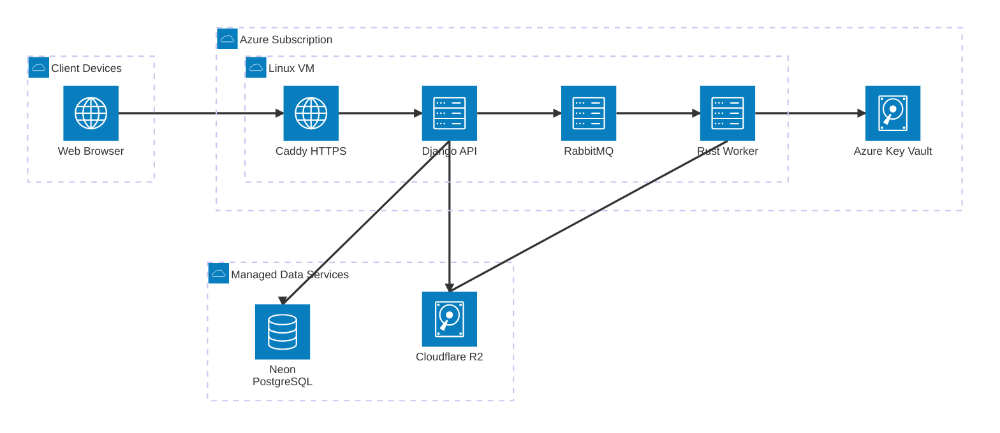

# ADR-001: Kiến trúc production trên Azure

| Trường | Giá trị |
| --- | --- |
| **Trạng thái** | Accepted |
| **Ngày** | 2026-08-13 |
| **Người quyết định** | Nhóm 9 |
| **Phạm vi** | MVP và buổi báo cáo SplitBind |

---

## Bối cảnh

SplitBind cần chạy như một website production-quality cho bài tập lớn, nhưng toàn bộ hạ tầng phải nằm trong nguồn lực miễn phí hoặc credit sinh viên. Máy phát triển chính dùng Windows; máy thành viên dùng MacBook Air M2 với 8 GiB RAM. Tài khoản Azure for Students hiện có `$100` credit trong 12 tháng và phù hợp với mục đích phát triển, kiểm thử, trình diễn phi thương mại.[^1]

Hệ thống xử lý PDF và ảnh nên cần tài nguyên cao hơn một web CRUD thông thường. Server phải chứa Caddy, Django, RabbitMQ và Rust worker, trong khi PostgreSQL và object storage nên được tách khỏi VM để giảm RAM, disk và trách nhiệm backup.

### Ràng buộc

- Tổng chi phí tiền thật bằng `0`; không nâng cấp Pay-as-you-go
- Deadline báo cáo là 17/09/2026
- Worker production dùng Rust và concurrency bằng `1`
- Peak RSS của worker không vượt 1.5 GiB
- Phải có offline demo và server dự phòng
- Không đưa secret, tài liệu thật hoặc thông tin máy thành viên vào repository

## Các phương án

| Tiêu chí | Azure Linux VM | Oracle Always Free | Mac + Lima | Azure PaaS phân mảnh |
| --- | --- | --- | --- | --- |
| Khả dụng hiện tại | Cao | Không chắc capacity | Cao nhưng phụ thuộc máy cá nhân | Cao |
| Dễ tái lập | Cao | Cao | Trung bình | Trung bình |
| Đủ cho worker PDF | Cao với 4 GiB | Phụ thuộc instance | Có, nhưng RAM máy chỉ 8 GiB | Cần thiết kế lại job runtime |
| Kiểm soát chi phí | `$100` credit + spending limit | Free tier | Điện và mạng cá nhân | Nhiều dịch vụ khó dự báo |
| Rủi ro demo | Thấp | Trung bình | Cao | Trung bình |
| Kết luận | **Chọn** | Dự phòng bị loại | Chỉ fallback | Không dùng cho MVP |

Oracle bị loại khỏi vai trò chính vì capacity free tier không bảo đảm. Mac + Lima không thích hợp làm server công khai chính do phụ thuộc nguồn điện, mạng gia đình và tài nguyên của máy thành viên. PaaS phân mảnh làm RabbitMQ, worker native và giới hạn chi phí khó quản lý hơn một VM duy nhất.

## Quyết định

Sử dụng một Azure Linux VM làm compute host production duy nhất. PostgreSQL dùng Neon; file dùng Cloudflare R2; khóa production dùng Azure Key Vault Secrets. Máy Mac + Lima chỉ làm fallback, còn Docker Compose trên laptop là offline demo.

_Sơ đồ cho thấy các container trên Azure VM kết nối tới dịch vụ dữ liệu managed và Key Vault:_

### Cấu hình cố định

| Hạng mục | Giá trị chốt |
| --- | --- |
| VM SKU | `Standard_B2ls_v2`[^2] |
| Kiến trúc CPU | x86-64 |
| Hệ điều hành | Debian 13 minimal |
| CPU / RAM | 2 vCPU / 4 GiB |
| OS disk | Standard SSD 32 GiB |
| Orchestration | Docker Compose |
| Hostname production | `splitbind.qivarn.id.vn`; giữ nguyên apex `qivarn.id.vn` |
| Public ports | `80`, `443` |
| Admin port | `22`, giới hạn theo IP và chỉ dùng SSH key |
| Worker concurrency | `1` |
| Database | Neon PostgreSQL |
| Object storage | Cloudflare R2 |
| Secret store | Azure Key Vault Secrets qua managed identity[^3] |

Nếu `Standard_B2ls_v2` không có trong region hoặc subscription, nhóm được phép chọn SKU x86-64 khác có ít nhất 2 vCPU và 4 GiB RAM, nhưng phải ghi giá dự kiến trước khi tạo. Không hạ xuống B1s 1 GiB.

### Biên triển khai

- Caddy phục vụ React static, reverse proxy API và kết thúc TLS
- Django API và outbox publisher chạy từ cùng image nhưng là process riêng
- RabbitMQ chỉ nghe trên Docker network; management UI không public
- Rust worker là service duy nhất đọc khóa ký và khóa watermark
- PostgreSQL và R2 không chạy trên VM
- Profile `research` và observability nặng không chạy trong production

## Hệ quả

### Tích cực

- Một compute host giúp triển khai và rollback đơn giản
- Database và file không phụ thuộc vòng đời VM
- Ngân sách container được thiết kế để vừa 4 GiB RAM và phải được xác nhận bằng load test
- Azure VM thay thế nhu cầu dùng Mac làm server chính
- Cùng Docker Compose chạy được trên Azure, Windows WSL2, macOS và offline demo

### Đánh đổi

- Một VM là single point of failure và không có SLA thương mại
- B-series dùng CPU credit nên không phù hợp tải liên tục
- Hết credit có thể khiến dịch vụ bị vô hiệu hóa[^1]
- Neon và R2 tạo phụ thuộc Internet ngay cả khi VM còn hoạt động

## Kiểm soát chi phí

- Giữ spending limit; không thêm phương thức Pay-as-you-go
- Tạo budget `$100` với actual-cost alert tại 25%, 50%, 75% và 90%
- Budget alert chỉ thông báo, không tự dừng tài nguyên[^4]
- Compute host `vm-splitbind-prod` đã được cấp phát; không tạo tài nguyên trùng và giữ deallocated cho đến khi release candidate cùng budget guardrail được xác minh
- Deallocate VM ngoài giai đoạn kiểm thử public; xác minh disk và public IP vẫn có thể phát sinh chi phí
- Xóa VM, disk, snapshot, public IP và Key Vault không còn cần sau khi hoàn tất dự án và backup bằng chứng cần giữ

## Điều kiện xem xét lại

ADR mới là bắt buộc nếu xảy ra một trong các điều kiện:

- workload thực đo vượt 4 GiB RAM với concurrency 1
- Azure credit dự báo hết trước ngày báo cáo
- SKU mục tiêu không khả dụng ở mọi region được phép
- Neon hoặc R2 không đáp ứng quota đã đo
- nhóm chuyển từ demo học thuật sang dịch vụ có SLA thương mại

## Liên kết

- [Đặc tả thiết kế SplitBind](../superpowers/specs/2026-08-13-splitbind-production-design.md)
- [Azure for Students FAQ](https://learn.microsoft.com/en-us/azure/education-hub/faq)
- [Azure VM Bsv2 sizes](https://learn.microsoft.com/en-sg/azure/virtual-machines/sizes/general-purpose/bsv2-series)
- [Azure Cost Management budgets](https://learn.microsoft.com/en-us/azure/cost-management-billing/costs/tutorial-acm-create-budgets)
- [Azure Key Vault security](https://learn.microsoft.com/en-us/azure/key-vault/general/secure-key-vault)

## Tham khảo

[^1]: Microsoft. (2026). [“Frequently asked questions about Azure for Education”](https://learn.microsoft.com/en-us/azure/education-hub/faq).

[^2]: Microsoft. (2026). [“Bsv2-series sizes”](https://learn.microsoft.com/en-sg/azure/virtual-machines/sizes/general-purpose/bsv2-series).

[^3]: Microsoft. (2026). [“Secure your Azure Key Vault”](https://learn.microsoft.com/en-us/azure/key-vault/general/secure-key-vault).

[^4]: Microsoft. (2026). [“Tutorial: Create and manage budgets”](https://learn.microsoft.com/en-us/azure/cost-management-billing/costs/tutorial-acm-create-budgets).

---

_Cập nhật lần cuối: 2026-08-27_
