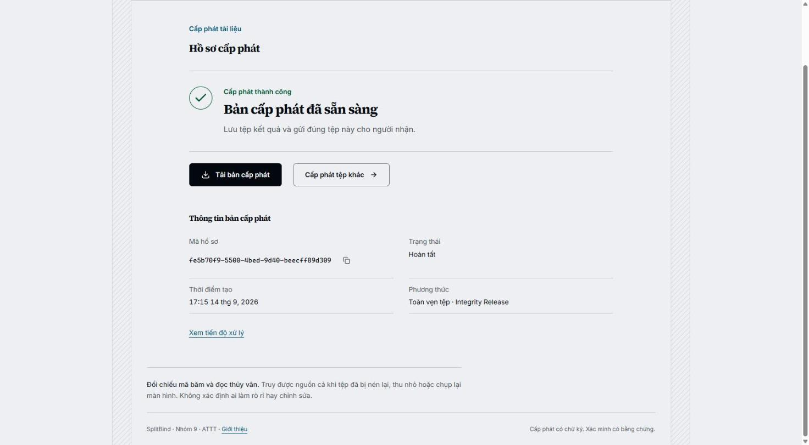
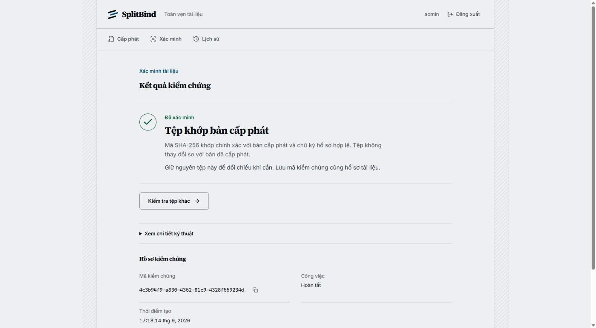
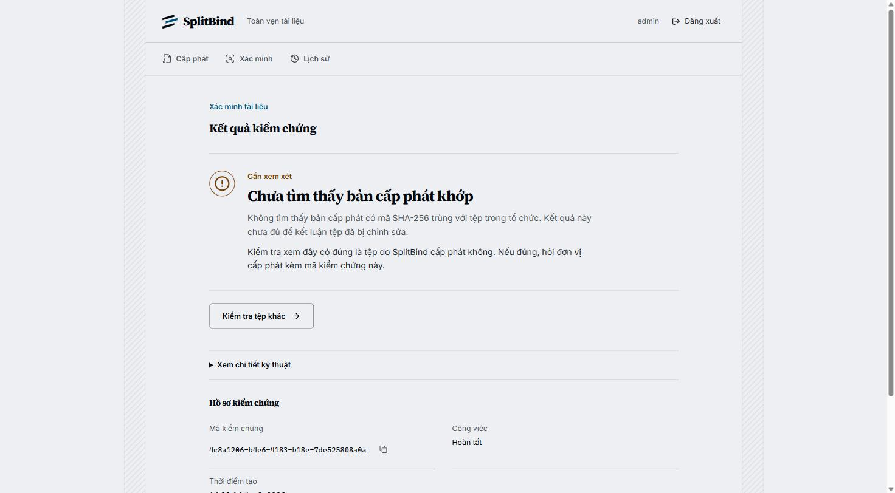
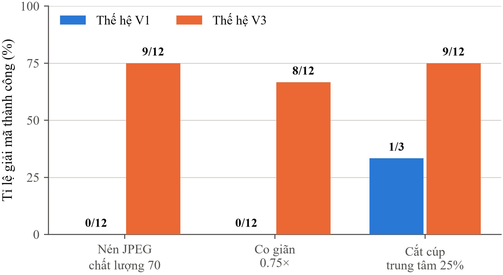
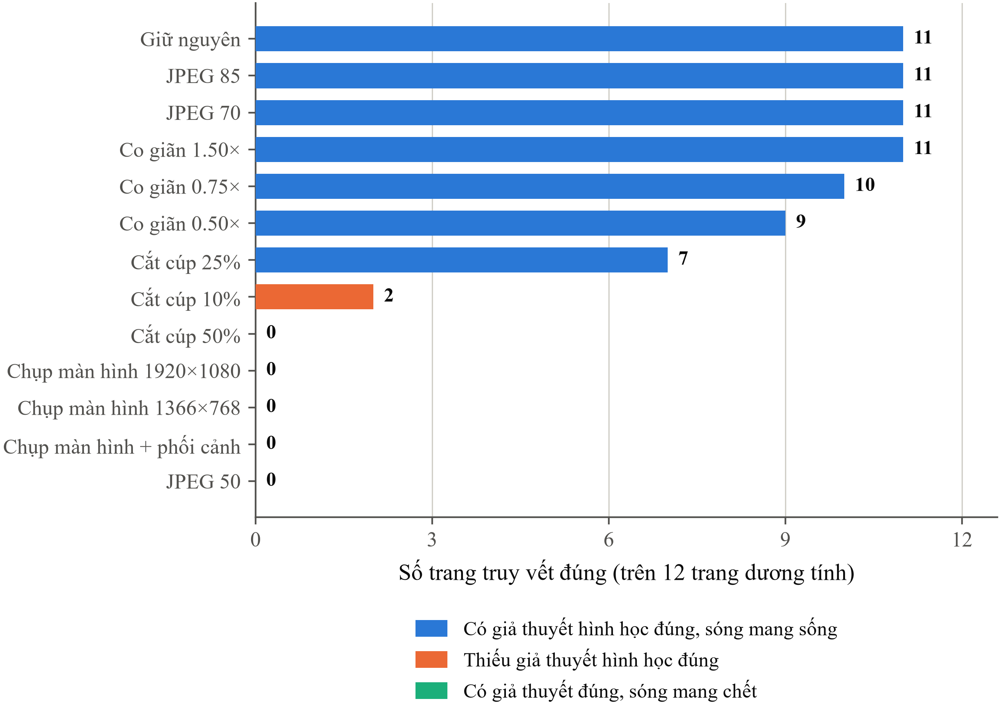
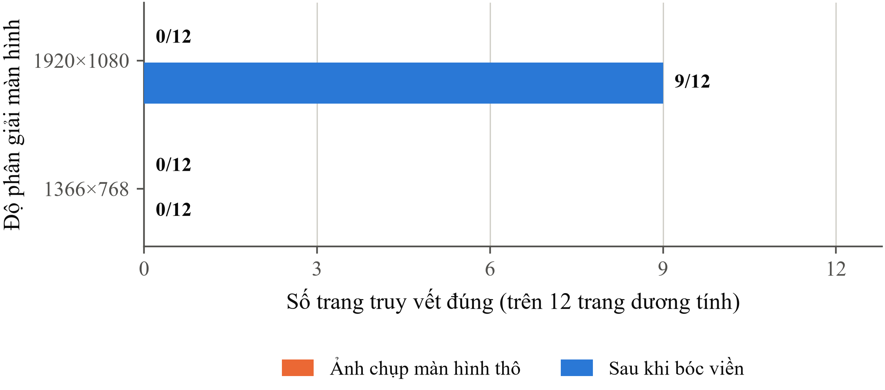

# MỤC LỤC

```{=openxml}
<w:sdt><w:sdtPr><w:docPartObj><w:docPartGallery w:val="Table of Contents"/><w:docPartUnique/></w:docPartObj></w:sdtPr><w:sdtContent><w:p><w:r><w:fldChar w:fldCharType="begin" w:dirty="true"/></w:r><w:r><w:instrText xml:space="preserve"> TOC \o "1-3" \h \z \u </w:instrText></w:r><w:r><w:fldChar w:fldCharType="separate"/></w:r><w:r><w:t>Nhấn chuột phải vào đây và chọn Update Field để sinh mục lục.</w:t></w:r><w:r><w:fldChar w:fldCharType="end"/></w:r></w:p></w:sdtContent></w:sdt>
```

```{=openxml}
<w:p><w:r><w:br w:type="page"/></w:r></w:p>
```

# DANH MỤC TỪ VIẾT TẮT VÀ THUẬT NGỮ

| Từ viết tắt / thuật ngữ | Nghĩa đầy đủ |
|---|---|
| **artifact** | Tệp kết quả do một lần chạy thực nghiệm sinh ra và được lưu lại để kiểm chứng về sau. |
| **BCH** | Bose-Chaudhuri-Hocquenghem, một họ mã sửa lỗi khối |
| **benchmark** | Bộ phép đo chuẩn hoá chạy trên cùng một corpus, để các lần chạy khác nhau so sánh được với nhau. |
| **BER** | Bit Error Rate, tỉ lệ lỗi bit |
| **BTL** | Bài tập lớn |
| **canvas** | Khung ảnh chuẩn tắc mà mọi trang tài liệu được đưa về trước khi nhúng |
| **corpus** | Bộ trang tài liệu mẫu cố định dùng cho mọi phép đo, để các lần chạy so sánh được với nhau |
| **CRC** | Cyclic Redundancy Check, mã kiểm dư vòng |
| **DCT** | Discrete Cosine Transform, biến đổi cosin rời rạc |
| **DWT** | Discrete Wavelet Transform, biến đổi sóng con rời rạc |
| **ECC** | Error-Correcting Code, mã sửa lỗi |
| **fixture** | Một trang tài liệu cụ thể trong corpus, đóng vai trò mẫu thử |
| **harness** | Bộ khung thực nghiệm: mã và cấu hình dùng để chạy hàng loạt phép đo lặp lại được, tách biệt với mã sản phẩm. |
| **HMAC** | Hash-based Message Authentication Code |
| **IoU** | Intersection over Union, tỉ số giao trên hợp |
| **JCS** | JSON Canonicalization Scheme (RFC 8785) |
| **JPEG** | Joint Photographic Experts Group, chuẩn nén ảnh có tổn hao; JPEG-70 nghĩa là nén ở mức chất lượng 70 |
| **letterbox** | Dải viền trơn mà ảnh chụp màn hình thêm vào hai bên khung ảnh khi tỉ lệ không khớp |
| **MAC** | Message Authentication Code, mã xác thực thông điệp dùng khóa bí mật chung |
| **manifest** | Hồ sơ toàn vẹn: tệp mô tả một lần cấp phát, được ký số để chống sửa đổi |
| **ORB** | Oriented FAST and Rotated BRIEF |
| **payload** | Chuỗi bit mang thông tin định danh được nhúng vào ảnh |
| **pre-gate** | Vòng sàng lọc chạy trước cổng phát hành, dùng để loại sớm các bộ tham số kém |
| **production** | Môi trường máy chủ đang phục vụ người dùng thật, phân biệt với môi trường thử nghiệm. Giữ nguyên tiếng Anh theo cách gọi phổ biến trong ngành phần mềm. |
| **profile** | Hồ sơ tham số đã khoá của một thế hệ thuật toán: kích thước ô, số lần lặp bit, bước lượng tử và các hằng số kèm theo. |
| **PSNR** | Peak Signal-to-Noise Ratio, tỉ số tín hiệu trên nhiễu đỉnh |
| **QIM** | Quantization Index Modulation, điều chế chỉ số lượng tử |
| **RANSAC** | Random Sample Consensus |
| **RBAC** | Role-Based Access Control, kiểm soát truy cập theo vai trò |
| **Reed-Solomon** | Mã sửa lỗi khối trên trường hữu hạn, cho phép khôi phục dữ liệu khi một số ký hiệu bị sai hoặc bị khai là mất. |
| **RSS** | Resident Set Size, dung lượng bộ nhớ thường trú |
| **SSIM** | Structural Similarity Index Measure |
| **SSOT** | Single Source of Truth, nguồn chân lý duy nhất |
| **tile** | Ô ảnh: vùng hình chữ nhật mà thuật toán chia trang ra để nhúng payload |
| **WM** | Watermark, thủy vân số |

```{=openxml}
<w:p><w:r><w:br w:type="page"/></w:r></w:p>
```

# DANH MỤC CÁC BẢNG

| Số hiệu | Tên bảng |
|---|---|
| Bảng 3.1 | Ma trận so sánh sáu kỹ thuật bảo vệ toàn vẹn trên bảy tiêu chí an ninh |
| Bảng 4.1 | Các số liệu thực nghiệm đã khóa của thế hệ V1 |
| Bảng 4.2 | Đối chiếu thế hệ V1 và V3 trên cùng một corpus |
| Bảng 4.3 | Phân rã số trang trượt theo từng phép tấn công so với phép đo không tấn công |
| Bảng 4.4 | Thời gian xử lý, bộ nhớ đỉnh và dung lượng tệp tạm đo trên 352 hàng |
| Bảng 4.5 | Chất lượng ảnh sau khi nhúng, đo trên 192 hàng có PSNR hữu hạn |
| Bảng 4.6 | Tỉ lệ khôi phục chính xác toàn bộ payload, đối chiếu SplitBind với ba hệ thống mã nguồn mở |
| Bảng 4.7 | Tác động của bước chuẩn hóa khung ảnh, đo trên trang tài liệu của SplitBind |
| Bảng 4.8 | Quét cường độ nhúng đối chiếu độ bền với độ trung thực, trên trang tài liệu của SplitBind |
| Bảng 4.9 | Năm phép thử thủy vân trên môi trường production |
| Bảng 4.10 | Ảnh hưởng của loại vật mang tới khả năng giải mã, ba vật mang trên năm điều kiện |
| Bảng 4.11 | Đối chiếu khả năng sinh giả thuyết hình học với tỉ lệ truy vết đo được |
| Bảng 4.12 | Ba lớp nguyên nhân thất bại và biện pháp tương ứng |

```{=openxml}
<w:p><w:r><w:br w:type="page"/></w:r></w:p>
```

# DANH MỤC CÁC HÌNH

| Số hiệu | Tên hình |
|---|---|
| Hình 4.1 | Giao diện cấp phát tài liệu trên hệ thống đang vận hành |
| Hình 4.2 | Kết quả xác minh khi tệp khớp bản cấp phát: mã SHA-256 trùng khớp và chữ ký hồ sơ hợp lệ |
| Hình 4.3 | Kết quả xác minh khi tệp đã bị chỉnh sửa: hệ thống báo không khớp và không quy kết hành vi cho bất kỳ ai |
| Hình 4.4 | Tỉ lệ giải mã của thế hệ V1 và V3 trên cùng hợp đồng corpus, cùng định nghĩa cổng |
| Hình 4.5 | Tỉ lệ truy vết của 13 phép biến đổi, phân theo ba lớp nguyên nhân thất bại |
| Hình 4.6 | Hiệu quả của bước bóc viền letterbox trước khi giải mã, đo trên 12 trang dương tính |

```{=openxml}
<w:p><w:r><w:br w:type="page"/></w:r></w:p>
```

# LỜI MỞ ĐẦU

Tài liệu điện tử ngày nay rò rỉ chủ yếu qua các kênh làm mất tính toàn vẹn bit: chụp ảnh màn hình, in ra rồi quét lại, hoặc chụp lại bằng điện thoại. Chữ ký số bảo vệ rất tốt biểu diễn số nguyên bản, nhưng chỉ cần một byte thay đổi là phép xác minh thất bại, và nó không cung cấp cơ chế nào để đối chiếu một bản sao đã qua biến đổi tín hiệu với hồ sơ phát hành gốc. Khoảng trống đó là lý do nhóm chọn đề tài này.

Báo cáo bám sát bốn nội dung được giao. Chương 1 trình bày lý thuyết kỹ thuật Digital Watermarking. Chương 2 trình bày ứng dụng thủy vân trong truy vết thay đổi hình ảnh. Chương 3 gồm hai phần: ứng dụng ký số trong bảo vệ thông tin truy vết, và so sánh với các kỹ thuật xác minh toàn vẹn khác. Chương 4 trình bày hệ thống SplitBind mà nhóm đã hiện thực, đo đạc và đề xuất cải tiến.

Nhóm chủ trương công bố giới hạn thay vì che giấu. Mọi khẳng định kỹ thuật trong báo cáo đều được gắn một trong năm nhãn phân định cấp độ tri thức, in nghiêng ngay trước nội dung: *lý thuyết đã công bố* cho lý thuyết kinh điển, *đã hiện thực trong mã nguồn* cho tính năng đã có mã nguồn, *số liệu đo thực nghiệm* cho kết quả đo có artifact và mã băm xác thực, *đang vận hành trên hệ thống thật* cho tính năng đang chạy thực tế, và *giới hạn đã nhận diện* cho ranh giới thất bại đã xác định. Các kết quả âm tính và các giả thuyết đã bị bác bỏ đều được trình bày đầy đủ, vì chúng là một phần của đóng góp khoa học chứ không phải điều cần giấu.

### Thông tin đề tài chính thức
* **Tên đề tài BTL:** Tìm hiểu và đề xuất hệ thống truy vết toàn vẹn văn bản.
* **Đơn vị thực hiện:** Nhóm 9 - lớp học phần An toàn thông tin.
* **Bốn yêu cầu cốt lõi của giảng viên:**
  1. Lý thuyết kỹ thuật Digital Watermarking.
  2. Ứng dụng watermarking trong truy vết thay đổi hình ảnh.
  3. Ứng dụng ký số trong bảo vệ thông tin truy vết hình ảnh.
  4. So sánh với các kỹ thuật xác minh bảo vệ tính toàn vẹn khác.

### Thống nhất ngữ nghĩa: "văn bản" (document) vs "hình ảnh" (image)

* **Nghịch lý ban đầu:** Đề tài yêu cầu xây dựng hệ thống truy vết toàn vẹn cho *văn bản*, nhưng các yêu cầu kỹ thuật chi tiết lại yêu cầu nghiên cứu và ứng dụng thủy vân trên *hình ảnh*.
* **Bản chất đường ống xử lý thực tế của SplitBind:**
  1. **Tài liệu PDF là vật mang nghiệp vụ (Business Document Layer):** Đầu vào và đầu ra của người dùng cuối là các tệp tài liệu số định dạng PDF (`application/pdf`).
  2. **Biểu diễn ảnh trang là vật mang tín hiệu (Signal Representation Layer):** Nhằm hướng tới khả năng chống chịu các kênh rò rỉ ngoại tuyến (in ấn ra giấy, quét lại, chụp màn hình máy tính, chuyển đổi thành ảnh đăng tải lên mạng xã hội), hệ thống chuyển đổi (render) từng trang tài liệu PDF thành mảng điểm ảnh raster hai chiều (kênh độ sáng Luminance) ở độ phân giải xác định (144 hoặc 300 DPI).
  3. **Thủy vân số tác động trên ảnh trang:** Các thuật toán thủy vân số (cả nhúng vết định danh rò rỉ lẫn nhúng thẻ xác thực toàn vẹn) được áp dụng trực tiếp lên biểu diễn ảnh raster của từng trang. Sau khi xử lý tín hiệu, trang ảnh được tái đóng gói trở lại thành tệp PDF hoàn chỉnh.
  4. **Chữ ký số tác động trên toàn văn bản:** Chữ ký số Ed25519 được tạo trên bản tóm lược (manifest) chứa mã băm SHA-256 của toàn bộ tệp PDF phát hành.
* **Phát biểu chuẩn mực dùng xuyên suốt slide và báo cáo:**
  > *"Hệ thống truy vết và bảo vệ tính toàn vẹn tài liệu văn bản thông qua kỹ thuật thủy vân số trên biểu diễn ảnh trang (Page-Image Document Watermarking) kết hợp chữ ký số trên hồ sơ cấp phát."*

```{=openxml}
<w:p><w:r><w:br w:type="page"/></w:r></w:p>
```

# CHƯƠNG 1. CƠ SỞ LÝ THUYẾT KỸ THUẬT DIGITAL WATERMARKING

## 1.1. Khái niệm và định nghĩa chuẩn mực
*Lý thuyết đã công bố* (tổng hợp từ [2] và [3])

* **Thủy vân số (Digital Watermarking):** Là kỹ thuật nhúng một lượng thông tin số xác định (gọi là thủy vân hoặc watermark - như định danh bản quyền, mã số cấp phát, nhãn toàn vẹn) trực tiếp vào trong dữ liệu đa phương tiện vật mang (ảnh, tài liệu, âm thanh, video) bằng cách hiệu chỉnh các đặc trưng tín hiệu của vật mang.
* **Mục tiêu an ninh:** Thông tin thủy vân gắn liền chặt chẽ với nội dung vật mang; mức độ bền vững (tồn tại qua các phép xử lý tín hiệu) hoặc mức độ dễ vỡ (bị phá hủy khi có can thiệp) được thiết kế có chủ đích nhằm phục vụ mục tiêu an ninh cụ thể (như truy vết bản quyền hoặc phát hiện sửa đổi).

## 1.2. Phân loại kỹ thuật thủy vân số

### 1.2.1. Phân loại theo miền nhúng (Embedding Domain)
1. **Miền không gian (Spatial Domain):**
   * *Nguyên lý:* Biến đổi trực tiếp giá trị độ sáng hoặc màu sắc của các điểm ảnh (pixel).
   * *Kỹ thuật tiêu biểu:* LSB (Least Significant Bit - thay thế các bit trọng số thấp nhất), Patchwork, dịch chuyển khối tương quan.
   * *Đặc điểm:* Độ phức tạp tính toán thấp, dung lượng nhúng tiềm năng cao. Độ bền vững phụ thuộc vào cấu trúc của từng lược đồ cụ thể: kỹ thuật LSB điển hình là rất yếu trước các phép xử lý tín hiệu (nén JPEG, lọc làm mịn, biến đổi hình học), trong khi các phương pháp thống kê như Patchwork có khả năng chống chịu tốt hơn trước một số biến dạng tín hiệu tuyến tính.
2. **Miền tần số / miền biến đổi (Transform Domain):**
   * *Nguyên lý:* Biến đổi ảnh sang miền tần số thông qua các phép biến đổi toán học trực giao, sau đó hiệu chỉnh các hệ số tần số để nhúng tin.
   * *Các phép biến đổi kinh điển:*
     * **DCT (Discrete Cosine Transform):** Biến đổi Cosine rời rạc. Tách ảnh thành các thành phần tần số thấp (năng lượng tập trung), trung bình và cao.
     * **DWT (Discrete Wavelet Transform):** Biến đổi Wavelet rời rạc. Phân rã ảnh theo nhiều mức độ phân giải và định hướng không gian (xấp xỉ LL, chi tiết ngang LH, chi tiết dọc HL, chi tiết chéo HH).
     * **DFT (Discrete Fourier Transform):** Biến đổi Fourier rời rạc. Phép tịnh tiến trong miền không gian làm biến đổi phổ pha nhưng độ lớn phổ biên độ (Fourier magnitude spectrum) có tính chất bất biến đối với phép tịnh tiến.
   * *Vị trí nhúng tối ưu:* Hệ số tần số trung bình (Middle-frequency band). Nhúng vào tần số thấp dễ gây biến dạng trực quan nhận thấy được; nhúng vào tần số cao thường bị các thuật toán nén lossy (như JPEG) loại bỏ. Do đó, dải trung tần là vùng dung hòa / thỏa hiệp phổ biến (standard engineering trade-off) giữa độ vô hình và độ bền vững trong các thiết kế truyền thống.

### 1.2.2. Phân loại theo mức độ bền vững và mục đích sử dụng
1. **Thủy vân bền vững (Robust Watermark):**
   * *Mục đích:* Được thiết kế để sống sót qua một tập hợp xác định các phép biến đổi và tấn công xử lý tín hiệu thông thường (nén lossy, cắt cúp, co giãn, in-scan) trong phạm vi ngưỡng thiết kế, phục vụ truy vết hoặc chứng minh quyền sở hữu.
   * *Ứng dụng:* Bảo vệ bản quyền tác giả (Copyright Protection), truy vết người làm rò rỉ tài liệu (Traitor Tracing / Leak Attribution).
2. **Thủy vân dễ vỡ (Fragile Watermark):**
   * *Mục đích:* Được thiết kế để rất nhạy cảm với các sửa đổi ngoài phạm vi cho phép; khi dữ liệu vật mang bị tác động làm suy biến đặc trưng nhúng, thủy vân bị phá hủy hoặc giải mã sai lệch để cảnh báo có sự can thiệp.
   * *Ứng dụng:* Phục vụ phát hiện can thiệp và xác thực toàn vẹn (Tamper Detection & Content Authentication).
3. **Thủy vân bán dễ vỡ (Semi-fragile Watermark):**
   * *Mục đích:* Chấp nhận (sống sót qua) các phép biến đổi bảo toàn nội dung thông thường (nén JPEG nhẹ, chuyển đổi định dạng), nhưng bị phá hủy và cảnh báo khi có sự can thiệp làm thay đổi ngữ nghĩa nội dung (sửa chữ số, xóa đoạn văn, chèn con dấu giả).
   * *Ứng dụng:* Kiểm tra tính toàn vẹn và định vị vùng bị can thiệp sửa đổi (Tamper Detection & Localization).

## 1.3. Tam giác đánh đổi cốt lõi (The Fundamental Trade-off Triangle)
*Lý thuyết đã công bố* (Cox et al., Digital Watermarking and Steganography)

Trong thiết kế bất kỳ hệ thống thủy vân số nào, tồn tại một ràng buộc đánh đổi kỹ thuật (Engineering / Design Trade-off) giữa ba yếu tố thường cạnh tranh lẫn nhau:

$$\text{Robustness (Độ bền vững)} \longleftrightarrow \text{Imperceptibility / Fidelity (Độ tàng hình)} \longleftrightarrow \text{Capacity (Dung lượng nhúng)}$$

* **Độ bền vững (Robustness):** Khả năng sống sót và giải mã chính xác của thủy vân sau khi vật mang trải qua các phép tấn công tín hiệu và biến dạng hình học.
* **Độ tàng hình / độ trung thực (Imperceptibility / Fidelity):** Mức độ suy giảm chất lượng cảm nhận trực quan của mắt người đối với ảnh sau khi nhúng thủy vân (đo bằng PSNR, SSIM).
* **Dung lượng (Capacity):** Số lượng bit thông tin có thể nhúng thành công trên một đơn vị diện tích tài liệu.
* *Bản chất đánh đổi kỹ thuật:* Khi tăng cường độ nhúng để tăng độ bền vững (Robustness), chất lượng ảnh dễ bị suy giảm (Fidelity giảm). Nếu tăng dung lượng nhúng (Capacity cao), khoảng cách giữa các trạng thái lượng tử hóa bị thu hẹp, làm giảm khả năng chịu nhiễu. Do đó, kỹ sư an toàn thông tin phải xác định điểm cân bằng phù hợp với mô hình đe dọa cụ thể.

## 1.4. Kỹ thuật điều chế chỉ số lượng tử hóa (QIM - Quantization Index Modulation)
*Lý thuyết đã công bố* (Chen & Wornell, IEEE Transactions on Information Theory, 2001)

* **Nguyên lý:** QIM là phương pháp nhúng thông tin có sự tham gia của vật mang (Informed Embedding). Thay vì cộng tín hiệu giả ngẫu nhiên vào ảnh (như Spread Spectrum), QIM chia miền giá trị của các hệ số biến đổi thành tập hợp các lưới lượng tử hóa rời rạc (Lattices) so le nhau.
* **Cơ chế Parity-QIM (Lưới chẵn/lẻ):**
  * Để nhúng bit $m \in \{0, 1\}$ vào hệ số $c$, hệ thống điều chỉnh $c$ về điểm lưới gần nhất sao cho:
    $$\text{round}\left(\frac{c}{\Delta}\right) \pmod 2 = m$$
    Trong đó $\Delta$ là bước lượng tử hóa (Quantization Step / Delta).
  * Khi giải mã, phía nhận chỉ cần lượng tử hóa hệ số nhận được và kiểm tra tính chẵn/lẻ của chỉ số lượng tử, hoàn toàn không cần ảnh gốc (Blind Extraction).

```{=openxml}
<w:p><w:r><w:br w:type="page"/></w:r></w:p>
```

# CHƯƠNG 2. ỨNG DỤNG THỦY VÂN TRONG TRUY VẾT VÀ TOÀN VẸN HÌNH ẢNH

Nhóm 9 đã tiếp cận và triển khai thực nghiệm cả hai bài toán ứng dụng độc lập trong an toàn thông tin hình ảnh:
1. **Bài toán A:** Ứng dụng thủy vân bền vững trong truy vết nguồn phát hành (Traitor Tracing / Source Attribution).
2. **Bài toán B:** Ứng dụng thủy vân bán dễ vỡ trong phát hiện và định vị sửa đổi (Tamper Detection & Localization).

---

## 2.1. Bài toán A: truy vết nguồn phát hành (Traitor Tracing)

### 2.1.1. Cấu trúc payload thực tế trong mã nguồn
*Đã hiện thực trong mã nguồn* (Tệp `research/python/src/splitbind_ref/payload.py: L18-L69` và `contracts/algorithm/payload-profile.v1.json`)

* **Tổng chiều dài:** Đúng 23 byte (184 bit nhị phân).
* **Các trường dữ liệu theo hợp đồng chuẩn hóa:**
  1. `magic_ascii`: Chuỗi định danh giao thức 2 byte (`"SB"` - mã hex `0x5342`).
  2. `schema_version`: 1 byte phiên bản giao thức (giá trị = `1` - mã hex `0x01`).
  3. **`issuance_id` (Định danh cấp phát cốt lõi): Đúng 16 byte (128-bit UUID ngẫu nhiên)**. Định danh này ánh xạ duy nhất tới một lần phát hành cho một người nhận cụ thể trong cơ sở dữ liệu.
  4. `crc32`: 4 byte mã kiểm tra dư thừa vòng (CRC-32/ISO-HDLC) tính trên 19 byte đầu (`magic` + `version` + `issuance_id`).
  *(Tổng cộng: $2 + 1 + 16 + 4 = 23\text{ byte}$)*.
* **Lưu ý học thuật về phân định vai trò an ninh giữa các thành phần:**
  * `CRC-32`: Chỉ đóng vai trò phát hiện lỗi ngẫu nhiên trong kênh truyền và giải mã tín hiệu (transmission error detection), giúp bộ giải mã phát hiện các trường hợp sai lệch bit; CRC-32 không dùng khóa và hoàn toàn không cung cấp tính toàn vẹn mật mã hay khả năng chống giả mạo.
  * `HMAC`: Cung cấp cơ chế xác thực nguồn gốc và toàn vẹn có khóa (keyed authentication / integrity) cho các thẻ xác thực trong thuật toán Semi-fragile.
  * `Chữ ký số Ed25519 trên Manifest`: Cung cấp tính toàn vẹn mật mã, xác thực nguồn gốc phát hành và hỗ trợ đặc tính chống chối bỏ kỹ thuật (non-repudiation) khi danh tính và vòng đời khóa ký được quản lý chặt chẽ theo chính sách tin cậy phù hợp. (Lưu ý: Khóa bí mật nhúng thủy vân không tạo ra đặc tính chống chối bỏ).
* **Mã sửa lỗi Reed-Solomon (ECC):** 23 byte thông điệp kết hợp với 16 ký hiệu kiểm tra Reed-Solomon trên trường $GF(256)$ tạo thành một từ mã (codeword) dài 39 byte, cho phép tự sửa tối đa 8 ký hiệu byte bị sai trong quá trình giải mã. Thuật ngữ "ký hiệu kiểm tra" ở đây là phần dư mà bộ mã hoá thêm vào để bên nhận khôi phục được dữ liệu, không phải phép kiểm tra chẵn lẻ một bit.
* *Kiểm chứng thực tế:* Bộ test suite `test_payload.py` vượt qua 10/10 ca kiểm thử về đóng gói, mã hóa và phục hồi nguyên vẹn `issuance_id`.

### 2.1.2. Pipeline nhúng và trích xuất thủy vân DWT-DCT-QIM
*Đã hiện thực trong mã nguồn* (`dwt_dct_qim.py`)

1. Trang tài liệu PDF được render thành ảnh độ phân giải cao; tách lấy kênh độ sáng (Luminance).
2. Chia ảnh thành các khối vuông (Tile Layout) và sinh vị trí nhúng bằng bộ sinh số giả ngẫu nhiên an toàn mật mã (CSPRNG).
3. Áp dụng biến đổi Haar DWT cấp 1, rồi lấy dải xấp xỉ `LL`. Đây là dải năng lượng thấp chứa phần "thô" của ảnh, không phải các dải chi tiết `LH`, `HL`, `HH`. Chọn `LL` vì nó sống sót tốt hơn qua nén và thu nhỏ, đánh đổi lại là dễ nhìn thấy hơn nên bước lượng tử phải giữ nhỏ.
4. Chia dải `LL` thành các khối $8 \times 8$ và áp dụng biến đổi DCT 2 chiều.
5. Mã hóa payload cùng mã sửa lỗi Reed-Solomon (khả năng tự sửa lỗi bit) và nhúng vào hệ số DCT bằng Parity-QIM.
6. Nhúng thêm một tín hiệu đồng bộ gọi là pilot: một chùm cặp tần số sinh từ khoá bí mật, tổng hợp thành một hoa văn trải khắp trang, trung bình bằng không và biên độ rất nhỏ so với nội dung. Khi giải mã, bộ giải mã dò lại chùm tần số này để ước lượng phép biến đổi đồng dạng đưa trang về toạ độ chuẩn, trong giới hạn hợp đồng cho phép: tỉ lệ co không dưới `0.45`, xoay không quá `8` độ, tịnh tiến không quá `0.60` chiều cạnh (`contracts/algorithm/fingerprint-candidates.v2.json`).
   * Hàm `align_page_v2` còn nhận thêm một mẫu đặc trưng ORB tuỳ chọn, nhưng `decode_fingerprint_v2` - đường mà dịch vụ thực sự gọi - không truyền mẫu đó. Nói cách khác, phiên bản đang chạy đồng bộ **chỉ bằng pilot**. Mô tả dùng ORB và RANSAC ở các tài liệu trước thuộc về thế hệ V1 và nhánh nghiên cứu V3, không mô tả đường đang vận hành.

### 2.1.3. Số liệu thực nghiệm đo lường thật từ benchmark V1
*Số liệu đo thực nghiệm* (`docs/evaluation/fingerprint-profile-v1.md`)

* **Quy mô thực nghiệm:** 22 trang tài liệu $\times$ 48 cấu hình thuật toán $\times$ 31 kịch bản tấn công = 32.736 hàng thực nghiệm.
* **Độ trung thực cảm nhận (Imperceptibility):**
  * Giá trị PSNR đo được trên các ứng viên đạt từ $65.7\text{ dB}$ đến $70.7\text{ dB}$.
  * Giá trị SSIM đo được đạt từ $0.9998$ đến $0.9999$.
  *(Lưu ý: Đây là chỉ số đo lường trên các mảng điểm ảnh thử nghiệm trước khi tấn công của bộ giải mã nghiên cứu).*
* **Tỷ lệ gán sai nguồn (False Attribution Rate):** 0.00% (0 / 682 hàng) trên toàn bộ 48 ứng viên. Trong 682 trường hợp benchmark đã xét, không quan sát thấy trường hợp false attribution nào (hệ thống trích xuất chính xác định danh người nhận hoặc báo lỗi kiểm tra CRC-32 / Reed-Solomon và từ chối giải mã, không gán nhầm sang định danh người nhận khác).

### 2.1.4. Ranh giới giới hạn kỹ thuật thực tế (Limitations)

* Mặc dù được thiết kế theo hướng bền vững (Robust), thuật toán nghiên cứu chưa đạt tiêu chuẩn bền vững mức độ Production:
  * **Nén JPEG chất lượng 70 (JPEG-70):** Tỷ lệ giải mã thành công đạt $0 / 12$ ($0\%$). Nén JPEG làm suy biến nặng nề các lưới lượng tử hóa QIM.
  * **Co giãn kích thước 0.75x (Resize-0.75):** Tỷ lệ giải mã thành công đạt $0 / 12$ ($0\%$). Hệ cơ sở DCT vẫn giữ nguyên tính trực giao toán học; tuy nhiên phép co giãn làm thay đổi lưới lấy mẫu không gian (sampling grid), nội suy lại các giá trị điểm ảnh và làm xô lệch ranh giới căn chỉnh (block alignment) của các khối $8 \times 8$, làm biến đổi các hệ số tần số và phá vỡ sự đồng bộ của lưới lượng tử hóa QIM.
  * **Cắt cúp 25% diện tích (Crop-0.25):** Tỷ lệ giải mã phụ thuộc từng ứng viên, dao động từ $10\%$ đến $66\%$. Mẫu đồng bộ ORB gặp khó khăn khi tài liệu có nhiều mảng màu trơn. Lưu ý ORB là cơ chế đồng bộ của thế hệ V1; phiên bản đang chạy dùng pilot, xem Mục 2.1.2 và Mục 4.2.3.2.

**Ba ranh giới trên là số đo của thế hệ V1 và đã thay đổi.** Nguyên nhân khiến JPEG-70 và Resize-0.75 thất bại không nằm ở vật mang mà ở cách bên nhận kế toán ký hiệu bị xoá; sau khi sửa, cả hai ca này giải mã được, và ca ảnh chụp màn hình cũng vậy. Số đo sau khi sửa cùng chẩn đoán đầy đủ nằm ở Mục 4.2.4. Giữ nguyên các con số V1 ở đây vì chúng là mốc so sánh của quá trình, không phải mô tả hiện trạng.
* **Kết luận học thuật:** Thuật toán chứng minh tính khả thi của việc nhúng định danh 128-bit với độ trung thực tín hiệu cao trên mảng điểm ảnh, nhưng còn hạn chế trước các biến đổi phi tuyến và nén lossy nặng. Một hướng nghiên cứu tiếp theo có thể xem xét là Deep Watermarking (như kiến trúc HiDDeN, StegaStamp) kết hợp mạng nơ-ron tích chập tự mã hóa (Autoencoder) bên cạnh việc tối ưu hóa bước lượng tử hóa thích nghi theo đặc trưng cục bộ.

---

## 2.2. Bài toán B: thủy vân bán dễ vỡ phát hiện và định vị sửa đổi (Tamper Localization)

### 2.2.1. Kiến trúc thuật toán semi-fragile phân tán
*Đã hiện thực trong mã nguồn* (`research/python/src/splitbind_ref/integrity.py`)

1. **Phân vùng ảnh:** Trang tài liệu được chia thành lưới các khối vuông kích thước $128 \times 128$ pixel.
2. **Trích xuất đặc trưng nội dung (Feature Extraction):**
   * Áp dụng DCT trên từng khối $128 \times 128$.
   * Trích xuất 16 hệ số tần số thấp tại tọa độ `[0,0]` đến `[3,3]`.
   * Lượng tử hóa với bước 512.0 để loại bỏ biến động nhiễu nhỏ nhưng giữ lại đặc trưng cấu trúc nội dung.
3. **Tạo thẻ xác thực (Authentication Tag):**
   * Tính toán thẻ 4 byte (Truncated HMAC 32-bit): $\text{Tag} = \text{HMAC-SHA256}(K, \text{Feature} \parallel \text{Index} \parallel \text{Nonce})[0..3]$.
   * *Lưu ý về biên độ an toàn mật mã (Security Margin):* Thẻ HMAC-SHA256 được cắt ngắn xuống 4 byte (32 bit) để phù hợp với dung lượng nhúng giới hạn của từng khối ảnh. Về mặt tiêu chuẩn kỹ thuật, RFC 2104 khuyến nghị thẻ xác thực rút gọn không nên dưới 80 bit; hướng dẫn NIST cho phép cắt ngắn trong các môi trường tài nguyên hạn chế nhưng lưu ý độ dài dưới 64 bit không được khuyến khích rộng rãi cho ứng dụng an ninh cao. Trong prototype nghiên cứu của SplitBind, việc giữ bí mật khóa $K$ ngăn chặn kẻ tấn công tính toán có chủ đích thẻ đúng cho nội dung giả mạo tùy ý; tuy nhiên do độ dài thẻ chỉ là 32 bit, vẫn tồn tại xác suất đoán ngẫu nhiên $1/2^{32} \approx 2.33 \times 10^{-10}$ cho mỗi khối. Đây là giới hạn về biên độ an toàn mật mã của prototype nghiên cứu, không thể xem là mức an ninh hoàn chỉnh cho môi trường sản xuất thực tế.
4. **Phân tán khối đối tác (Partner Region Ring):**
   * Dùng hàm băm có khóa ánh xạ mỗi khối tới 3 khối đối tác khác trên trang tài liệu.
5. **Nhúng thẻ:** Nhúng 3 bản sao của thẻ xác thực vào 3 khối đối tác bằng Parity-QIM ($\Delta = 48.0$).

### 2.2.2. Cơ chế xác minh và định vị

* Khi kiểm tra, hệ thống trích xuất thẻ từ các khối đối tác và so khớp với thẻ tính lại từ nội dung khối hiện tại.
* Nếu có ít nhất 2 trong 3 bản sao đối tác báo không khớp, khối đó được đánh dấu là khối nghi vấn (`suspicious`) và hệ thống xuất ra tọa độ hình chữ nhật chuẩn hóa `NormalizedRect(x, y, width, height)` để khoanh vùng can thiệp tiềm năng.

### 2.2.3. Số liệu đo lường thực nghiệm thật
*Số liệu đo thực nghiệm* (`docs/evaluation/integrity-profile-v1.md`)

* **Bộ dữ liệu thử nghiệm:** 12 trang tài liệu $\times$ 4 loại tấn công can thiệp = 48 hàng thực nghiệm.
* **Bốn loại tấn công can thiệp được đánh giá:**
  1. `replace_text`: Thay thế một vùng văn bản (sửa nội dung chữ số/từ ngữ).
  2. `cover_region`: Che khuất một vùng thông tin bằng mảng màu.
  3. `copy_move`: Sao chép một vùng nội dung và dán sang vị trí khác trên trang.
  4. `insert_object`: Chèn thêm một đối tượng/hình ảnh mới vào trang tài liệu.
* **Kết quả đo lường chỉ số IoU (Intersection over Union) thực tế:**
  * **Chỉ số IoU tổng hợp (Aggregate Localization IoU):** `0.089981` (xấp xỉ 0.09).
  * Chi tiết theo từng dạng can thiệp:
    * `copy_move`: $\text{IoU} = \mathbf{0.187500}$ (8 hàng bị kích hoạt giới hạn).
    * `insert_object`: $\text{IoU} = \mathbf{0.117736}$ (9 hàng bị kích hoạt giới hạn).
    * `replace_text`: $\text{IoU} = \mathbf{0.054687}$ (9 hàng bị kích hoạt giới hạn).
    * `cover_region`: $\text{IoU} = \mathbf{0.000000}$ (12/12 hàng bị kích hoạt giới hạn).

### 2.2.4. Giải thích nguyên nhân kỹ thuật và giới hạn thực nghiệm

* **Không được dùng từ "định vị tốt" hay "chính xác cao":** Kết quả IoU ~ 0.09 là mức độ nhận diện khiêm tốn ở giai đoạn nghiên cứu ban đầu.
* **Nguyên nhân chính dẫn đến IoU ~ 0.09 (Cơ chế Fail-safe):**
  * Thuật toán cài đặt chính sách bảo vệ an toàn nghiêm ngặt: Khi phát hiện tỷ lệ khối không khớp $\ge 10\%$ trên toàn trang (`mismatch_ratio >= 0.10`), hệ thống kích hoạt cơ chế nhận diện nén mạnh (`strong_compression`) hoặc lỗi hình học (`geometry_failure`).
  * Khi cơ chế này kích hoạt, hệ thống chủ động xóa danh sách vùng nghi vấn (`suspicious = ()`) để không đưa ra bản đồ định vị sai lệch cho người dùng.
  * Trong thực nghiệm, do các phép tấn công can thiệp chiếm diện tích đáng kể, 38 trên tổng số 48 hàng thử nghiệm đã kích hoạt cơ chế hạn chế này, làm giảm mạnh giá trị IoU trung bình toàn bộ tập mẫu.
* **Ý nghĩa học thuật:** Kết quả thực nghiệm phản ánh trung thực năng lực và ranh giới kỹ thuật thực tế của phương pháp Semi-fragile phân tán dựa trên khối DCT truyền thống: mô hình minh chứng quy trình phát hiện và định vị can thiệp trên ảnh trang tài liệu, nhưng độ chính xác định vị hình học (IoU) còn rất hạn chế trong điều kiện can thiệp diện tích lớn do bị chi phối bởi cơ chế fail-safe bảo vệ trước nén mạnh. Ranh giới này khẳng định sự cần thiết của các nghiên cứu sâu hơn về phân rã đặc trưng đa tỉ lệ hoặc mạng nơ-ron học sâu trong bài toán bảo vệ tính toàn vẹn hình ảnh.

```{=openxml}
<w:p><w:r><w:br w:type="page"/></w:r></w:p>
```

# CHƯƠNG 3. ỨNG DỤNG CHỮ KÝ SỐ VÀ SO SÁNH CÁC KỸ THUẬT TOÀN VẸN

## 3.1. Ứng dụng chữ ký số trong bảo vệ thông tin truy vết

#### 3.1.0.1. Phân định ba cấp độ kiến trúc (Bắt buộc không đánh đồng)
*Lý thuyết đã công bố*, *Đã hiện thực trong mã nguồn* và *Đang vận hành trên hệ thống thật*

Để bảo vệ bài báo cáo trước hội đồng chuyên môn, nhóm phân định rạch ròi ba cấp độ:

* **Cấp độ A (Payload Layer):** Thủy vân số mang định danh nhị phân là mã số cấp phát `issuance_id` (128-bit UUID).
* **Cấp độ B (Architectural Linkage Layer):** Về mặt kiến trúc và cơ sở dữ liệu, `issuance_id` là khóa chính (`primary key`) liên kết trực tiếp tới bản ghi cấp phát (`Issuance Record`), từ đó truy xuất Manifest đã được ký số Ed25519 và thông tin người nhận tài liệu.
* **Cấp độ C (Production Capability Layer):** Trên môi trường vận hành thực tế, hệ thống luôn áp dụng cơ chế xác thực toàn vẹn tệp chính xác (Exact-file integrity qua SHA-256) kèm chữ ký Ed25519 trên Manifest. Từ ngày 12/09/2026, nhóm bật thêm phân hệ thủy vân trên chính hệ thống đang chạy: mỗi bản cấp phát nhúng thủy vân V2 và mỗi lần xác minh đều chạy bộ giải mã.
  * Ngày 12/09, năm phép thử đầu tiên trên môi trường production đều trượt và mọi lần trượt đều trả 0 phiếu hợp lệ, nên hệ thống không quy kết cho bất kỳ ai. Số liệu ấy giữ nguyên ở Mục 4.2.3 như một mốc của quá trình.
  * Ngày 13 và 14/09, nhóm tìm ra nguyên nhân gốc thứ ba và sửa. Bản phát hành `integrity-v0.2.1` đang chạy nhận cả PDF, PNG và JPEG ở cả hai chiều cấp phát và xác minh, và truy vết được tệp đã bị nén lại, bị thu nhỏ hoặc chụp lại màn hình. Chi tiết, bảng số liệu và ranh giới còn lại ở Mục 4.2.4.
  * Trên đường đi có một khiếm khuyết đáng ghi lại vì cách nó ẩn mình. Khóa đối tượng đầu ra bị cố định đuôi `.pdf` ở hai nơi cùng lúc, tại bước nhận việc của tiến trình xử lý và tại ràng buộc hợp lệ của bản ghi kết quả, nên hai lỗi triệt tiêu nhau và mọi kiểm tra nội bộ đều xanh. Hậu quả là tệp cấp phát cho tài liệu ảnh tuy đúng là PNG về nội dung nhưng lại mang tên và kiểu nội dung `.pdf`. Nó chỉ lộ ra khi đem thử trên hệ thống thật. Bản `integrity-v0.2.1` suy đuôi tệp từ kiểu nội dung của tài liệu nguồn ở cả ba nơi (`services/api/splitbind/demo/worker.py: L45`, `services/api/splitbind/demo/issuance.py: L172`, `services/api/splitbind/documents/views.py: L200-L203`). Việc truy vết chưa bao giờ bị ảnh hưởng, vì bên nhận nhận dạng định dạng bằng chuỗi byte mở đầu tệp chứ không bằng phần mở rộng (`services/api/splitbind/demo/verification.py: L276-L280`).
  * Đây vẫn là năng lực chưa qua cổng phát hành mà nhóm tự đặt: mọi kết quả truy vết đều mang nhãn giới hạn về độ thu hồi, do chính hệ thống gắn vào chứ không phải do người viết báo cáo thêm vào.

---

#### 3.1.0.2. Kiến trúc hồ sơ toàn vẹn (Signed Manifest)
*Đã hiện thực trong mã nguồn* và *Đang vận hành trên hệ thống thật* (Tệp `services/api/splitbind/release/manifest.py: L58-L119`)

Hệ thống không ký trực tiếp lên file PDF nhị phân, mà sử dụng mô hình Hồ sơ toàn vẹn chuẩn hóa (Signed Manifest) nhằm thiết lập liên kết mật mã (cryptographic binding) chặt chẽ giữa tài liệu phát hành và các siêu dữ liệu truy vết nghiệp vụ (`issuance_id`, `recipient_id`, `source_sha256`, `output_sha256`, `signing_key_id`...), được chuẩn tắc hóa qua RFC 8785 và ký bằng Ed25519:

```
+-----------------------------------------------------------------------------+
|                          INTERNAL MANIFEST PAYLOAD                          |
|  - schema_version: 1                                                        |
|  - issuance_id: "de5cf342-faf4-4cc7-a581-f8899467bc13" (Khóa liên kết)     |
|  - recipient_id: "89904907-4a28-4bdb-853d-cb4fa783290c" (Người nhận)       |
|  - source_sha256: Hash tệp gốc ban đầu                                      |
|  - output_sha256: Hash tệp sau khi cấp phát                                 |
|  - signing_key_id: "key-integrity-20260908-01"                             |
+-----------------------------------------------------------------------------+
                                       │
                                       ▼
                       RFC 8785 JSON Canonicalization (JCS)
             (Tạo chuỗi nhị phân UTF-8 xác định, bất biến thứ tự key)
                                       │
                                       ▼
                         Ed25519 Private Key Signing
                                       │
                                       ▼
               {"algorithm": "Ed25519", "signature": "Base64..."}
```

* **Vai trò của SHA-256:** Bảo vệ tính toàn vẹn bit thô của tài liệu nguồn và tài liệu phát hành (`source_sha256`, `output_sha256`). Dưới các giả định an toàn mật mã của SHA-256 (hiệu ứng thác lũ và tính kháng va chạm), bất kỳ sự thay đổi bit nào trên tệp PDF đều được kỳ vọng về mặt thống kê sẽ tạo ra bản tóm lược (digest) khác biệt hoàn toàn.
* **Vai trò của Ed25519:** Chữ ký số hiệu năng cao trên đường cong Edwards Curve 25519 (RFC 8032). Ký trên biểu diễn chuẩn hóa RFC 8785 để xác thực nguồn gốc cơ quan phát hành và bảo vệ tính toàn vẹn của hồ sơ truy vết. Về mặt mật mã học, chữ ký số cung cấp đặc tính chống chối bỏ kỹ thuật (cryptographic non-repudiation); giá trị chứng cứ pháp lý ràng buộc trong thực tế phụ thuộc vào quy trình định danh chủ thể, quản lý khóa riêng và chính sách chứng thư theo khuôn khổ pháp luật hiện hành.
* **Chuẩn hóa RFC 8785 JCS:** Tạo biểu diễn JSON xác định / chuẩn tắc (canonical representation) độc lập với thư viện tuần tự hóa, bảo đảm đầu vào của hàm băm và chữ ký số luôn ổn định, lặp lại được (deterministic input for hashing and signing).

---

#### 3.1.0.3. Giải quyết "Mâu thuẫn giữa thủy vân số và chữ ký số"
*Lý thuyết đã công bố* (Giải quyết thắc mắc của Giảng viên TS. Hồ Đăng Thế)

* **Vấn đề giảng viên nêu ra:** *"Chữ ký số đòi hỏi tính toàn vẹn từng bit (1 bit đổi là hỏng chữ ký). Thủy vân số lại chủ động làm thay đổi điểm ảnh/dữ liệu của tệp. Hai kỹ thuật này có mâu thuẫn triệt tiêu lẫn nhau không?"*
* **Lời giải kỹ thuật của Nhóm 9 (Nguyên lý Phân tầng Trách nhiệm):**
  1. **Không có mâu thuẫn về thứ tự thực thi trong kiến trúc tích hợp đề xuất:** Quy trình cấp phát nhúng thủy vân vào tài liệu trước, sau đó mới tính toán mã băm SHA-256 trên tài liệu đã mang thủy vân, đóng gói vào hồ sơ Manifest và thực hiện ký số Ed25519 trên biểu diễn chuẩn tắc RFC 8785:
     $$h_{\text{output}} = \text{SHA-256}(W(D))$$
     $$M = \text{JCS}(\{\text{"schema\_version"}: 1, \text{"issuance\_id"}: \text{id}, \dots, \text{"output\_sha256"}: h_{\text{output}}, \dots\})$$
     $$S = \text{Ed25519.Sign}(sk, M)$$
     *(Lưu ý ngữ cảnh triển khai, cập nhật 14/09/2026: thứ tự trên không còn là kiến trúc đề xuất mà là thứ tự đang chạy. Trong bản phát hành `integrity-v0.2.1`, `output_sha256` được tính trên chính tệp đã nhúng thủy vân sau khi tệp ấy được tải lên kho lưu trữ (`services/api/splitbind/demo/issuance.py: L317`), rồi mới đưa vào manifest và ký (`L1085-L1095`). Câu văn ở các bản báo cáo trước, nói rằng production ký trên tệp cấp phát nguyên bản còn đường ống $W(D)$ chỉ tồn tại ở tầng nghiên cứu, đã bị chính bản phát hành này thay thế).*
     Chữ ký số bảo vệ tính toàn vẹn và chống giả mạo của hồ sơ cấp phát chứa mã băm của văn bản đã mang thủy vân dưới các giả định an toàn mật mã của SHA-256 và Ed25519.
  2. **Giải quyết phân kỳ về mô hình đe dọa (Threat Model):**
     * **Kênh toàn vẹn số (Digital / Exact Channel):** Nếu tài liệu được truyền qua kênh số nguyên bản, hệ thống dùng Mã băm SHA-256 + Chữ ký số Ed25519 trên Manifest để xác minh rằng biểu diễn nhị phân của tệp nhận được khớp hoàn toàn với bản tóm lược (digest) đã ký, dưới các giả định an toàn về tính kháng va chạm của SHA-256 và tính không thể giả mạo của Ed25519.
     * **Kênh rò rỉ biến đổi (Analog / Lossy Leak Channel):** Nếu tài liệu bị in ra giấy, chụp màn hình, hoặc nén gửi qua mạng xã hội, tệp bị biến đổi các byte nhị phân thô nên mã băm của tệp nghi vấn sẽ không còn khớp với `output_sha256` ghi trong Manifest. Bản thân chữ ký Ed25519 trên Manifest gốc vẫn hoàn toàn hợp lệ (chứng minh Manifest không bị giả mạo), nhưng giá trị hash trong đó xác nhận tệp nghi vấn không phải là tệp nguyên bản phát hành. Về mặt lý thuyết thiết kế, Thủy vân số bền vững (Robust Watermark) được kỳ vọng đóng vai trò là cơ chế chủ động (proactive) sống sót qua biến đổi tín hiệu để trích xuất lại `issuance_id`, từ đó làm cầu nối đối chiếu ngược về Manifest gốc đã ký số trong cơ sở dữ liệu. Cần phân định rõ giữa mục tiêu thiết kế và năng lực đã đo được. Thế hệ V1 thất bại hoàn toàn trước JPEG-70 và Resize-0.75 (0/12 ở cả hai) và chỉ khôi phục một phần dưới Crop-0.25. Thế hệ V3, đo trên cùng một corpus, đạt 9/12 ở JPEG-70, 8/12 ở Resize-0.75 và 9/12 ở Crop-0.25 (Mục 4.2.1.1). Cả hai mức đều dưới cổng phát hành 0.95 mà nhóm tự đặt, nên phân hệ thủy vân vẫn mang nhãn nghiên cứu dù đã bật trên hệ thống đang chạy (Mục 4.2.4). (Bên cạnh thủy vân, các kỹ thuật điều tra số khác như perceptual hashing, đối soát OCR văn bản cũng có thể hỗ trợ nhưng thủy vân nhúng sẵn định danh trực tiếp trong nội dung ảnh).
  * **Kết luận:** Hai cơ chế không triệt tiêu nhau mà tạo thành Hai tầng phòng thủ bổ trợ nhau (Defense-in-Depth).

---

#### 3.1.0.4. Minh bạch ngữ nghĩa trạng thái trên production (`NO_WATERMARK`)

* Trên backend API, khi không tìm được bản cấp phát nào trùng mã băm và cũng không đọc được thủy vân, trạng thái nội bộ trả về là `NO_WATERMARK` (`services/api/splitbind/documents/models.py: L205`). Kèm theo đó là danh sách mã hạn chế, được chọn theo đúng cấu hình đang bật (`services/api/splitbind/documents/serializers.py: L109-L117`):
  * Khi phân hệ thủy vân đang bật, như trên hệ thống hiện chạy, mã hạn chế là `fingerprint.recall_below_release_gate`, nghĩa là bộ đọc thủy vân có chạy nhưng độ thu hồi chưa đạt cổng phát hành.
  * Khi phân hệ thủy vân tắt, mã hạn chế là `fingerprint.transformed_attribution_unavailable`, nghĩa là hệ thống không hề thử đọc thủy vân.
  * Mã `evidence.not_proof_of_leak_edit_or_distribution` luôn có mặt trong cả hai trường hợp.
* **Trên giao diện Web người dùng (`apps/web`):** Hệ thống không dùng từ "Không có watermark", mà hiển thị chuẩn mực:
  * Nhãn: "Chưa tìm thấy bản cấp phát khớp".
  * Diễn giải: *"Không tìm thấy bản cấp phát có mã SHA-256 trùng với tệp trong tổ chức. Kết quả này chưa đủ để kết luận tệp đã bị chỉnh sửa."*
  * Thông báo phạm vi: *"Kiểm tra này đối chiếu toàn bộ tệp bằng SHA-256 và xác minh chữ ký của hồ sơ cấp phát trong tổ chức. Không định vị vùng chỉnh sửa hay xác định người chỉnh sửa, làm lộ hoặc phát tán tài liệu."*
* Nguyên tắc đằng sau cách diễn đạt này là không kết luận quá điều đã đo được: mã băm không khớp chỉ nói lên rằng không tìm thấy bản cấp phát trùng khít từng byte, nó không phải bằng chứng tệp đã bị sửa.
* **Cập nhật ở bản `integrity-v0.2.1`:** trong một giai đoạn, câu thông báo phạm vi nói thiếu so với việc hệ thống thực sự làm. Giao diện được đóng gói trước khi phân hệ truy vết được bật nên chỉ nhắc tới SHA-256 và chữ ký, trong khi phía sau đã chạy thêm bộ giải mã thủy vân ở mỗi lần xác minh. Bản đang chạy sửa điều đó, và sửa theo hướng không cứng nhắc: câu thông báo phạm vi được chọn ngay lúc hiển thị dựa trên danh sách mã hạn chế mà chính hệ thống trả về, chứ không phải một câu viết cứng trong giao diện. Khi phân hệ thủy vân bật, giao diện nói rõ nó làm hai việc là đối chiếu mã băm và đọc thủy vân; khi tắt, nó trở lại câu cũ. Nhờ vậy giao diện không thể mô tả sai năng lực của hệ thống, kể cả khi cấu hình đổi về sau.

## 3.2. So sánh với các kỹ thuật xác minh bảo vệ tính toàn vẹn khác

*Lý thuyết đã công bố* (tổng hợp từ [1], [2], [14] và [15])

#### 3.2.0.1. Bảng ma trận so sánh đa chiều toàn diện (7 Tiêu chí $\times$ 6 Kỹ thuật)

**Bảng 3.1:** Ma trận so sánh sáu kỹ thuật bảo vệ toàn vẹn trên bảy tiêu chí an ninh

| Tiêu chí so sánh | Hàm băm mật mã (Cryptographic Hash) | Mã xác thực thông điệp (HMAC / MAC) | Chữ ký số (Digital Signature) | Thủy vân bền vững (Robust Watermark) | Thủy vân bán dễ vỡ (Semi-fragile WM) | Giấu tin bí mật (Steganography) |
|---|---|---|---|---|---|---|
| **1. Mục tiêu an ninh chính** | Kiểm tra toàn vẹn bit thô (đối soát nguyên bản, phát hiện lỗi). | Xác thực nguồn gốc và tính toàn vẹn thông điệp giữa các bên chia sẻ khóa. | Xác thực nguồn gốc phát hành, toàn vẹn bit, chống chối bỏ. | Truy vết rò rỉ (traitor tracing), bảo vệ bản quyền qua kênh lossy. | Phát hiện can thiệp và định vị vùng bị sửa đổi nội dung trên ảnh. | Giấu sự tồn tại của kênh liên lạc bí mật trong vật mang. |
| **2. Độ bền trước nén/biến đổi** | Không chịu được biến đổi nếu yêu cầu exact match: một thay đổi nhỏ được kỳ vọng tạo digest khác. | Không chịu được biến đổi thông điệp: tag cũ sẽ không còn xác minh cho thông điệp mới dưới giả định an toàn của MAC. | **Không:** Phép xác minh tệp thất bại khi có bất kỳ biến đổi byte nào (digest không khớp). | **Cao:** Thiết kế để sống sót qua nén lossy, crop, resize, in-scan trong ngưỡng. | **Trung bình / chọn lọc:** Bền trước nén nhẹ; báo động khi sửa nội dung. | **Thấp:** Thường bị phá hủy khi vật mang bị nén lại hoặc biến đổi. |
| **3. Khả năng định vị vùng sửa** | Không hỗ trợ (chỉ biết mã băm không khớp). | Không hỗ trợ (chỉ biết thẻ MAC không hợp lệ). | Không hỗ trợ (chỉ biết chữ ký không hợp lệ). | Không hỗ trợ (chỉ giải mã định danh nhúng). | **Có hỗ trợ:** Xuất tọa độ vùng nghi vấn. | Không hỗ trợ. |
| **4. Tính nhạy cảm từng bit** | Rất nhạy với thay đổi bit, có hiệu ứng thác lũ (avalanche effect): bất kỳ thay đổi nhỏ nào đều được kỳ vọng về mặt thống kê sẽ tạo ra bản tóm lược (digest) khác biệt hoàn toàn. | Thay đổi thông điệp làm thẻ MAC hợp lệ cũ không còn xác minh được, dưới các giả định an toàn của hàm băm và HMAC. | Thay đổi biểu diễn được ký làm phép xác minh chữ ký số thất bại, dưới các giả định an toàn của thuật toán ký. | Rất thấp (chống chịu biến đổi tín hiệu trong ngưỡng thiết kế). | Có chọn lọc (bỏ qua nhiễu nhẹ, nhạy với sửa ngữ nghĩa). | Trung bình đến cao (nhạy cảm với tái lượng tử hóa). |
| **5. Dung lượng nhúng** | Cố định (SHA-256: 32 B, SHA-512: 64 B). | Cố định theo hàm băm nền (HMAC-SHA256: 32 B, có thể cắt ngắn thẻ). | Cố định theo thuật toán (Ed25519: 64 B; RSA-2048: 256 B). | Rất nhỏ (vài byte đến vài chục byte; SplitBind: 23 bytes). | Nhỏ đến trung bình (thẻ xác thực theo khối $128 \times 128$). | Linh hoạt theo thiết kế (tối ưu hóa đánh đổi giữa dung lượng và khả năng chống phân tích ẩn mật / steganalysis). |
| **6. Yêu cầu quản lý khóa** | Không cần khóa (Unkeyed primitive). | Khóa đối xứng bí mật (Symmetric Shared Key). | Cặp khóa bất đối xứng (Private/Public). Phân phối qua PKI CA, pinning hoặc Web of Trust. | Có thể dùng khóa/seed tùy thiết kế; SplitBind dùng secret seed/key để chọn vị trí nhúng. | Khóa đối xứng HMAC tạo thẻ và khóa định tuyến đối tác (Ring Key). | Có thể dùng stego-key tùy lược đồ; cũng tồn tại phương pháp không dùng khóa. |
| **7. Giá trị pháp lý / chống chối bỏ** | Không có tính chứng thực nguồn gốc hay chống chối bỏ. | Không có tính chống chối bỏ (bên nhận có cùng khóa có thể tự tạo MAC). | **Cung cấp tính chống chối bỏ mật mã học;** giá trị pháp lý phụ thuộc quản lý khóa và luật sở tại. | Bằng chứng kỹ thuật hỗ trợ điều tra số nội bộ; cần bằng chứng bổ trợ. | Bằng chứng kỹ thuật định vị vùng sửa đổi phục vụ giám định số. | Không có giá trị chứng cứ pháp lý công khai. |

---

#### 3.2.0.2. Phân tích tương phản chuyên sâu giữa các cặp kỹ thuật

##### Thủy vân số (Watermarking) vs giấu tin bí mật (Steganography)
* **Điểm tương đồng:** Cùng sử dụng kỹ thuật nhúng dữ liệu vào vật mang đa phương tiện mà không làm thay đổi cảm nhận trực quan của con người.
* **Sự khác biệt cốt lõi:**
  * *Steganography:* Mục tiêu tối thượng là giấu sự tồn tại của hành vi truyền tin (kẻ nghe lén không được biết có thông điệp ẩn). Các yếu tố dung lượng (capacity), khả năng chống phân tích ẩn mật (steganalysis resistance) và độ bền vững (robustness) là các bài toán đánh đổi phụ thuộc vào mục tiêu thiết kế của từng sơ đồ; nếu kênh truyền bị can thiệp làm mất dữ liệu nhúng, liên lạc bí mật có thể thất bại.
  * *Watermarking:* Sự tồn tại của thủy vân có thể được công bố công khai. Mục tiêu tối thượng là gắn chặt thông điệp vào vật mang; thuật toán được thiết kế để gây khó khăn tối đa cho kẻ tấn công khi cố loại bỏ thủy vân mà không làm suy giảm nghiêm trọng giá trị sử dụng của vật mang trong ngưỡng thiết kế xác định. Tuy nhiên, không có thủy vân nào mặc nhiên bất khả xóa trong mọi điều kiện tấn công tùy ý.

##### Thủy vân số (Watermarking) vs chữ ký số (Digital Signature)
* **Digital Signature:** Bảo vệ văn bản trên biểu diễn số nguyên bản (exact representation). Bất kỳ sự thay đổi byte nào đều khiến chữ ký ban đầu không còn hợp lệ; chữ ký số không tự cung cấp cơ chế so khớp hay phục hồi đối với các bản chuyển đổi analog/lossy (như in-scan, chụp ảnh màn hình).
* **Watermarking:** Tồn tại trên kênh tín hiệu trực quan (Visual representation). Về mặt lý thuyết thiết kế, thủy vân bền vững hướng tới cung cấp cơ chế trích xuất định danh để làm cầu nối đối chiếu ngay cả khi tài liệu đã bị biến đổi qua kênh analog/lossy (cắt xén, in-scan, chụp lại màn hình). Trong thực nghiệm của SplitBind, năng lực này phụ thuộc thế hệ thuật toán. Ở thế hệ V1, giải mã bị phá vỡ hoàn toàn trước JPEG-70 và Resize-0.75 (0/12 cả hai) và chỉ khôi phục một phần dưới Crop-0.25. Ở thế hệ nghiên cứu V3, đo trên đúng cùng corpus và cùng bộ cổng, giải mã đạt 9/12 với JPEG-70, 9/12 với Crop-0.25 và 8/12 với Resize-0.75; đáng chú ý là JPEG-70 và Crop-0.25 không gây mất mát nào so với kênh không bị tấn công (chi tiết phân rã ở Mục 4.2.1). Dù vậy V3 vẫn không đạt cổng phát hành 0.95 và mang phạm vi bằng chứng `research_measurement_only`, nên phân hệ thủy vân bền vững chưa qua cổng phát hành. Từ 12/09/2026 nhóm đã bật nó trên chính hệ thống đang chạy để đo thực tế. Năm phép thử đầu tiên đều trượt, sau đó nhóm tìm ra nguyên nhân gốc và sửa, và bản đang chạy truy vết được tệp đã bị nén lại, bị thu nhỏ hoặc chụp lại màn hình. Số liệu đầy đủ và ranh giới ở Mục 4.2.1, 4.2.3 và 4.2.4.

```{=openxml}
<w:p><w:r><w:br w:type="page"/></w:r></w:p>
```

# CHƯƠNG 4. HỆ THỐNG SPLITBIND: HIỆN THỰC, THỰC NGHIỆM VÀ ĐỀ XUẤT

## 4.1. Kiến trúc và hiện thực hệ thống

#### 4.1.0.1. Sơ đồ kiến trúc hệ thống SplitBind

Hệ thống được tổ chức thành hai phân hệ độc lập:

```
                            [ CLIENT BROWSER ]
                                    │
                               HTTPS / TLS
                                    ▼
                         [ Caddy Reverse Proxy ]
                                    │
                  ┌─────────────────┴─────────────────┐
                  ▼                                   ▼
        [ React Frontend UI ]               [ Django API Backend ]
         (apps/web - Vite)                   (services/api)
                  │                                   │
                  │                            Database Queries
                  │                                   ▼
                  │                        [ Neon PostgreSQL 18 ]
                  │                         (Metadata & Manifests)
                  │                                   │
                  ▼                                   ▼
          Direct Presigned S3               [ Cloudflare R2 Bucket ]
                  └───────────────────────────────► (PDF / PNG Objects)

─────────────────────────────────────────────────────────────────────────────
                TẦNG NGHIÊN CỨU và KIỂM THỬ THUẬT TOÁN (RESEARCH)
  [ Python Reference Codec ] ──► [ Synthetic Corpus ] ──► [ Attack Matrix ]
    - DWT-DCT-QIM Fingerprint                             - 31 Image Attacks
    - Semi-fragile HMAC Tamper                            - 4 Tamper Attacks
```

#### 4.1.0.2. Hai quy trình nghiệp vụ cốt lõi

1. **Quy trình cấp phát tài liệu (Issuance Workflow):**
   * Người cấp phát tải lên tệp nguồn, định dạng PDF, PNG hoặc JPEG $\rightarrow$ hệ thống sinh mã cấp phát `issuance_id` $\rightarrow$ đưa ảnh từng trang về khung chuẩn rồi nhúng thủy vân ẩn mang mã ấy $\rightarrow$ trả ảnh về đúng kích thước ban đầu $\rightarrow$ tính mã băm SHA-256 của tệp nguồn và tệp phát hành $\rightarrow$ dựng Manifest chuẩn hoá theo RFC 8785 $\rightarrow$ ký số bằng khoá riêng Ed25519 $\rightarrow$ lưu hồ sơ cấp phát và cấp liên kết tải có thời hạn.
   * Đầu vào là ảnh thì đầu ra luôn là PNG, vì mã hoá lại bằng JPEG sẽ làm hỏng chính thủy vân vừa nhúng. Đầu vào là PDF thì đầu ra là PDF.
   * Khi cấu hình tắt phân hệ thủy vân, hệ thống chuyển sang in một nhãn cấp phát nhìn thấy được dạng `SB1-<base32(issuance_id)>` lên mỗi trang thay cho thủy vân ẩn. Đây là đường dự phòng, không phải cấu hình đang chạy trên môi trường production.
2. **Quy trình xác minh tính toàn vẹn (Verification Workflow):**
   * Người kiểm tra tải lên tệp nghi vấn, định dạng PDF, PNG hoặc JPEG $\rightarrow$ hệ thống tính mã băm SHA-256 và tìm bản cấp phát trùng khít từng byte $\rightarrow$ nếu không trùng, hệ thống bóc dải viền trơn để đưa ảnh về khung chuẩn rồi đọc thủy vân nhằm truy nguồn $\rightarrow$ xác minh chữ ký số Ed25519 trên Manifest tương ứng $\rightarrow$ trả kết quả.
   * Hai câu hỏi được trả lời tách rời: tệp bắt nguồn từ bản cấp phát nào, và tệp có còn nguyên vẹn so với lúc phát hành hay không. Kết quả có thể là `VERIFIED_INTACT` khi khớp cả mã băm lẫn chữ ký, `SOURCE_IDENTIFIED_MODIFIED` khi đọc được thủy vân nhưng mã băm đã khác, hoặc `NO_WATERMARK` khi không tìm được nguồn nào.

## 4.2. Kết quả thực nghiệm

Mọi con số trình bày trên slide thuyết trình và báo cáo bắt buộc phải sử dụng chính xác các giá trị sau.

> **Lưu ý phạm vi:** bảng dưới đây là số liệu của thế hệ thuật toán V1. Kết quả đo của thế hệ V3 nằm riêng ở Mục 4.2.1 và không thay thế bất kỳ giá trị nào trong bảng này. Khi trích dẫn độ bền thủy vân, luôn nói rõ đang nói về thế hệ nào.

**Bảng 4.1:** Các số liệu thực nghiệm đã khóa của thế hệ V1

| Số liệu thực nghiệm | Giá trị khóa chính xác | Nguồn gốc tệp artifact (SHA-256) | Đối tượng đo lường và pipeline | Ý nghĩa chứng minh kỹ thuật |
|---|---|---|---|---|
| **PSNR trang PDF** | **`41.69 dB`** | `artifacts/task-1-fidelity/fidelity-report.json` | 1 trang tài liệu PDF kết quả thực tế ở độ phân giải 144 DPI. | Thể hiện mức độ suy biến tín hiệu thấp theo chỉ số đo lường khách quan ($\text{PSNR} > 40\text{ dB}$ trên ảnh render), dù không thay thế cho nghiên cứu cảm nhận thị giác chủ quan (MOS / User Study). |
| **SSIM trang PDF** | **`0.9825`** | `artifacts/task-1-fidelity/fidelity-report.json` | Đo cấu trúc ảnh giữa trang PDF gốc và trang PDF đã xử lý ở 144 DPI. | Thể hiện mức độ tương đồng cấu trúc ký tự rất cao ($\text{SSIM} > 0.98$) theo mô hình đánh giá cấu trúc khách quan. |
| **PSNR bộ mã hóa nghiên cứu** | **`65.7 - 70.7 dB`** | `docs/evaluation/fingerprint-profile-v1.md` | Mảng điểm ảnh thử nghiệm trước tấn công của bộ giải mã nghiên cứu. | Chứng minh thuật toán Parity-QIM trên dải trung tần có mức độ nhiễu lượng tử hóa rất thấp ở tầng mảng điểm ảnh. |
| **SSIM bộ mã hóa nghiên cứu** | **`0.9998 - 0.9999`** | `docs/evaluation/fingerprint-profile-v1.md` | Mảng điểm ảnh thử nghiệm trước tấn công của bộ giải mã nghiên cứu. | Độ toàn vẹn cấu trúc điểm ảnh ở tầng thuật toán thuần túy. |
| **Quy mô thực nghiệm V1** | **`32.736 hàng`** | `reports/fingerprint-baseline-v1/results.jsonl` (SHA-256: `e4e9898f...`) | 22 trang $\times$ 48 ứng viên thuật toán $\times$ 31 kịch bản tấn công. | Mô tả quy mô quét tham số của benchmark V1 (22 trang $\times$ 48 ứng viên $\times$ 31 kịch bản tấn công). |
| **Tỷ lệ gán sai (False Attribution)** | **`0.00%` (0 / 682)** | `fingerprint-profile-v1.md` | 682 hàng kiểm tra trên 48 ứng viên thuật toán. | Trong toàn bộ 682 trường hợp benchmark đã xét, không quan sát thấy bất kỳ ca gán sai định danh nào (hệ thống giải mã đúng hoặc từ chối giải mã do lỗi CRC-32 / Reed-Solomon). |
| **Quy mô benchmark can thiệp** | **`48 hàng`** | `docs/evaluation/integrity-profile-v1.md` | 12 trang $\times$ 4 loại tấn công can thiệp (`replace_text`, `cover_region`, `copy_move`, `insert_object`). | Quy mô thực nghiệm đánh giá khả năng định vị sửa đổi của thuật toán Semi-fragile. |
| **IoU định vị can thiệp** | **`0.089981` (~0.09)** | `docs/evaluation/integrity-profile-v1.md` | Chỉ số giao trên hợp (IoU) tổng hợp trên toàn bộ 48 hàng thử nghiệm. | Minh bạch giới hạn thuật toán: 38/48 hàng kích hoạt cơ chế fail-safe bảo vệ trước nén mạnh, làm giảm IoU. |
| **Tỷ lệ giải mã JPEG-70 và Resize** | **`0%` (0 / 12)** | `fingerprint-profile-v1.md` | Thực nghiệm dưới nén JPEG Q=70 và co giãn 0.75x. | Minh chứng lý do thuật toán được giữ ở tầng nghiên cứu. Từ 12/09/2026 phân hệ này được bật trên production để đo thực tế; kết quả âm tính ban đầu ở Mục 4.2.3, kết quả sau khi sửa nguyên nhân gốc ở Mục 4.2.4. |

---

### 4.2.1. BỔ SUNG: KẾT QUẢ ĐO THẾ HỆ V3 (KHÔNG THAY THẾ FROZEN METRICS V1)


Bảng Frozen Metrics ở trên là số liệu của thế hệ thuật toán V1. Dự án đã phát triển tiếp lên V3 và có một lần chạy benchmark hoàn chỉnh chưa được đưa vào bảng khóa. Mục này trình bày kết quả đó dưới nhãn riêng; mọi con số V1 ở mục 7.1 giữ nguyên, không sửa đổi.

Nguồn: `reports/fingerprint-pregate-v3/`, ngày 2026-09-06, `status: complete`, `planned_rows` 352 = `completed_rows` 352, `execution_errors: 0`, `false_attributions: 0`, 4 ứng viên, 12 quan sát chất lượng mỗi ứng viên.

- `plan_sha256`: `efa3b78646f340600fae07eb60fc0c861a2c5b29734173ba0974c37242c696aa`
- `results_csv_sha256`: `e0b1ba7d90b7c5c4ca9a4212a4abe5cbf29232286eda68bdba6a4f5e543bf983`
- `results_sha256`: `69de7db807a69217dade43426d7f9f9e021a9073cfa78fb0d9eb5df489632938`

#### 4.2.1.1. Đối chiếu V1 và V3 trên cùng một corpus

Ứng viên tốt nhất của V3: `da34231d8ae5b50c0271cd5d06a794a780c0a1c051d791d9e1d7d778ce1e9d56`.

**Bảng 4.2:** Đối chiếu thế hệ V1 và V3 trên cùng một corpus

| Chỉ số | V1 tốt nhất | V3 tốt nhất | Mẫu số |
|---|---:|---:|---:|
| Giải mã JPEG-70 | 0 / 12 (0.000) | **9 / 12 (0.750)** | 12 |
| Giải mã Resize-0.75 | 0 / 12 (0.000) | **8 / 12 (0.667)** | 12 |
| Giải mã Crop-0.25 | 1 / 3 (0.333) | **9 / 12 (0.750)** | 12 |
| Lỗi thực thi | 31 / 682 | **0 / 352** | - |
| Gán sai định danh | 0 | **0** | - |
| PSNR tối thiểu | 69.31 dB | 42.47 dB | 12 |
| SSIM tối thiểu | 0.99992 | 0.9554 | 12 |

**Phép so sánh này có kiểm soát.** Cả hai thế hệ được đo trên cùng một hợp đồng corpus `e5837cd446ab9c9959ba3fc4b85d205ec9d80e91efc6f801d139810b088a77ef`, cùng định nghĩa cổng (JPEG-70 và resize-0.75 tối thiểu 0.95, crop-0.25 tối thiểu 0.90, quần thể chất lượng đúng 12) và cùng mẫu số 12 cặp ứng viên/trang dương tính. Do đó chênh lệch quy được cho thế hệ thuật toán, không phải do đổi tập dữ liệu hay đổi cách đo.

**Đánh đổi chất lượng.** PSNR tối thiểu giảm từ 69.31 dB xuống 42.47 dB và SSIM tối thiểu từ 0.99992 xuống 0.9554. Cả hai vẫn vượt ngưỡng cổng chất lượng (38 dB PSNR, 0.95 SSIM), nên đánh đổi nằm trong ngân sách thiết kế. Cần nói chính xác: phần giảm chất lượng này phát sinh ở bước V1 → V2 (đổi dải nhúng `HL → LL` và nâng bước lượng tử), còn phần tăng độ bền lại đến ở bước V2 → V3 (thêm trải phổ). V2 đã chứng minh rằng chỉ nâng bước lượng tử thì trả giá chất lượng mà không thu được độ bền (xem Câu hỏi 9).

#### 4.2.1.2. Phân rã: 0.750 là trần của kênh sạch, không phải thiệt hại do tấn công

Đọc 9/12 thành "V3 sống sót 75% trước JPEG-70" là sai. Phân rã 88 hàng của ứng viên tốt nhất theo trang bị trượt:

**Bảng 4.3:** Phân rã số trang trượt theo từng phép tấn công so với phép đo không tấn công

| Tấn công | Số trang trượt | Trùng đúng các trang mà `identity` trượt? | Trượt thêm so với `identity` |
|---|---:|---|---:|
| `identity` (không tấn công) | 3 | - | - |
| JPEG-70 | 3 | **Có** | **0** |
| Crop-0.25 | 3 | **Có** | **0** |
| Resize-0.75 | 4 | Không | **1** |

Cả 3 trang trượt của `identity` đều thuộc đúng một fixture `pdf-multi-mixed` (trang 0, 1, 2). Mỗi hàng đều có `outcome: partial`, `valid_vote_count: 1`, `confidence: 0.3333` và `bit_error_rate: 0.0` - bộ giải mã khôi phục payload không sai một bit nào rồi chủ động từ chối kết luận, vì mới có 1 trong 3 lần lặp payload cho phiếu tile hợp lệ trong khi cơ chế fail-safe đòi nhiều hơn.

Phát biểu đúng là: dưới JPEG-70 và cắt cúp trung tâm 0.25, V3 giải mã đúng bằng mức nó đạt được trên kênh không bị tấn công - không mất thêm hàng nào. Khoảng trống 3/12 còn lại là giới hạn đặt tile và độ phủ phiếu trên một fixture đa trang, không phải thiệt hại do nén hay cắt cúp. Chỉ Resize-0.75 gây thiệt hại tấn công thật sự, và đúng một hàng: `image-clean-noise` trang 0, `not_detected`, 0 phiếu hợp lệ.

Điều này khớp với bất biến sắp xếp tile chống cắt cúp: tiền tố payload phải giữ được tối thiểu `max(2, ceil(0.60 × payload_repetitions))` tile nguyên vẹn. Với `payload_repetitions = 3`, ngưỡng là 2 phiếu, còn `pdf-multi-mixed` chỉ cho 1. Fixture này phơi bày đúng ràng buộc đặt tile - khuyết tật nằm ở vị trí đặt, không phải ở tái dựng hình học và cũng không phải ở độ bền kênh truyền.

#### 4.2.1.3. Hiệu năng và tài nguyên đo được

Đo trên toàn bộ 352 hàng:

**Bảng 4.4:** Thời gian xử lý, bộ nhớ đỉnh và dung lượng tệp tạm đo trên 352 hàng

| Chỉ số | n | Trung bình | Trung vị | P95 | Lớn nhất |
|---|---:|---:|---:|---:|---:|
| Thời gian một lượt tấn công rồi giải mã (ms) | 352 | 5195.6 | 4427.5 | 12176.1 | 16567.0 |
| Bộ nhớ đỉnh của tiến trình (MiB) | 352 | 1005.0 | 1014.0 | 1014.0 | 1014.0 |
| Tệp tạm ghi ra đĩa (MiB) | 352 | 0.0 | 0.0 | 0.0 | 0.0 |

Chất lượng ảnh sau khi nhúng, đo trên 192 hàng có PSNR hữu hạn bằng cách so ảnh gốc với ảnh đã nhúng thủy vân trước khi tấn công, thang dữ liệu 255:

**Bảng 4.5:** Chất lượng ảnh sau khi nhúng, đo trên 192 hàng có PSNR hữu hạn

| Chỉ số | Nhỏ nhất | Trung bình | Lớn nhất |
|---|---:|---:|---:|
| PSNR (dB) | 42.32 | 43.40 | 44.14 |
| SSIM | 0.9532 | 0.9760 | 0.9932 |

Dung lượng tệp tạm bằng 0 ở mọi hàng vì toàn bộ pipeline tấn công và giải mã chạy trong bộ nhớ, không ghi tệp tạm.

#### 4.2.1.4. Ranh giới bắt buộc phải nêu kèm


- Phạm vi bằng chứng của lần chạy được đánh dấu là chỉ dùng cho đo đạc nghiên cứu (`evidence_scope = research_measurement_only`). Chính bản tóm tắt tuyên bố V3 pre-gate là bộ lọc kiểm soát chi phí có tính tất định, không phải bằng chứng phát hành, và chỉ đo `identity`, JPEG 70, resize 0.75, cắt cúp trung tâm 0.25.
- Không hồ sơ tham số nào được đề bạt và danh sách ứng viên đạt chuẩn rỗng (`profile_promoted: False`, `qualified_candidate_ids: []`), vì 0.750 và 0.667 không đạt cổng 0.95. V3 không đủ điều kiện đưa lên hệ thống vận hành thật trên bằng chứng này.
- Không slide hay đoạn báo cáo nào được mô tả V3 như năng lực đã phát hành. Cần phân biệt hai mốc: ở thời điểm lần chạy này (06/09/2026), bản đang chạy trên production là Integrity Release 0.1, chỉ xác thực toàn vẹn tệp chính xác và không nhúng thủy vân ở bất kỳ thế hệ nào. Từ 12/09/2026, bản đang chạy có nhúng và có đọc thủy vân, nhưng là thế hệ V2 chứ không phải V3 (Mục 4.2.3 và 4.2.4). Nói cách khác, các con số trong mục này vẫn không phải số liệu của bản đang chạy.
- Ngược lại, cũng không được trình bày con số 0/12 của V1 như "độ bền thủy vân của dự án" mà không nói rõ đó là thế hệ V1. Trên cùng corpus, thế hệ nghiên cứu hiện tại đạt 0.750 ở JPEG-70.

---

### 4.2.2. ĐỊNH VỊ KẾT QUẢ CỦA NHÓM SO VỚI CÁC CÔNG TRÌNH MÃ NGUỒN MỞ

*Số liệu đo thực nghiệm* và *giới hạn đã nhận diện*

Một kết quả thực nghiệm chỉ có ý nghĩa khi biết nó đứng ở đâu. Mục này đối chiếu độ bền của SplitBind với ba hệ thống thủy vân mã nguồn mở đang được xem là hiện đại nhất, sau đó tách phần nhóm còn thiếu thành hai loại có bản chất khác hẳn nhau.

#### 4.2.2.1. Cơ sở đối chiếu và tính so sánh được của tiêu chí

Bộ đo `wmbench` [16] chấm ba hệ thống Adobe TrustMark [17], Meta PixelSeal và Meta Watermark Anything [18] trên 18 ảnh, dưới 38 phép biến đổi. Điều khiến bộ đo này so sánh được trực tiếp với công trình của nhóm là tiêu chí thành công của nó trùng khít với cổng phát hành mà nhóm tự đặt ra: một lần giải mã chỉ được tính là thành công khi khôi phục chính xác toàn bộ payload, sai một bit cũng bị tính là trượt. Đây không phải độ chính xác theo bit.

**Bảng 4.6:** Tỉ lệ khôi phục chính xác toàn bộ payload, đối chiếu SplitBind với ba hệ thống mã nguồn mở

| Hệ thống | Nén JPEG mạnh | Thu nhỏ mạnh | Cắt còn 80% | Cắt còn 50% | Xoay 5 độ | Chụp màn hình | Chụp lại màn hình |
|---|---|---|---|---|---|---|---|
| Adobe TrustMark (B, 40 bit) | 100% | 100% | 100% | 0% | 22% | 100% | 94% |
| Meta PixelSeal (BCH 40) | 89% | 94% | 83% | 39% | 89% | 94% | 67% |
| Meta Watermark Anything | 89% | 89% | 78% | 28% | 50% | 0% | 0% |
| **SplitBind V3** | **75%** (JPEG-70) | **67%** (0.75x) | - | **75%** (0.25x) | - | 0% | - |

Nguồn của ba dòng đầu là tệp `results/results.json` công bố kèm [16]; nhóm đọc lại tệp này chứ không tự tái lập phép đo. Dòng SplitBind lấy từ Mục 4.2.1 của báo cáo, đo trên bộ ngữ liệu và bộ tấn công riêng của dự án, nên các ô không tương đương tuyệt đối về cường độ tấn công và chỉ nên đọc theo bậc độ lớn.

#### 4.2.2.2. Hai loại thất bại có bản chất khác nhau

Bảng trên cho thấy nén và thu nhỏ là bài toán đã được giải trong công trình công khai. Để xác định vì sao cùng một lớp tấn công lại chặn được SplitBind, nhóm dựng một thí nghiệm đối chứng trên chính trang tài liệu do hệ thống render (tỉ lệ 2.0, kích thước 1190 x 1684 điểm ảnh), dùng một bộ mã hóa thủy vân DWT-DCT-SVD-QIM độc lập [19] thay cho bộ của dự án, payload 64 bit. Mỗi ảnh bị tấn công được giải hai lần: một lần ở đúng kích thước kẻ tấn công để lại, một lần sau khi đã phóng khung ảnh về kích thước nhúng ban đầu.

**Bảng 4.7:** Tác động của bước chuẩn hóa khung ảnh, đo trên trang tài liệu của SplitBind

| Phép tấn công | Giải ở kích thước bị tấn công | Giải sau khi phục hồi khung |
|---|---|---|
| Thu nhỏ 0.75x | 0.453 | **1.000** |
| Thu nhỏ 0.50x | 0.422 | **1.000** |
| Thu nhỏ 0.35x | 0.438 | **1.000** |
| Nén JPEG Q=70 | 0.422 | 0.422 |
| Nén JPEG Q=50 | 0.641 | 0.641 |
| Thu nhỏ 0.50x rồi nén JPEG Q=70 | 0.578 | 0.625 |

Giá trị là tỉ lệ bit giải đúng; 1.000 nghĩa là khôi phục nguyên vẹn payload.

Kết quả tách bạch hai loại thất bại vốn bị gộp chung dưới nhãn "thủy vân không đủ bền":

* **Loại A, mất đồng bộ hình học.** Thu nhỏ thuần túy không phá hủy thủy vân. Đọc ở kích thước bị tấn công cho tỉ lệ 0.42 đến 0.45, tức ngang mức đoán ngẫu nhiên; phục hồi khung ảnh rồi mới đọc thì khôi phục nguyên vẹn, kể cả khi ảnh chỉ còn 35% kích thước gốc. Thông tin vẫn nằm nguyên trong ảnh, chỉ là bộ giải mã không còn biết nó nằm ở đâu.
* **Loại B, vật mang bị phá hủy.** Nén JPEG cho kết quả không đổi trước và sau khi phục hồi khung, vì ở đây không có gì mất đồng bộ để mà sửa. Đây mới đúng là bài toán của thủy vân.

Hai loại thất bại cộng dồn khi đi cùng nhau: tổ hợp thu nhỏ rồi nén vẫn trượt ngay cả sau khi phục hồi khung.

#### 4.2.2.3. Kiểm chứng lại kết luận đã bác bỏ hướng tinh chỉnh tham số

Tham số `d1` của bộ thủy vân đối chứng [19] là bước lượng tử QIM, cùng loại tham số với bước lượng tử của SplitBind. Ở `d1` bằng 36, trang đã nhúng đo được 41.73 dB PSNR, lệch 0.04 dB so với giá trị 41.69 dB đã khóa của V1 ở Bảng 4.1, nên phép so sánh diễn ra ở cùng mức độ trung thực thị giác.

**Bảng 4.8:** Quét cường độ nhúng đối chiếu độ bền với độ trung thực, trên trang tài liệu của SplitBind

| `d1` | PSNR (dB) | JPEG Q=70 | JPEG Q=50 | JPEG Q=30 | Thu nhỏ 0.5x sau khi phục khung |
|---|---|---|---|---|---|
| 36 | 41.73 | 0.422 | 0.641 | 0.625 | 1.000 |
| 64 | 35.66 | 0.781 | 1.000 | 0.703 | 1.000 |
| 96 | 36.54 | 0.984 | 0.797 | 0.406 | 1.000 |
| 128 | 28.98 | 0.594 | 0.875 | 0.578 | 1.000 |
| 160 | 28.56 | 0.984 | 0.734 | 0.766 | 1.000 |

Khả năng sống sót qua nén JPEG không đơn điệu theo bước lượng tử, trong khi độ trung thực suy giảm 13 dB trên toàn dải quét. Một cơ sở mã nguồn hoàn toàn khác, chạy trên vật mang của chính dự án, tái lập đúng kết luận mà nhóm đã rút ra sau ba thế hệ thuật toán: bước lượng tử không phải là đòn bẩy cần kéo. Ngược lại, cột chuẩn hóa khung giữ nguyên 1.000 ở mọi cường độ, tức Loại A được giải triệt để mà không phải trả bất kỳ chi phí trung thực nào.

Đây là một phép thăm dò chỉ báo, không phải một chiến dịch đo lường: một vật mang, một payload, một hạt giống ngẫu nhiên. Giá trị của nó nằm ở chỗ nó được tạo ra bên ngoài mã nguồn của nhóm mà vẫn đồng thuận với kết luận của nhóm.

#### 4.2.2.4. Bốn hệ quả rút ra

1. **Chuẩn hóa khung ảnh là bước đi đúng và rẻ.** Bảng 4.7 chứng minh Loại A được giải triệt để chỉ bằng một phép biến đổi hình học, không cần đổi thuật toán thủy vân, không tốn thêm độ trung thực.
2. **Vị thế của SplitBind thuận lợi hơn các thư viện công khai ở đúng điểm này.** Một công cụ thủy vân mù buộc phải suy đoán hình học gốc: thư viện [19] dò vét 200 mốc tỉ lệ trong dải 0.5 đến 2.0 bằng tương quan chuẩn hóa, và hàm ước lượng tham số cắt của nó còn đòi hỏi ảnh gốc. SplitBind giữ hồ sơ cấp phát nên có thể render lại trang gốc bất kỳ lúc nào; thứ mà thư viện phải đoán thì hệ thống của nhóm chỉ việc tra ra.
3. **Loại B cần đổi vật mang chứ không cần chỉnh tham số.** Các hệ thống ở Bảng 4.6 đạt 100% dưới nén mạnh nhờ bộ mã hóa và giải mã học sâu chuẩn hóa toàn khung về một độ phân giải cố định trước khi giải, chứ không dò tìm lưới nhúng.
4. **Phần nhóm chưa giải được cũng là phần chưa ai giải được.** Cắt còn một nửa cho 0% ở TrustMark và 28 đến 39% ở hai hệ còn lại; xoay 5 độ cho 22% ở TrustMark. Đây là thuộc tính của bài toán, không phải khuyết điểm riêng của cài đặt trong dự án này.

Một quan sát bổ sung đáng lưu ý cho tầng sửa lỗi: PixelSeal đạt 0% khôi phục chính xác khi không bật biến thể mã sửa lỗi BCH, và 89 đến 94% khi bật. Dưới tiêu chí khớp payload tuyệt đối, mã sửa lỗi không phải phần tô điểm thêm lên một bộ giải mã đã hoạt động, mà là điều kiện làm cho khôi phục chính xác trở nên khả thi. Kết luận này cần được đặt cạnh tầng Reed-Solomon 23 sang 39 byte của SplitBind trước khi quy bất kỳ thất bại nào cho cường độ nhúng.

#### 4.2.2.5. Khoảng trống mà dự án đang lấp

Khảo sát mã nguồn mở cho thấy toàn bộ kết quả công khai về thủy vân bền vững đều nhắm vào ảnh tự nhiên. Các truy vấn về thủy vân cho tài liệu PDF hoặc truy vết theo hồ sơ phát hành không trả về cài đặt nào có quy mô tương đương. Bài toán mà SplitBind giải, tức gắn định danh phát hành vào tài liệu văn bản và truy vết trở lại hồ sơ cấp phát đã ký số, hiện chưa có lời giải mã nguồn mở nào để đối chiếu trực tiếp.

### 4.2.3. BẬT THỦY VÂN TRÊN HỆ THỐNG ĐANG CHẠY: ĐO THỰC TẾ VÀ NGUYÊN NHÂN GỐC THỨ HAI

*Số liệu đo thực nghiệm* và *giới hạn đã nhận diện*

Ngày 12/09/2026 nhóm đưa phân hệ thủy vân lên chính hệ thống đang vận hành, thay vì chỉ đo trong phòng thí nghiệm. Mỗi bản cấp phát nhúng fingerprint V2 vào biểu diễn ảnh trang, mỗi lần xác minh chạy bộ giải mã. Mục đích không phải công bố một năng lực mới mà để trả lời một câu hỏi mà benchmark không trả lời được: khi rời khỏi harness nghiên cứu, thuật toán còn làm được gì?

Câu trả lời là một kết quả âm tính, và nó dẫn tới một chẩn đoán nguyên nhân gốc thứ hai, độc lập với chẩn đoán hình học ở Mục 4.3.

#### 4.2.3.1. Năm phép thử trên môi trường production

Mọi phép thử chạy qua giao diện công khai, trên tài liệu tổng hợp do nhóm tự sinh.

**Bảng 4.9:** Năm phép thử thủy vân trên môi trường production

| Hình học trang | Phép tấn công | Trạng thái giải mã | Phiếu hợp lệ | Độ tin cậy hình học |
|---|---|---|---|---|
| A4 render tỉ lệ 2.0, 1190 x 1684 | không | `insufficient_sync_evidence` | 0 | 0.019 |
| nhỏ, 576 x 768 | không | `decoded` | 3 | 1.000 |
| nhỏ, 576 x 768 | nén JPEG q0.7 | `insufficient_sync_evidence` | 0 | 0.152 |
| nhỏ, 576 x 768 | thu nhỏ 0.75 | `payload_not_detected` | 0 | 0.425 |
| nhỏ, 576 x 768 | thu nhỏ 0.50 | `payload_not_detected` | 0 | 0.215 |

Ba điều đọc ra được.

Thứ nhất, không một bản biến đổi nào được truy vết. Trường hợp duy nhất giải mã thành công là bản nguyên vẹn ở một khổ trang hẹp, mà ở đúng trường hợp đó phép đối chiếu mã băm đã trả lời xong, nên thủy vân không đóng góp thêm gì.

Thứ hai, bản A4 chưa hề bị đụng vào cũng không giải được. A4 chính là khổ tài liệu thật mà sản phẩm phục vụ.

Thứ ba, hai kiểu trượt khác nhau và sự khác nhau đó có ý nghĩa. Nén làm mất đồng bộ hình học hoàn toàn, độ tin cậy rơi về 0.152. Thu nhỏ thì bắt được đồng bộ với độ tin cậy 0.425, rồi payload mới chết ở khâu trích và kiểm CRC. Dưới phép thu nhỏ vẫn còn tín hiệu thật, chỉ là không đủ qua cổng sửa lỗi.

Một tính chất giữ nguyên suốt năm phép thử: hệ thống không bao giờ quy kết sai. Trượt thì trả 0 phiếu và im lặng, đúng với tỉ lệ gán sai 0.00% đo trên 352 hàng V3 ở Mục 4.2.1.

#### 4.2.3.2. Giả thuyết đã bị bác bỏ: mẫu đồng bộ ORB

Phần bổ sung kết quả V3 ghi rằng harness nghiên cứu cấp mẫu đồng bộ ORB cho bộ giải mã còn đường production thì không. Đọc mã xác nhận đúng: `splitbind_bench/runner.py` dựng `sync_template` ngay lúc nhúng rồi truyền thẳng lại cho bộ giải mã, vì trong benchmark hai bước nằm chung một tiến trình. Trên production, cấp phát và xác minh là hai công việc riêng nên bộ giải mã luôn chạy với `orb_template=None`.

Giả thuyết vì thế rất hợp lý: chỉ cần lưu mẫu đồng bộ vào hồ sơ cấp phát rồi lấy ra lúc xác minh. Nhóm còn ở vị thế thuận lợi để làm, vì bên xác minh nắm hồ sơ cấp phát, trong khi một công cụ thủy vân mù buộc phải suy đoán hình học gốc.

Giả thuyết này đã bị bác bỏ bằng thực nghiệm. Đo trực tiếp qua `decode_fingerprint_v3`, trên các trang được canonical hóa đúng như đường production, với ba loại vật mang và năm điều kiện tấn công, giải mã có mẫu đồng bộ và không có mẫu đồng bộ cho ra trạng thái giống hệt nhau ở cả ba mươi ô. Mẫu đồng bộ không phải mảnh còn thiếu.

#### 4.2.3.3. Nguyên nhân gốc thứ hai: vật mang quyết định, không phải thuật toán

Cũng chính phép đo đó lộ ra điều quan trọng hơn nhiều.

**Bảng 4.10:** Ảnh hưởng của loại vật mang tới khả năng giải mã, ba vật mang trên năm điều kiện

| Vật mang | không tấn công | JPEG q70 | JPEG q50 | thu nhỏ 0.75 | thu nhỏ 0.50 |
|---|---|---|---|---|---|
| trang văn bản render tỉ lệ 2.0 | không có | không có | không có | không có | không có |
| `clean-one-page-vector.pdf` | một phần | một phần | không có | không có | không có |
| `clean-one-page-gradient.pdf` | một phần | một phần | không có | một phần | một phần |

"Một phần" là `partial_payload_evidence`, tức đã thu được phiếu tile nhưng chưa đủ quorum. "Không có" là `payload_not_detected`. Không ô nào đạt `decoded`, kể cả cột không tấn công, dù thử với một profile ứng viên hay cả bốn.

Kết luận rút ra là một chẩn đoán mới:

**Trang văn bản là vật mang gần như tệ nhất có thể cho thiết kế này.** Nó gần như toàn trắng, chỉ có những nét chữ tương phản cao và thưa, tức gần như không có kết cấu trung tần để điều chế, mà trung tần lại đúng là nơi payload QIM cư trú. Trang gradient nhiều kết cấu giữ được bằng chứng payload qua cả phép thu nhỏ 0.50, trong khi trang văn bản không cho ra gì ngay cả khi không bị tấn công.

Hệ quả trực tiếp: mọi tài liệu thật mà sản phẩm này cấp phát đều là trang văn bản. Một tỉ lệ độ bền đo trên corpus gồm gradient và hình vector không đại diện cho đầu vào thật của sản phẩm, và không được đọc như một năng lực sản phẩm.

Chẩn đoán này giải thích được điều mà ba thế hệ tinh chỉnh tham số không giải thích nổi. Nhóm đã lần lượt bác bỏ ba hướng chỉnh tham số ở Mục 4.3, rồi chẩn đoán nút thắt nằm ở tập giả thuyết hình học. Chẩn đoán đó đúng cho lớp thất bại do mất đồng bộ. Nhưng nó không cứu được tình huống mà payload chưa bao giờ sống sót qua khâu trích, và đó mới là tình huống thực tế của dự án trên chính tài liệu của mình.

#### 4.2.3.4. Hệ quả cho kiến trúc V4

Ba điều chỉnh so với đề xuất ở Mục 4.3.

Chuẩn hóa khung ảnh vẫn đúng và vẫn nên làm, vì nó giải triệt để lớp mất đồng bộ, và Bảng 4.7 đã đo được hiệu quả đó trên chính trang tài liệu của nhóm. Nhưng nó không còn là bước đầu tiên.

Bước đầu tiên phải là chọn lại vật mang hoặc miền nhúng cho phù hợp với trang văn bản. Payload phải nằm ở nơi trang văn bản thực sự có năng lượng, thay vì ở dải trung tần mà trang văn bản gần như không có.

Và tiêu chí nghiệm thu phải đổi: mọi cổng phát hành về sau phải đo trên corpus gồm trang văn bản render từ PDF thật, không phải gradient hay hình vector. Một con số đo trên vật mang không đại diện là một con số không dùng được, dù quy mô benchmark có lớn đến đâu.

#### 4.2.3.5. Ranh giới của kết luận này

Đây là phép đo trên một hệ thống thật với năm phép thử, cộng một phép thăm dò ba vật mang nhân năm điều kiện. Nó đủ để bác bỏ một giả thuyết cụ thể và đủ để nêu một chẩn đoán, nhưng chưa phải một chiến dịch đo lường có quy mô thống kê. Nhóm công bố nó vì kết quả âm tính là một phần của đóng góp khoa học, và vì nó thay đổi hướng đi của V4.

**Lưu ý đọc tiếp.** Chẩn đoán vật mang nêu ở Mục 4.2.3.3 và đề nghị đổi miền nhúng ở Mục 4.2.3.4 đã bị chính nhóm bác bỏ bằng phép đo ngày 13/09/2026. Nguyên nhân thật nằm ở kế toán ký hiệu xoá của bên nhận, không ở vật mang. Đọc Mục 4.2.4 trước khi sử dụng bất kỳ khuyến nghị nào trong mục này.

### 4.2.4. NGUYÊN NHÂN GỐC THỨ BA VÀ HIỆU CHỈNH CHẨN ĐOÁN Ở MỤC 4.2.3

*Số liệu đo thực nghiệm*, *tính năng đã triển khai* và *giới hạn đã nhận diện*

Hai ngày 13 và 14/09/2026 nhóm tiếp tục điều tra kết quả âm tính ở Mục 4.2.3 và tìm được nguyên nhân gốc thứ ba. Kết quả buộc nhóm rút lại một phần chẩn đoán đã công bố ở Mục 4.2.3.3. Nhóm giữ lại cả hai phiên bản trong báo cáo vì quá trình tự bác bỏ là một phần của đóng góp, và vì việc xoá đi một chẩn đoán sai sẽ khiến người đọc không kiểm chứng được đường đi của lập luận.

#### 4.2.4.1. Bác bỏ giả thuyết vật mang bằng phép đo trực tiếp

*Số liệu đo thực nghiệm* Mục 4.2.3.3 kết luận rằng vật mang là nút thắt, và đề nghị đổi miền nhúng trước tiên. Để kiểm chứng, nhóm cài đặt một vật mang thứ hai mô phỏng đúng cách `guofei9987/blind_watermark` làm: lượng tử hoá giá trị kỳ dị lớn nhất của mỗi khối, thay vì lượng tử hoá hiệu hai hệ số DCT như thiết kế đang dùng. Hai vật mang dùng chung cách chọn vị trí, cách lặp và cách kế toán ký hiệu bị xoá, nên chỉ khác đúng đại lượng được lượng tử hoá.

Đo trên cùng một ô (tile) 512 px kiểu trang văn bản, cùng một từ mã, độ chính xác bit sau một vòng thu nhỏ rồi phóng lại. Đây là kích thước ô của bộ khung thực nghiệm V3; hồ sơ tham số đang chạy trên dịch vụ dùng ô 384 px, nên con số dưới đây mô tả vật mang chứ không mô tả sản phẩm:

| Vật mang | PSNR | 1.0 | 0.875 | 0.75 | 0.625 | 0.5 | 0.375 | 0.25 |
|---|---|---|---|---|---|---|---|---|
| Hiệu hai hệ số DCT (đang dùng) | 48.29 | 1.000 | 0.997 | 0.997 | 0.997 | 1.000 | 0.978 | 0.971 |
| Giá trị kỳ dị lớn nhất (kiểu blind_watermark) | 50.27 | 0.965 | 0.891 | 0.917 | 0.875 | 0.965 | 0.776 | 0.843 |

Giả thuyết bị bác bỏ hai lần. Vật mang thay thế kém hơn ở mọi tỉ lệ, và vật mang đang dùng đã khôi phục 99,7 phần trăm số bit ở đúng tỉ lệ 0.625 mà toàn bộ dây chuyền trả về rỗng. Module thử nghiệm đã bị xoá khỏi kho mã: một vật mang đo kém hơn ở mọi điểm không đáng giữ lại.

Kết luận trung gian: nếu từ mã về tới nơi gần như nguyên vẹn mà hệ thống vẫn không truy vết được, thì lỗi không nằm ở kênh truyền.

#### 4.2.4.2. Nguyên nhân gốc thứ ba: bên nhận tự xoá nhiều hơn mức mã sửa được

*Số liệu đo thực nghiệm* Phép đo quyết định là in tỉ lệ lỗi bit của từ mã trích được cạnh số ký hiệu bị khai là xoá, trong cùng một dòng:

```
tỉ lệ 0.625   t0 ber=0.000 -- er=21 | t1 ber=0.000 -- er=21 | t2 ber=0.000 -- er=24
tỉ lệ 0.500   t0 ber=0.000 OK er=3  | t1 ber=0.000 OK er=5  | t2 ber=0.000 OK er=10
```

Ở tỉ lệ 0.625, tỉ lệ lỗi bit bằng 0,000: từ mã về tới nơi hoàn toàn chính xác. Nhưng bên nhận khai 21 tới 24 ký hiệu là không đáng tin, trong khi mã Reed-Solomon của thiết kế chỉ sửa được tối đa 16. Bộ giải mã vì thế từ chối chính những từ mã mà nó đã khôi phục đúng.

Nguyên nhân là một sai lệch về đơn vị đo. Hệ thống đo độ tin cậy ở mức bit, nhưng khai ký hiệu bị xoá ở mức byte: chỉ cần một bit yếu là cả tám bit cùng byte bị khai xoá. Hệ số khuếch đại giữa hai mức là tám, và không ai kiểm hệ số đó trước khi tin vào phép đếm.

Cách sửa nằm ở bên nhận, không phải ở vật mang. Hệ thống xếp các vị trí byte theo độ tin cậy từ thấp đến cao, rồi thử lần lượt các ngưỡng 16, 12, 8, 4 và 0 ký hiệu xoá, lấy khai báo ban đầu trước tiên. Mã kiểm CRC của payload xác thực từng lần thử, nên một tập xoá lỏng hơn không thể tạo ra một danh tính giả. Không đổi khâu nhúng, không đổi định danh profile, không phải cấp phát lại tài liệu cũ.

**Bài học tổng quát.** Một khai báo xoá là một khoản chi trên ngân sách cố định, nên bộ giải mã không bao giờ được khai nhiều hơn mức mã của nó chịu được. Vượt ngân sách thì "tôi không chắc" và "tôi sai" tốn ngang nhau, và lựa chọn trông có vẻ trung thực lại phá huỷ dữ liệu còn khôi phục được. Hễ độ tin cậy được đo ở đơn vị nhỏ hơn đơn vị dùng để khai xoá, phải kiểm hệ số khuếch đại giữa hai đơn vị trước khi tin vào phép đếm.

#### 4.2.4.3. Ca ảnh chụp màn hình: cần đủ cả hai mảnh ghép

*Số liệu đo thực nghiệm* Ảnh chụp màn hình đặt một trang 1536 x 3072 pixel vào màn hình 1920 x 1080, tức đúng một phép thu nhỏ 0.625 kèm hai dải viền tối. Kích thước 1536 x 3072 là khung chuẩn của bộ khung thực nghiệm (`research/python/scripts/run_v5_envelope.py`), chia vừa đúng 3 x 6 = 18 ô; khung chuẩn của dịch vụ đang chạy là 1152 x 2304. Đó là lý do nó nằm đúng bên thua của vách xoá nói trên. Cùng một trang, cùng khoá, cùng profile, sau khi sửa ngân sách xoá:

| Trường hợp | Kết quả |
|---|---|
| Không tấn công | giải mã được |
| Nén JPEG q70 | giải mã được |
| Nén JPEG q50 | giải mã được |
| Ảnh chụp màn hình có viền | giải mã được |
| Ảnh chụp màn hình kèm JPEG q80 | giải mã được |
| Ảnh chụp màn hình kèm JPEG q60 | không phát hiện payload |

Ca ảnh chụp màn hình cần cả hai mảnh ghép và không mảnh nào đủ một mình: bóc viền để đưa trang về khung chuẩn, và sửa ngân sách xoá để bên nhận đừng vứt đi từ mã mà khung đã bóc trao cho nó. Ghi nhận ở Mục 4.3.3, bóc viền một mình chỉ chuyển ca này từ `insufficient_sync_evidence` sang `payload_not_detected`, tức nó sửa xong hình học rồi phơi ra khiếm khuyết thật nằm phía sau.

*Giới hạn đã nhận diện* Ranh giới còn lại là tổn thất chồng nhau, không phải một phép biến đổi đơn lẻ: ảnh chụp màn hình cộng JPEG q60 thất bại trong khi từng phép một đều sống. Phải phát biểu giới hạn theo đúng dạng đó. Nói "sống được qua ảnh chụp màn hình" và "sống được qua nén JPEG" một cách riêng rẽ là đúng, nhưng vẫn gây hiểu sai về hai phép cộng lại.

#### 4.2.4.4. Một lớp thất bại không nằm ở thuật toán: dịch vụ không được phép kết luận

*Đã hiện thực trong mã nguồn* *Giới hạn đã nhận diện* Ngày 14/09 nhóm phát hiện một lớp thất bại khác hẳn ba nguyên nhân trên, và đáng ghi lại vì nó không xuất hiện trong bất kỳ phép đo thuật toán nào.

Khi người dùng tải lên một tấm ảnh, dịch vụ không biết đó là trang thứ mấy của tài liệu, nên nó thử năm giả thuyết số trang. Nhưng số trang là một thành phần của phép dẫn xuất có khoá, nên đúng một giả thuyết có thể giải mã được. Đo trên cả ảnh sạch lẫn ảnh chụp màn hình, kết quả giống nhau: chỉ số trang đúng cho ra `decoded`, bốn số còn lại cho ra `insufficient_sync_evidence` với 0 phiếu.

Trong khi đó, quy tắc chống quy kết nhầm của dịch vụ đòi ít nhất hai kết quả giải mã khớp nhau mới được công bố danh tính. Một tấm ảnh chỉ là một trang, nên chỉ sinh được một kết quả, nên không bao giờ vượt được ngưỡng hai. Đường truy vết ảnh vì thế không thể đưa ra kết luận, bất kể thuật toán tốt đến đâu.

Điều này định vị lại mọi con số ở Mục 4.2.1 và 4.2.2: chúng được đo bằng cách gọi thẳng bộ giải mã và truyền sẵn số trang, tức một thông tin mà dịch vụ không có khi nhận một tấm ảnh trần. Bảng độ bền đo bằng cách gọi thư viện mô tả thư viện, không mô tả sản phẩm, mỗi khi bên gọi phải tự đoán một tham số mà harness được cho sẵn.

*Số liệu đo thực nghiệm* Nhóm hạ ngưỡng xuống một kết quả sau khi xác định ngưỡng hai không phải là chốt an toàn mà nó trông giống. Đo trên 120 ảnh âm tính, gồm 60 ảnh chưa từng đóng dấu và 60 ảnh đóng dấu bằng khoá khác, kết quả là 0 lần quy kết nhầm.

Phải đọc con số này cho đúng: cả 120 ảnh đều bị chặn ở khâu đồng bộ có khoá, trước khi một từ mã nào được trích. Nghĩa là phép đo chứng minh nội dung sai khoá không bao giờ chạm tới lớp payload, chứ không chứng minh một kết quả giải mã đơn lẻ là đáng tin. Nó cũng cho thấy ngưỡng hai không hề bảo vệ gì trong các ca này, vì khâu hình học đã từ chối chúng từ trước.

Chốt an toàn thật nằm ở chỗ khác và đã có sẵn: danh tính giải mã được phải tra ra một hồ sơ cấp phát có thật trong cùng tổ chức, nếu không hệ thống tự hạ xuống mức bằng chứng một phần. Một kết quả giả mạo vì thế phải sinh ra một định danh 128 bit trùng với một bản ghi đang tồn tại, sau khi đã vượt qua mã sửa lỗi, chuỗi nhận dạng, byte phiên bản và mã kiểm CRC.

#### 4.2.4.5. Trạng thái hệ thống đang vận hành sau khi sửa

*Đang vận hành trên hệ thống thật* Tính tới 14/09/2026, trên `https://splitbind.qivarn.id.vn`:

- Cấp phát nhận PDF, PNG và JPEG. Đầu vào là ảnh thì nội dung trả về luôn được mã hoá thành PNG, vì nén lại bằng JPEG sẽ phá chính thủy vân vừa nhúng. Ảnh giữ nguyên kích thước gốc, không chèn viền, không kéo méo.
- Tệp cấp phát cho tài liệu ảnh được lưu và tải về đúng đuôi `.png`, tên tệp là dạng ASCII đọc được suy từ tên tài liệu gốc. Trước bản `integrity-v0.2.1` đuôi này bị cố định là `.pdf` ở hai nơi cùng lúc nên hai lỗi che nhau và chỉ lộ khi thử trên hệ thống thật.
- Xác minh nhận PDF, PNG và JPEG, kể cả ảnh chụp màn hình có viền.
- Phép kiểm cuối chạy bằng khoá thật trong container đang phục vụ: một ảnh JPEG 1400 x 900 đi qua đúng hàm cấp phát của hệ thống, rồi đem kết quả qua đúng hàm xác minh, cho ra `decoded` và đúng mã hồ sơ.

*Giới hạn đã nhận diện* Mọi kết quả truy vết vẫn mang nhãn giới hạn `fingerprint.recall_below_release_gate` do chính hệ thống gắn, nghĩa là độ thu hồi chưa đạt ngưỡng phát hành mà nhóm tự đặt. Nhóm giữ nguyên nhãn này thay vì gỡ đi, vì nó đúng.

#### 4.2.4.6. Phần nào của Mục 4.2.3 bị hiệu chỉnh

*Giới hạn đã nhận diện* Mục 4.2.3.3 kết luận "trang văn bản là vật mang gần như tệ nhất có thể cho thiết kế này" và Mục 4.2.3.4 đề nghị đổi vật mang hoặc miền nhúng trước tiên. Đề nghị đó không còn đứng vững:

- Vật mang đang dùng khôi phục 99,7 phần trăm số bit ở đúng tỉ lệ mà dây chuyền trả về rỗng (Mục 4.2.4.1). Kênh truyền không hỏng.
- Vật mang thay thế theo hướng được đề nghị đo kém hơn ở mọi tỉ lệ (Mục 4.2.4.1).
- Nguyên nhân thật nằm ở kế toán ký hiệu xoá của bên nhận (Mục 4.2.4.2), và sửa nó khôi phục được cả JPEG q50 lẫn ảnh chụp màn hình mà không đụng tới vật mang.

Phần vẫn đúng của Mục 4.2.3: yêu cầu đo trên corpus trang văn bản render từ PDF thật thay vì gradient hay hình vector. Đó là một yêu cầu về phương pháp đánh giá, độc lập với việc vật mang nào được chọn, và nó vẫn là điều kiện nghiệm thu cho mọi cổng phát hành về sau.

**Bài học phương pháp.** Ba giả thuyết đầu đều nói về kênh truyền, và kênh truyền không hỏng. Phép đo kết thúc cuộc điều tra chỉ thêm đúng một cột: tỉ lệ lỗi bit đặt cạnh số ký hiệu bị khai xoá. So sánh cái đã khôi phục được với cái lẽ ra phải khôi phục được, thay vì chỉ xem việc giải mã thành công hay thất bại, là thứ tách được "dữ liệu không tới nơi" khỏi "dữ liệu tới nơi rồi bị vứt đi". Nên in cả hai vế của phân biệt đó từ sớm.

## 4.3. Đề xuất kiến trúc V4: chẩn đoán nguyên nhân gốc


Đề bài yêu cầu "tìm hiểu và đề xuất" một hệ thống. Phần này là đóng góp đề xuất của nhóm: một chẩn đoán nguyên nhân gốc dựa trên số đo, một phép kiểm chứng đã thực hiện, và kiến trúc V4 rút ra từ đó.

### 4.3.1. Chẩn đoán: nút thắt nằm ở tập giả thuyết hình học, không ở thủy vân

Đọc hàm tìm kiếm hình học `search_geometry_v3` trong mã nguồn, bộ giải mã chỉ sinh ứng viên chuẩn tắc từ đúng ba nguồn:

1. `identity` - chỉ khi raster bị tấn công có đúng kích thước chuẩn tắc.
2. `pure_resize` - chỉ khi hai trục co giãn cùng một tỉ lệ, sai số `geometry_ratio_tolerance = 0.001`.
3. `center_crop` - chỉ cho các tỉ lệ nằm trong `profile.crop_retained_scales`, vốn bị đóng băng ở đúng một giá trị `0.8660254037844386`.

Ngoài ba trường hợp đó, bộ giải mã không sinh được giả thuyết hình học nào, nên tầng payload không bao giờ được chạy tới - bất kể vật mang mạnh đến đâu.

### 4.3.2. Bằng chứng: tương quan hoàn hảo giữa "có giả thuyết" và "truy vết được"

Đo trên 286 hàng, 0 lỗi thực thi (`run_v5_envelope.py`, 2026-09-11):

**Bảng 4.11:** Đối chiếu khả năng sinh giả thuyết hình học với tỉ lệ truy vết đo được

| Phép biến đổi | Kích thước ra | Giả thuyết **đúng** có sẵn? | `decode_status` chủ đạo | Truy vết được |
|---|---|---|---|---:|
| crop 0.10 (cạnh 0.9487) | 1457×2914 | **không** (0.9486 ∉ {0.8660}) | `partial` 5, `payload_not_detected` 5 | 2/12 |
| crop 0.25 (cạnh 0.8660) | 1330×2660 | **có** (`center_crop`) | `decoded` 7, `partial` 5, **`payload_not_detected` 0** | **7/12** |
| crop 0.50 (cạnh 0.7071) | 1086×2172 | **không** | `payload_not_detected` 12 | 0/12 |
| JPEG 50 | không đổi | **có** (`identity`) | `payload_not_detected` 12 | 0/12 |
| resize 0.75 / 0.50 / 1.50 | co giãn đều | **có** (`pure_resize`) | phần lớn `decoded` | 10 / 9 / 11 /12 |
| screenshot 1920×1080 | 1080×1920 | **không** (tỉ lệ khung lệch) | `payload_not_detected` 7, `insufficient_sync` 5 | 0/12 |
| screenshot 1366×768 | 768×1366 | **không** | `insufficient_sync_evidence` 12 | 0/12 |

**Mọi phép biến đổi có sẵn giả thuyết đúng đều đạt 7-11/12, trừ JPEG-50. Mọi phép thiếu giả thuyết đúng đều đạt 0-2/12.**

Cần chính xác một điểm: với các phép cắt, vẫn có giả thuyết được sinh ra - `pure_resize` kích hoạt vì cắt giữa làm hai trục co cùng tỉ lệ - nhưng nó căn sai, kéo vùng đã cắt ra full canvas. Khuyết tật không nằm ở việc *không sinh* giả thuyết mà ở *độ phủ*: ứng viên đúng vắng mặt trong khi một ứng viên sai trông hợp lý chiếm chỗ. Đó là lý do các hàng này báo `payload_not_detected` (đã căn, không thấy tín hiệu) thay vì `insufficient_sync_evidence` (chưa từng căn được).

**Bằng chứng sắc nhất cho luận điểm tối ưu quá mức:** crop 0.25 là phép cắt duy nhất có 0 hàng `payload_not_detected`. Mọi trang đều sinh được ít nhất bằng chứng một phần, và chỉ ở đó. Đúng như dự đoán "giả thuyết đúng tồn tại cho tỉ lệ này và không tỉ lệ nào khác", và không giải thích được bằng cường độ tín hiệu, vì crop 0.10 bỏ đi ít hơn.

#### 4.3.2.1. Ba lớp thất bại khác nhau, không phải một

**Bảng 4.12:** Ba lớp nguyên nhân thất bại và biện pháp tương ứng

| Lớp | Dấu hiệu | Ví dụ | Cách sửa |
|---|---|---|---|
| **1. Không tạo được ứng viên** | `insufficient_sync_evidence` | screenshot 1366, phối cảnh | Chuẩn hoá khung ảnh - **đã kiểm chứng**: 0/12 → 9/12 ở 1920×1080 |
| **2. Tạo ứng viên sai** | `payload_not_detected` **kèm đổi kích thước** | crop 0.10, crop 0.50 | Ước lượng tỉ lệ cắt thay vì liệt kê một giá trị cứng |
| **3. Ứng viên đúng, vật mang chết** | `payload_not_detected` **không đổi kích thước** | JPEG 50; screenshot 1366 sau khi bóc viền | Lớp **duy nhất** mà các lever tham số từng là câu chuyện đúng - và cả ba lever đó đã bị bác bỏ bằng đo đạc |

Phải phân loại thất bại theo `decode_status` cộng với việc raster có đổi kích thước hay không, trước khi đề xuất bất kỳ biện pháp nào.

Hai hệ quả phải nói thẳng:

- **Kết quả crop 0.25 bị tối ưu quá mức cho chính benchmark.** `crop_retained_scales = [sqrt(0.75)]` chính xác là tỉ lệ cạnh mà `crop_fraction = 0.25` tạo ra - đúng phép cắt duy nhất mà pre-gate đo. Bộ giải mã được cứng hoá để hoàn tác đúng phép tấn công mà nó bị chấm điểm. Đó là lý do một phép cắt nhẹ hơn (10%) lại tệ hơn một phép cắt nặng hơn (25%): vô lý nếu giải thích bằng cường độ tín hiệu, hoàn toàn hợp lý nếu giải thích bằng độ phủ giả thuyết.
- **Screenshot hỏng vì một lý do cơ bản hơn và không liên quan.** Đặt trang 1536×3072 vào màn hình 1920×1080 kèm viền letterbox cho hai tỉ lệ 0.703 và 0.625 - không khớp, nên cả `pure_resize` lẫn `center_crop` đều không kích hoạt. Bộ giải mã báo `insufficient_sync_evidence` vì nó chưa từng tạo ra ứng viên nào.

### 4.3.3. Kiểm chứng: bóc viền letterbox khôi phục truy vết screenshot

Chẩn đoán trên sinh ra một dự đoán kiểm chứng được: nếu bỏ viền đồng màu của màn hình, hai tỉ lệ sẽ khớp lại và giả thuyết `pure_resize` sẵn có sẽ kích hoạt. Kết quả đo trên 12 trang dương tính:

| Màn hình | Ảnh thô | Sau khi bóc viền |
|---|---:|---:|
| **1920×1080** | **0/12** | **9/12** |
| 1366×768 | 0/12 | 0/12 |

**9/12 đúng bằng tỉ lệ của resize-0.50** - chính là điều dự đoán đòi hỏi: bỏ viền đi thì screenshot *chính là* một phép co giãn đều, mà bộ giải mã vốn đã xử lý được. Thủy vân, ECC, tham số trải phổ và vị trí tile giữ nguyên không đổi; phần sửa chỉ khoảng hai mươi dòng tiền xử lý tất định: tìm màu viền theo trung vị bốn cạnh rồi cắt các hàng/cột nằm trong dung sai của màu đó.

Hai kích thước màn hình hỏng vì hai lý do khác nhau, và phép bóc viền tách bạch được chúng:

- Ở 1920×1080, sau khi bóc, trang nằm ở tỉ lệ 0.625. Hai tỉ lệ khớp, `pure_resize` kích hoạt, truy vết phục hồi. Đây chưa bao giờ là vấn đề của thủy vân.
- Ở 1366×768, trang nằm ở 683×1366, tỉ lệ 0.4447. Trạng thái chuyển từ `insufficient_sync_evidence` (12/12 hàng) sang `payload_not_detected` (11/12 hàng, một hàng đạt `partial_payload_evidence`) - hình học giờ thành công và chính payload mới là thứ chết. 0.4447 thấp hơn mốc resize-0.50 vốn đạt 9/12, nên đây là giới hạn phân giải thật của vật mang.

Chuyển dịch mã trạng thái đó là công cụ chẩn đoán đáng dùng: `insufficient_sync_evidence` nghĩa là chưa tạo được ứng viên, hỏng ở hình học; `payload_not_detected` nghĩa là đã căn được trang và tín hiệu đã mất.

### 4.3.4. Kiến trúc V4 đề xuất

Xếp theo tỉ lệ lợi ích trên chi phí đo được:

**Tầng 1 - Chuẩn hoá khung ảnh trước khi giải mã (đã kiểm chứng).**
Bóc viền đồng màu; mở rộng sang phát hiện biên trang và khử nghiêng. Bộ giải mã V3 ngầm giả định đầu vào đã được đóng khung giống hệt bản phát hành, trong khi kênh rò rỉ thật không bao giờ như vậy. Đây là tầng cho nhiều độ bền nhất trên mỗi dòng mã.

**Tầng 2 - Ước lượng tỉ lệ cắt thay vì liệt kê.**
Thay `crop_retained_scales` cố định bằng tìm kiếm tỉ lệ, hoặc ước lượng tỉ lệ từ tương quan log-polar của pilot (hạ tầng này đã có sẵn trong `synchronization_v2.py`). Xoá điểm tối ưu quá mức tại 0.25 và làm crop 0.10 / 0.50 trở nên xử lý được.

**Tầng 3 - Cho phép hai trục co giãn độc lập.**
Ràng buộc `ratios_agree` loại bỏ mọi phép biến đổi đổi tỉ lệ khung. Nới nó ra cho phép xử lý ảnh bị kéo méo và bù phối cảnh.

**Tầng 4 - Chọn vật mang theo nội dung (chưa kiểm chứng).**
Chấm điểm tile ứng viên theo kết cấu trước khi chọn, vẫn tất định từ khoá. Giải quyết việc *trang nào* hỏng bên trong một phép biến đổi mà bộ giải mã đã hoàn tác được - hiệu ứng thứ cấp thật, nhưng không phải nguyên nhân của các thất bại diện rộng.

### 4.3.5. Cái gì kiến trúc này không sửa được


- **Giới hạn phân giải là thật, nhưng ngưỡng đã dịch.** Ở thời điểm đo này, dưới tỉ lệ khoảng 0.45 payload chết kể cả khi hình học hoàn hảo; sau khi sửa ngân sách ký hiệu xoá, ngưỡng đó hạ xuống thấp hơn (Mục 4.2.4.2). Phần vẫn đúng là bản chất của giới hạn: tồn tại một tỉ lệ đủ nhỏ để payload không còn khôi phục được. Không tầng nào ở trên chạm tới điều đó; muốn sửa phải tăng dung lượng hoặc giảm payload, và nhóm đã đo được rằng nâng `qim_delta` không phải lối ra (V2 quét 24→64, trần vẫn 3/12).
- **JPEG-50 là thất bại vật mang thật** (lớp 3): hình học đúng vì ảnh không đổi kích thước, nhưng nén phá huỷ tín hiệu. Đây là giới hạn mà không tầng kiến trúc nào ở trên chạm tới được, và ba lever tham số đã bị bác bỏ bằng đo đạc, nên hướng duy nhất còn lại là tăng dung lượng kênh hoặc giảm payload.
  * **Đính chính ngày 14/09/2026.** Kết luận vừa nêu đã bị chính nhóm bác bỏ. Tín hiệu không hề bị nén phá huỷ: ở đúng các ca này, từ mã về tới bên nhận với tỉ lệ lỗi bit bằng 0,000 rồi bị chính bên nhận vứt đi vì khai quá ngân sách ký hiệu xoá. Sau khi sửa phần kế toán đó, nén JPEG q50 giải mã được (Mục 4.2.4.2 và 4.2.4.3). Giữ nguyên đoạn trên vì nó là chẩn đoán mà nhóm thực sự đã đưa ra ở thời điểm đó, và đường đi từ chẩn đoán sai tới phép đo bác bỏ nó là một phần của kết quả.
- **Toàn bộ số trong phần này đến từ harness nghiên cứu, không phải pre-gate**, và khác pre-gate ở cách dẫn xuất RNG tấn công cùng việc cấp mẫu đồng bộ ORB cho bộ giải mã. Không được trộn với Mục 4.2.1, và không được trình bày như năng lực đã phát hành. Từ 12/09/2026 production có bật đường ống nhúng và giải thủy vân. Mục 4.2.3 ghi lại kết quả âm tính ban đầu, còn Mục 4.2.4 ghi lại trạng thái sau khi sửa nguyên nhân gốc; kết luận chắc chắn trả cho người dùng vẫn dựa trên đối chiếu tệp chính xác và chữ ký, còn kết quả truy vết luôn kèm nhãn giới hạn.

### 4.3.6. Vì sao chẩn đoán này có được

Đáng ghi nhận về mặt phương pháp: chẩn đoán trên chỉ tìm ra được vì dự án đã ghi lại bằng chứng đúng cách. Mã trạng thái phân biệt `insufficient_sync_evidence` với `payload_not_detected` là thứ tách được hai nguyên nhân; hợp đồng tấn công có sẵn họ `screenshot` để đo; corpus khoá theo hash làm phép so sánh có kiểm soát. Một dự án ghi chép cẩu thả sẽ không để lại gì để kiểm toán.

## Hình ảnh minh hoạ hệ thống và biểu đồ kết quả

Các hình dưới đây được chụp từ hệ thống đang vận hành và dựng từ dữ liệu đo đã trình bày ở các mục trên.



**Hình 4.1:** Giao diện cấp phát tài liệu trên hệ thống đang vận hành



**Hình 4.2:** Kết quả xác minh khi tệp khớp bản cấp phát: mã SHA-256 trùng khớp và chữ ký hồ sơ hợp lệ



**Hình 4.3:** Kết quả xác minh khi tệp đã bị chỉnh sửa: hệ thống báo không khớp và không quy kết hành vi cho bất kỳ ai



**Hình 4.4:** Tỉ lệ giải mã của thế hệ V1 và V3 trên cùng hợp đồng corpus, cùng định nghĩa cổng



**Hình 4.5:** Tỉ lệ truy vết của 13 phép biến đổi, phân theo ba lớp nguyên nhân thất bại



**Hình 4.6:** Hiệu quả của bước bóc viền letterbox trước khi giải mã, đo trên 12 trang dương tính

```{=openxml}
<w:p><w:r><w:br w:type="page"/></w:r></w:p>
```

# KẾT LUẬN

Báo cáo đã hoàn thành bốn nội dung được giao. Về lý thuyết, nhóm trình bày cơ sở kỹ thuật Digital Watermarking, phân loại theo miền nhúng và theo mục tiêu an ninh, cùng bài toán đánh đổi giữa độ bền, tính vô hình và dung lượng nhúng. Về ứng dụng, nhóm phân tích vai trò của thủy vân bền vững trong truy vết nguồn phát hành, của thủy vân bán dễ vỡ trong định vị can thiệp, và của chữ ký số Ed25519 trên manifest chuẩn tắc RFC 8785 trong bảo vệ thông tin truy vết. Về so sánh, nhóm đặt sáu kỹ thuật toàn vẹn cạnh nhau trên bảy tiêu chí an ninh.

Điểm khác biệt của báo cáo là toàn bộ phần lý thuyết đều được kiểm chứng bằng một hệ thống hiện thực đầy đủ và đang vận hành, chứ không dừng ở mô hình.

Đóng góp chính của nhóm không phải một con số độ bền, mà là một chẩn đoán nguyên nhân gốc. Qua ba thế hệ thuật toán, nhóm đã lần lượt kiểm chứng và bác bỏ cả ba hướng tinh chỉnh tham số, mỗi lần bằng một loại bằng chứng khác nhau: một sweep 1408 hàng, một lần đọc mã nguồn, và một thí nghiệm 192 hàng. Kết quả âm tính đó dẫn tới câu hỏi đúng, và câu trả lời là: độ bền của hệ thống không bị giới hạn bởi thủy vân, mà bởi tập giả thuyết hình học của bộ giải mã. Bằng chứng là một tương quan không có ngoại lệ trên 286 hàng đo, sau đó được xác nhận bằng một phép thử có tính tiên đoán: bóc viền letterbox đưa tỉ lệ truy vết của ảnh chụp màn hình 1920×1080 từ 0 trên 12 lên 9 trên 12, mà không thay đổi bất kỳ tham số nào của thủy vân. Ở 1366×768 phép bóc viền không khôi phục được hàng nào, và chính sự khác biệt giữa hai độ phân giải là thứ tách bạch được hai lớp thất bại.

Từ đó nhóm phân tách được ba lớp thất bại vốn bị gộp chung dưới nhãn thủy vân không đủ bền: không tạo được ứng viên hình học, tạo ứng viên sai, và ứng viên đúng nhưng vật mang đã chết. Chỉ lớp thứ ba mới thực sự là vấn đề của thủy vân.

Điều tra tiếp trong hai ngày cuối tìm ra một nguyên nhân gốc thứ ba, và nó buộc nhóm rút lại một phần chẩn đoán của chính mình. Lớp thất bại thứ ba hoá ra không phải vật mang chết: bộ giải mã đo độ tin cậy ở mức bit nhưng khai ký hiệu bị xoá ở mức byte, nên một bit yếu làm cả tám bit cùng byte bị khai xoá, và số ký hiệu xoá vượt quá mức mã Reed-Solomon sửa được. Hệ thống từ chối đúng những từ mã mà nó đã khôi phục ở tỉ lệ lỗi bit bằng 0,000. Một vật mang thay thế được cài đặt để kiểm chứng giả thuyết vật mang đã đo kém hơn ở mọi tỉ lệ và bị loại bỏ. Sửa kế toán ký hiệu xoá khôi phục được nén JPEG q50 và cả ca ảnh chụp màn hình có viền, mà không đụng tới khâu nhúng và không phải cấp phát lại tài liệu cũ. Chi tiết và bảng số liệu ở Mục 4.2.4.

Nhóm cũng ghi nhận một lớp thất bại nằm ngoài thuật toán: dịch vụ đòi hai kết quả giải mã khớp nhau mới công bố danh tính, trong khi số trang là thành phần của phép dẫn xuất có khoá nên một tấm ảnh chỉ sinh được đúng một kết quả. Đường truy vết ảnh vì thế không thể kết luận dù thuật toán hoạt động đúng. Điều này định vị lại mọi bảng độ bền trong báo cáo: chúng được đo bằng cách gọi thẳng bộ giải mã và truyền sẵn số trang, tức mô tả thư viện chứ chưa mô tả sản phẩm.

Về các giới hạn đã nhận diện, phân hệ thủy vân đã được bật trên hệ thống vận hành và mọi kết quả truy vết vẫn mang nhãn độ thu hồi chưa đạt cổng phát hành do chính hệ thống gắn. Ranh giới còn lại là tổn thất chồng nhau chứ không phải một phép biến đổi đơn lẻ: ảnh chụp màn hình cộng nén JPEG q60 thất bại trong khi từng phép một đều sống. Cắt ảnh quá nửa và xoay vẫn chưa giải được ở đây lẫn ở mọi công trình mã nguồn mở đã đối chiếu. Định vị can thiệp đạt IoU tổng hợp khoảng 0.09 do cơ chế fail-safe kích hoạt trên phần lớn kịch bản có diện tích can thiệp lớn. Và quan trọng nhất: không kết quả nào trong báo cáo chứng minh danh tính người làm rò rỉ, chỉnh sửa hay phát tán tài liệu; thủy vân và chữ ký số cung cấp tín hiệu kỹ thuật phục vụ điều tra, không phải kết luận pháp lý về hành vi của một cá nhân.

Hướng phát triển rút ra trực tiếp từ chẩn đoán: chuẩn hoá khung ảnh trước khi giải mã, ước lượng tỉ lệ cắt thay vì liệt kê một giá trị cứng, cho phép hai trục co giãn độc lập, và cuối cùng mới là chọn vật mang theo nội dung. Xa hơn, bước lượng tử thích nghi theo mô hình thị giác người và các kiến trúc học sâu là lối đi cho lớp thất bại thứ ba.
```{=openxml}
<w:p><w:r><w:br w:type="page"/></w:r></w:p>
```

# TÀI LIỆU THAM KHẢO

Tất cả các trích dẫn trong bài thuyết trình và báo cáo thuyết minh được định dạng theo chuẩn IEEE:

* **Sách Chuyên khảo Quốc tế:**
  1. [1] W. Stallings, *Cryptography and Network Security: Principles and Practice*, 7th ed. Boston, MA, USA: Pearson, 2017, ch. 11-14.
  2. [2] I. J. Cox, M. L. Miller, J. A. Bloom, J. Fridrich, and T. Kalker, *Digital Watermarking and Steganography*, 2nd ed. Burlington, MA, USA: Morgan Kaufmann, 2007.

* **Giáo trình đại học trong nước:**
  3. [3] Hoàng Xuân Dậu, *Giáo trình Cơ sở An toàn Thông tin*, Hà Nội: Học viện Công nghệ Bưu chính Viễn thông, 2020.
  4. [4] T. T. Tùng, *Giáo trình Mật mã học & Hệ thống Thông tin An toàn*. Hà Nội: Nhà xuất bản Thông tin và Truyền thông, 2011.

* **Bài báo Khoa học Tiêu biểu:**
  5. [5] B. Chen and G. W. Wornell, "Quantization index modulation: a class of provably good methods for digital watermarking and information embedding," *IEEE Transactions on Information Theory*, vol. 47, no. 4, pp. 1423-1443, May 2001, doi: 10.1109/18.923725.
  6. [6] J. Zhu, R. Kaplan, A. Johnson, and L. Fei-Fei, "HiDDeN: Hiding Data with Deep Networks," in *Proc. European Conference on Computer Vision (ECCV)*, Munich, Germany, 2018, pp. 657-672, doi: 10.1007/978-3-030-01267-0_40.
  7. [7] M. Tancik, B. Mildenhall, and R. Ng, "StegaStamp: Invisible Hyperlinks in Physical Photographs," in *Proc. IEEE/CVF Conference on Computer Vision and Pattern Recognition (CVPR)*, Seattle, WA, USA, 2020, pp. 2117-2126.

* **Tiêu chuẩn Kỹ thuật và Giao thức Quốc tế:**
  8. [8] A. Rundgren, B. Jordan, and S. Erdtman, "JSON Canonicalization Scheme (JCS)," Internet Engineering Task Force (IETF), RFC 8785, June 2020. [Online]. Available: https://www.rfc-editor.org/rfc/rfc8785
  9. [9] S. Josefsson and I. Liusvaara, "Edwards-Curve Digital Signature Algorithm (EdDSA)," Internet Engineering Task Force (IETF), RFC 8032, January 2017. [Online]. Available: https://www.rfc-editor.org/rfc/rfc8032
  10. [10] National Institute of Standards and Technology (NIST), "Secure Hash Standard (SHS)," Federal Information Processing Standards Publication (FIPS PUB) 180-4, August 2015.
  11. [11] National Institute of Standards and Technology (NIST), "The Keyed-Hash Message Authentication Code (HMAC)," Federal Information Processing Standards Publication (FIPS PUB) 198-1, July 2008.
  12. [12] H. Krawczyk, M. Bellare, and R. Canetti, "HMAC: Keyed-Hashing for Message Authentication," Internet Engineering Task Force (IETF), RFC 2104, February 1997. [Online]. Available: https://www.rfc-editor.org/rfc/rfc2104
  13. [13] National Institute of Standards and Technology (NIST), "Implementation Guidance for FIPS 140-3 and the Cryptographic Module Verification Program," NIST CSRC, April 2026. [Online]. Available: https://csrc.nist.gov/projects/cryptographic-module-validation-program/fips-140-3-ig-announcements
  14. [14] N. Hamid, A. Yahya, R. B. Ahmad, and O. M. Al-Qershi, "Image Steganography Techniques: An Overview," *International Journal of Computer Science and Security (IJCSS)*, vol. 6, no. 3, pp. 168-187, 2012.
  15. [15] M. Douglas, K. Bailey, M. Leeney, and K. Curran, "An overview of steganography techniques applied to the protection of biometric data," *Multimedia Tools and Applications*, vol. 77, no. 13, pp. 17333-17373, 2018, doi: 10.1007/s11042-017-5308-3.

* **Cài đặt Mã nguồn mở dùng để đối chiếu:**
  16. [16] wmbench contributors, "wmbench: image watermarking benchmark," GitHub repository, 2026. [Online]. Available: https://github.com/alexandersolonsky/wmbench
  17. [17] Adobe Research, "TrustMark: Universal Watermarking for Arbitrary Resolution Images," GitHub repository, 2026. [Online]. Available: https://github.com/adobe/trustmark
  18. [18] T. Sander, P. Fernandez, A. Durmus, M. Douze, and T. Furon, "Watermark Anything with Localized Messages," Meta AI Research, GitHub repository, 2025. [Online]. Available: https://github.com/facebookresearch/watermark-anything
  19. [19] Guo Fei, "blind_watermark: blind and invisible image watermark," GitHub repository, 2025. [Online]. Available: https://github.com/guofei9987/blind_watermark

```{=openxml}
<w:p><w:r><w:br w:type="page"/></w:r></w:p>
```

# PHỤ LỤC A. MA TRẬN TRUY VẾT KHẲNG ĐỊNH VÀ BẰNG CHỨNG

Bảng đối chiếu toàn diện giữa các tuyên bố kỹ thuật trong tài liệu với bằng chứng thực tế trong kho lưu trữ:

| Khẳng định Kỹ thuật / Số liệu | Phân loại Nhãn | Bằng chứng Thực tế / Đường dẫn Mã nguồn | Trạng thái Kiểm chứng |
|---|---|---|---|
| Cấu trúc payload nhúng đúng 23 byte (`magic`, `version`, `UUID`, `CRC32`) | *Đã hiện thực trong mã nguồn* | `contracts/algorithm/payload-profile.v1.json: L3-L10`, `research/python/src/splitbind_ref/payload.py: L18-L33` | Đã kiểm chứng: 10/10 tests pass trong `test_payload.py`. |
| Mã sửa lỗi Reed-Solomon 39 byte từ 23 byte payload | *Đã hiện thực trong mã nguồn* | `contracts/algorithm/payload-profile.v1.json: L20-L27`, `research/python/src/splitbind_ref/payload.py` | Đã kiểm chứng qua hợp đồng thuật toán cố định. |
| Thuật toán thủy vân DWT-DCT-QIM nhúng vào dải xấp xỉ `LL` | *Đã hiện thực trong mã nguồn* | `research/python/src/splitbind_ref/dwt_dct_qim.py`, `research/python/src/splitbind_ref/fingerprint_v2_codec.py: L52-L60`, `contracts/algorithm/fingerprint-candidates.v2.json` (`detail_band: "LL"`) | Đã kiểm chứng qua pipeline mã hoá/giải mã tham chiếu. |
| Đồng bộ hình học của phiên bản đang chạy dùng pilot, không dùng ORB-RANSAC | *Đã hiện thực trong mã nguồn* và *Giới hạn đã nhận diện* | `research/python/src/splitbind_ref/synchronization_v2.py`; `decode_fingerprint_v2` trong `research/python/src/splitbind_ref/fingerprint_v2.py: L124-L130` không có tham số nhận mẫu ORB | Đã kiểm chứng: `align_page_v2` có tham số `orb_template` tuỳ chọn nhưng đường dịch vụ gọi không truyền. ORB-RANSAC thuộc thế hệ V1 và nhánh nghiên cứu V3. Xem Mục 4.2.3.2. |
| Số liệu PSNR 41.69 dB và SSIM 0.9825 trên trang PDF | *Số liệu đo thực nghiệm* | `artifacts/task-1-fidelity/fidelity-report.json` | Đã kiểm chứng: Đo lường khách quan trên trang PDF render 144 DPI. |
| Quy mô Benchmark V1: 32.736 hàng thực nghiệm | *Số liệu đo thực nghiệm* | `docs/evaluation/fingerprint-profile-v1.md`; dữ liệu thô `reports/fingerprint-baseline-v1/results.jsonl` (Mã băm SHA-256: `e4e9898f...`) | Đã kiểm chứng: 22 trang $\times$ 48 ứng viên $\times$ 31 kịch bản tấn công. |
| Tỷ lệ gán sai 0.00% (0 / 682 hàng) | *Số liệu đo thực nghiệm* | `docs/evaluation/fingerprint-profile-v1.md: Table 4` | Đã kiểm chứng trên tập mẫu benchmark V1 đã xét. |
| Ranh giới thất bại trước JPEG-70 và Resize-0.75 | *Giới hạn đã nhận diện* | `docs/evaluation/fingerprint-profile-v1.md: Section 5` | Đã kiểm chứng: 0/12 ca giải mã thành công trong benchmark. |
| Thuật toán Semi-fragile Tamper Localization khối $128 \times 128$ | *Đã hiện thực trong mã nguồn* | `research/python/src/splitbind_ref/integrity.py` | Đã kiểm chứng mã nguồn cài đặt DCT + HMAC-SHA256 + Partner Ring. |
| Quy mô Benchmark Can thiệp 48 hàng, Aggregate IoU = 0.089981 | *Số liệu đo thực nghiệm* | `docs/evaluation/integrity-profile-v1.md: Table 2` | Đã kiểm chứng: 12 trang $\times$ 4 loại tấn công; 38/48 hàng kích hoạt fail-safe. |
| Chuẩn hóa RFC 8785 JCS và ký số Ed25519 trên Manifest | *Đã hiện thực trong mã nguồn* và *Đang vận hành trên hệ thống thật* | `services/api/splitbind/release/manifest.py: L58-L119` | Đã kiểm chứng qua hàm `build_signed_issuance_manifest` và `_sign` với Ed25519 trên Azure. |
| Trạng thái UI minh bạch "Chưa tìm thấy bản cấp phát khớp" | *Đang vận hành trên hệ thống thật* và *Giới hạn đã nhận diện* | `STATUS_COPY` và `integrityVerdict` trong `apps/web/src/features/evidence/copy.ts`, `apps/web/src/pages/VerifyDocumentPage.tsx` | Đã kiểm chứng logic hiển thị trạng thái và thông báo phạm vi trên giao diện web production. |
| Phân định rạch ròi ba cấp độ A (Payload), B (Kiến trúc), C (Production) | *Đã hiện thực trong mã nguồn* và *Đang vận hành trên hệ thống thật* (Thiết kế Kiến trúc Dự án) | `docs/superpowers/specs/2026-08-13-splitbind-production-design.md: Section 1-3`, `docs/decisions/001-azure-production-architecture.md` | Đã kiểm chứng thống nhất trong hồ sơ đặc tả thiết kế kiến trúc SplitBind. |
| Thủy vân đã bật trên production từ 12/09/2026; trong năm phép thử ngày hôm đó, không bản biến đổi nào được truy vết | *Đang vận hành trên hệ thống thật* và *Giới hạn đã nhận diện* | Đo qua giao diện công khai; bảng ở Bảng 4.9 | Đã kiểm chứng: 1 trong 5 giải được, và đó là bản nguyên vẹn mà mã băm đã trả lời xong. Đây là số liệu của ngày 12/09, đã bị Mục 4.2.4 thay thế sau khi sửa nguyên nhân gốc thứ ba. |
| Mẫu đồng bộ ORB không phải mảnh còn thiếu của bộ giải mã | *Giới hạn đã nhận diện* (giả thuyết bị bác bỏ) | 3 vật mang nhân 5 điều kiện, giải hai lần mỗi ô; Mục 4.2.3 | Đã kiểm chứng: 30/30 ô cho trạng thái giống hệt nhau khi có và không có mẫu đồng bộ. |
| Trang văn bản là vật mang gần như tệ nhất cho thiết kế QIM trung tần | *Số liệu đo thực nghiệm* | Bảng 4.10 | Đã kiểm chứng: trang gradient giữ được bằng chứng payload qua thu nhỏ 0.50; trang văn bản không ra gì kể cả khi không tấn công. |
| Chuẩn hóa khung ảnh khôi phục nguyên vẹn payload sau thu nhỏ 0.75x, 0.50x và 0.35x | *Số liệu đo thực nghiệm* | Thí nghiệm đối chứng trên trang render 1190x1684 của chính hệ thống, bộ mã hóa thủy vân [19], payload 64 bit; kết quả ở Bảng 4.7 | Đã kiểm chứng: 0.453, 0.422 và 0.438 khi giải trực tiếp; 1.000 sau khi phục hồi khung. |
| Bước lượng tử không phải đòn bẩy: sống sót JPEG không đơn điệu theo cường độ nhúng | *Giới hạn đã nhận diện* | Quét `d1` từ 36 đến 160 trên cùng vật mang; kết quả ở Bảng 4.8 | Đã kiểm chứng: PSNR giảm 13 dB trên toàn dải mà JPEG-70 dao động 0.422 đến 0.984 không theo chiều. |
| Nén, thu nhỏ và chụp màn hình đã được giải trong công trình công khai; cắt một nửa và xoay thì chưa | *Số liệu đo thực nghiệm* (bên thứ ba) | Tệp `results/results.json` công bố kèm [16]; trích ở Bảng 4.6 | Đã đọc lại từ tệp công bố, không tự tái lập phép đo. |
| Vật mang kiểu blind_watermark đo kém hơn vật mang đang dùng ở mọi tỉ lệ | *Số liệu đo thực nghiệm* | Bảng Mục 4.2.4.1; vật mang đang dùng cài trong `research/python/src/splitbind_ref/fingerprint_v2_codec.py` | Đã kiểm chứng: 7 tỉ lệ, vật mang thay thế thua ở cả 7; module thử nghiệm đã gỡ khỏi kho sau khi đo. |
| Nguyên nhân gốc thứ ba: bên nhận khai nhiều ký hiệu bị xoá hơn mức mã sửa được | *Số liệu đo thực nghiệm* và *Đã hiện thực trong mã nguồn* | Nhật ký đo in kèm ở Mục 4.2.4.2; ngân sách xoá cài trong `research/python/src/splitbind_ref/fingerprint_v2_codec.py`; hợp đồng mã ở `contracts/algorithm/payload-profile.v1.json` | Đã kiểm chứng: tỉ lệ lỗi bit 0,000 đi kèm 21-24 ký hiệu bị khai xoá, vượt ngưỡng 16 mà mã chịu được. |
| Bóc viền đưa ảnh về khung chuẩn trước khi giải mã | *Đã hiện thực trong mã nguồn* và *Đang vận hành trên hệ thống thật* | `research/python/src/splitbind_ref/frame_restore.py`; nối vào dịch vụ tại `services/api/splitbind/demo/verification.py` (`_geometry_hypotheses`) | Đã kiểm chứng bằng `services/api/tests/demo/test_screenshot_frame_restore.py`: ảnh chụp màn hình có viền chuyển từ `insufficient_sync_evidence` sang giải mã đúng mã hồ sơ. |
| Ngưỡng hai kết quả khớp nhau khiến một tấm ảnh không bao giờ được quy kết | *Đã hiện thực trong mã nguồn* và *Giới hạn đã nhận diện* | `_aggregate_unknown_page_decisions` trong `services/api/splitbind/demo/verification.py` | Đã kiểm chứng: số trang nằm trong phép dẫn xuất có khoá nên đúng một giả thuyết giải mã được; 120 ảnh âm tính cho 0 lần quy kết nhầm, tất cả dừng ở khâu đồng bộ có khoá. |
| Cấp phát ảnh: đầu vào PNG hoặc JPEG, nội dung đầu ra luôn là PNG, giữ nguyên kích thước gốc | *Đã hiện thực trong mã nguồn* và *Đang vận hành trên hệ thống thật* | `_build_issuance_artifact` trong `services/api/splitbind/demo/issuance.py` | Đã kiểm chứng bằng `services/api/tests/demo/test_image_issuance.py`: ảnh JPEG 1400 x 900 cấp phát xong truy ngược lại đúng mã hồ sơ, kích thước không đổi. |
| Đuôi tệp cấp phát suy từ kiểu nội dung của tài liệu nguồn, ở cả ba nơi quyết định | *Đã hiện thực trong mã nguồn* và *Đang vận hành trên hệ thống thật* | `services/api/splitbind/demo/worker.py: L45`, `services/api/splitbind/demo/issuance.py: L172`, `services/api/splitbind/documents/views.py: L200-L203` tại commit `52751f2`, chính là commit dựng nên ảnh chứa ghi trong `release-images.env` | Đã kiểm chứng bằng `services/api/tests/documents/test_issuance_download.py`: tài liệu ảnh tải về mang đuôi `.png` và tên ASCII đọc được. Trước đó đuôi bị cố định `.pdf` ở hai nơi nên hai lỗi triệt tiêu nhau và mọi kiểm tra nội bộ đều xanh. |

---

> **HẾT TÀI LIỆU CƠ SỞ TRI THỨC**  
> *Đã hoàn tất đóng băng kỹ thuật và biên tập chuẩn hóa học thuật ngày 10/09/2026.*  
> *Chính thức phê duyệt bàn giao cho thành viên thực hiện Slide Thuyết trình (PPTX) và Báo cáo Thuyết minh.*
