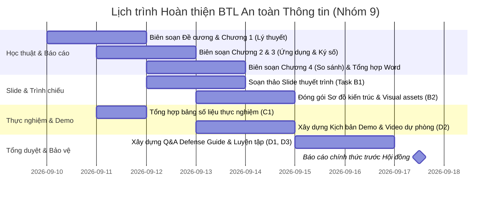

# Kế hoạch Hoàn thiện Bài tập lớn An toàn Thông tin - Nhóm 9 (SplitBind)

> **Dành cho Tác tử Thực thi:** BẮT BUỘC SỬ DỤNG KỸ NĂNG: `superpowers:executing-plans` hoặc `superpowers:subagent-driven-development` để triển khai từng tác vụ. Các bước sử dụng cú pháp checkbox (`- [ ]`) để theo dõi tiến độ.
> **Hạn chót Báo cáo:** 17/09/2026 (Còn 7 ngày).

**Mục tiêu:** Đưa toàn bộ Bài tập lớn An toàn Thông tin của Nhóm 9 ("Tìm hiểu và đề xuất Hệ thống truy vết toàn vẹn văn bản") từ hiện trạng (đã có mã nguồn sản phẩm và benchmark nghiên cứu phong phú nhưng thiếu sản phẩm học thuật bàn giao) về trạng thái hoàn chỉnh, sẵn sàng báo cáo xuất sắc trước hội đồng môn học vào ngày 17/09/2026.

**Kiến trúc Giải pháp Học thuật:**
1. Khung lý thuyết vững chắc: Trình bày bài bản lý thuyết Thủy vân số (DWT-DCT-QIM, Reed-Solomon, Semi-fragile HMAC), Chữ ký số (Ed25519, RFC 8785), và mô hình đe dọa (Threat Model).
2. Minh bạch hiện trạng hệ thống: Tách rõ hai tầng kiến trúc: Tầng Production (bảo vệ toàn vẹn tệp chính xác bằng Ed25519 + SHA-256 manifest trên Azure) và Tầng Research (thực nghiệm thuật toán Robust Fingerprinting và Semi-fragile Tamper Localization).
3. Đóng gói đầy đủ sản phẩm giao nộp: Slide thuyết trình, Báo cáo thuyết minh Word/PDF, Kịch bản demo (trực tiếp + video dự phòng), Bộ số liệu thực nghiệm đo lường thật (PSNR, SSIM, IoU), và Sổ tay phản biện bảo vệ (Q&A Defense Guide).

**Ràng buộc Toàn cục (Global Constraints):**
- **Nguyên tắc YAGNI:** Không phát triển tính năng mới ngoài phạm vi; không tái cấu trúc mã nguồn sản phẩm đang ổn định.
- **Tính Trung thực Học thuật:** Tuyệt đối không ngụy tạo số liệu thực nghiệm; sử dụng chính xác các kết quả đo lường từ benchmark V1, V2 và Integrity.
- **Ranh giới Sản phẩm vs Nghiên cứu:** Phân định rõ ràng giữa Production Release 0.1 (Exact-file integrity) và Research Algorithm Candidates (Semi-fragile watermark & Traitor tracing).
- **Ngôn ngữ Báo cáo:** Tiếng Việt học thuật chuẩn mực, đầy đủ dấu, thuật ngữ chuyên môn an toàn thông tin chuẩn xác.

---

## 1. Bảng Khảo sát Hiện trạng Chi tiết (Codebase Inventory)

| Hạng mục / Thành phần | Tệp / Mã nguồn Thực tế | Trạng thái Hoàn thiện | Phục vụ Yêu cầu | Còn thiếu để Sẵn sàng Báo cáo |
|---|---|---|---|---|
| **Lý thuyết & Thiết kế Kiến trúc** | `docs/superpowers/specs/2026-08-13-splitbind-production-design.md` `docs/decisions/001-azure-production-architecture.md` | Hoàn chỉnh về mặt kỹ thuật nội bộ | Req 1, 2, 3, 4 | Chưa tổng hợp thành các chương của Báo cáo thuyết minh (`.docx`) và các slide lý thuyết (`.pptx`). |
| **Thực nghiệm Thủy vân Bền vững (Robust Fingerprint)** | `research/python/src/splitbind_ref/dwt_dct_qim.py` `contracts/algorithm/attack-matrix.v1.json` `docs/evaluation/fingerprint-profile-v1.md` `docs/evaluation/fingerprint-profile-v2.md` | Hoàn chỉnh ở tầng nghiên cứu; đã đo 32.736 hàng thực nghiệm | Req 1, 2 | Chưa trích xuất biểu đồ trực quan, bảng số liệu so sánh các attack (JPEG, crop, resize, noise) vào slide và báo cáo. |
| **Thực nghiệm Định vị Sửa đổi (Tamper Localization)** | `research/python/src/splitbind_ref/integrity.py` `contracts/algorithm/integrity-profile.v1.json` `docs/evaluation/integrity-profile-v1.md` | Hoàn chỉnh thuật toán 128x128 DCT-HMAC; đo lường 4 loại tamper | Req 2 | Chưa có hình ảnh trực quan hóa vùng nghi vấn (IoU heatmap/visual) trong báo cáo học thuật. |
| **Hệ thống Ký số & Manifest Toàn vẹn** | `services/api/splitbind/release/manifest.py` `contracts/jsonschema/internal-manifest-v1.schema.json` `contracts/jsonschema/public-manifest-v1.schema.json` | Hoàn chỉnh production (Ed25519 + RFC 8785 canonical JSON) | Req 3 | Chưa có sơ đồ trực quan hóa luồng ký và cấu trúc manifest để giải thích trước hội đồng. |
| **Sản phẩm Web & Cloud Production** | `apps/web/` `services/api/` `https://splitbind.qivarn.id.vn` | Đã cutover live trên Azure VM; passed real issuance/verification | Req 2, 3 | Cần kịch bản demo chi tiết cho buổi bảo vệ (2 luồng: khớp toàn vẹn và cảnh báo không khớp). |
| **Tài liệu Giao tiếp Giảng viên** | `docs/project/lecturer-email-summary.md` | Đã tổng hợp 7 email trao đổi định hướng | Toàn bộ | Cần chuẩn bị phương án trả lời câu hỏi giảng viên về "tính mâu thuẫn giữa watermarking và chữ ký số". |
| **Sản phẩm Bàn giao Môn học** | Slide (`*.pptx`), Báo cáo (`*.docx`), Kịch bản thuyết trình | **0% (Chưa tồn tại)** | Toàn bộ | **Lỗ hổng lớn nhất (Critical Gap)**: Phải tập trung nguồn lực xây dựng ngay. |

---

## 2. Đánh giá Hai Trục đối với 4 Yêu cầu của Giảng viên

1. **Req 1: Cơ sở lý thuyết về Thủy vân số (Watermarking)**
   - *Technical Coverage:* **Một phần (Partial - Narrow Pipeline Focus)**. Codebase có biến đổi Haar DWT2, DCT2 8x8, Parity QIM, Reed-Solomon. Chưa có tài liệu tổng quan lý thuyết toàn diện về các miền nhúng (spatial vs transform), mô hình Cox, và Shannon capacity trade-off.
   - *Deliverable Readiness:* **Pending**. Chưa có slide hay chương báo cáo.
2. **Req 2: Ứng dụng watermarking trong truy vết thay đổi hình ảnh**
   - *Technical Coverage:* **Đạt ở mức Nghiên cứu (Verified Research)**. Cần phân định rõ: Đã cài đặt và đo lường thuật toán Semi-fragile DCT-HMAC cho bài toán định vị vùng can thiệp (`integrity.py`, IoU measured) VÀ bài toán truy vết nguồn phát hành (`fingerprint.py`). Trên production chỉ triển khai exact-integrity.
   - *Deliverable Readiness:* **Pending**. Chưa có slide minh họa.
3. **Req 3: Ứng dụng ký số trong bảo vệ thông tin truy vết hình ảnh**
   - *Technical Coverage:* **Đạt (Verified)** cho việc dùng Ed25519 bảo vệ siêu dữ liệu cấp phát và hash tệp qua RFC 8785; **Một phần (Partial)** cho việc tích hợp trực tiếp với watermark trích xuất từ ảnh biến đổi trên production.
   - *Deliverable Readiness:* **Pending**.
4. **Req 4: Phân tích so sánh Thủy vân số với các kỹ thuật khác**
   - *Technical Coverage:* **Một phần (Partial)**. Hiện mới có so sánh 1-1 giữa Chữ ký số và Thủy vân; thiếu Steganography, DRM, Content Hashing.
   - *Deliverable Readiness:* **Pending**.

---

## 3. Danh mục Công việc theo Thứ tự Ưu tiên (P0 - P1 - P2)

### WORKSTREAM A: ACADEMIC REPORT & THEORY (Nội dung Học thuật & Báo cáo)

#### Task A1 (P0): Biên soạn Đề cương và Chương 1 - Tổng quan & Cơ sở Lý thuyết (Req 1)
- **Mục tiêu:** Xây dựng phần lý thuyết thủy vân số hoàn chỉnh, chuẩn xác theo giáo trình An toàn thông tin.
- **Tệp tạo/sửa:** `docs/report/01-co-so-ly-thuyet-thuy-van-so.md`
- **Nội dung chính:**
  - Khái niệm, phân loại Thủy vân số: Miền không gian (Spatial - LSB) vs Miền tần số (Transform - DCT, DWT).
  - Tam giác đánh đổi cốt lõi: Độ bền vững (Robustness) - Độ trung thực/Tàng hình (Imperceptibility) - Dung lượng (Capacity).
  - Thuật toán lượng tử hóa QIM (Quantization Index Modulation) và mã sửa lỗi Reed-Solomon.
  - Phân loại theo mục đích: Robust (bảo vệ bản quyền/truy vết) vs Fragile/Semi-fragile (xác thực tính toàn vẹn/định vị sửa đổi).
- **Cách verify:** So sánh với đề cương chi tiết môn học ATTT (`123033 - An toan thong tin DCCT 2025.pdf`).

#### Task A2 (P0): Biên soạn Chương 2 - Ứng dụng Thủy vân số trong Truy vết & Định vị Sửa đổi (Req 2)
- **Mục tiêu:** Phân định rõ hai bài toán Traitor Tracing và Tamper Localization; trình bày chi tiết thuật toán của SplitBind.
- **Tệp tạo/sửa:** `docs/report/02-ung-dung-thuy-van-truy-vet-va-toan-ven.md`
- **Nội dung chính:**
  - Phân định rõ: Truy vết nguồn rò rỉ (Source Attribution / Traitor Tracing) vs Định vị can thiệp (Tamper Detection / Localization).
  - Thiết kế Semi-fragile Watermarking của SplitBind (`splitbind_ref/integrity.py`): Chia khối 128x128, trích xuất hệ số DCT tần số thấp, tạo mã xác thực HMAC-SHA256, nhúng vào 3 khối đối tác qua Parity QIM.
  - Phân tích số liệu thực nghiệm đo lường IoU từ `docs/evaluation/integrity-profile-v1.md` trên 4 loại can thiệp: `replace_text`, `cover_region`, `copy_move`, `insert_object`.
  - Phân tích giới hạn kỹ thuật: ảnh hưởng của nén JPEG mạnh và biến đổi hình học tới độ chính xác định vị.
- **Cách verify:** Đối soát 100% số liệu với `docs/evaluation/integrity-profile-v1.md`.

#### Task A3 (P0): Biên soạn Chương 3 - Ứng dụng Chữ ký số trong Bảo vệ Hồ sơ Truy vết (Req 3)
- **Mục tiêu:** Làm rõ vai trò của Chữ ký số Ed25519 và chuẩn hóa RFC 8785 trong việc bảo vệ hồ sơ cấp phát.
- **Tệp tạo/sửa:** `docs/report/03-ung-dung-chu-ky-so-bao-ve-ho-so.md`
- **Nội dung chính:**
  - Kiến trúc Manifest của SplitBind: Internal Manifest vs Public Manifest.
  - Vai trò của SHA-256 (xác thực tính toàn vẹn từng bit của tệp gốc và tệp kết quả).
  - Vai trò của Ed25519 (chứng thực nguồn gốc phát hành, chống chối bỏ).
  - Phân tích kỹ thuật giải quyết "mâu thuẫn giữa Thủy vân và Chữ ký số" (tách vai trò: file gốc kiểm tra bằng hash + signature; ảnh rò rỉ biến đổi dùng watermark để khôi phục issuance_id, sau đó tra cứu manifest đã ký).
  - Trích dẫn mã nguồn thực tế: `services/api/splitbind/release/manifest.py`.
- **Cách verify:** Đối soát với hợp đồng JSON Schema `contracts/jsonschema/internal-manifest-v1.schema.json`.

#### Task A4 (P0): Biên soạn Chương 4 - Phân tích So sánh Thủy vân số với các Kỹ thuật Khác (Req 4)
- **Mục tiêu:** Xây dựng ma trận so sánh toàn diện, đa chiều đáp ứng trọn vẹn tiêu chí Sufficiency.
- **Tệp tạo/sửa:** `docs/report/04-phan-tich-so-sanh-cac-ky-thuat.md`
- **Nội dung chính:**
  - So sánh 5 kỹ thuật: Robust Watermarking, Fragile/Semi-fragile Watermarking, Digital Signatures, Steganography, Perceptual Hashing / Content Hashing.
  - Hệ tiêu chí 7 chiều: (1) Mục tiêu an ninh, (2) Khả năng tồn tại qua nén/biến đổi, (3) Tính nhạy cảm từng bit, (4) Khả năng định vị vùng sửa đổi, (5) Dung lượng thông tin ẩn, (6) Yêu cầu hạ tầng khóa, (7) Giá trị chứng cứ pháp lý.
  - Phân tích sâu sự khác biệt giữa Giấu tin bí mật (Steganography - mục tiêu giấu sự tồn tại của thông điệp) và Thủy vân số (Watermarking - mục tiêu gắn chặt thông điệp với vật chủ để chống gỡ bỏ).
- **Cách verify:** Rà soát đủ 5 kỹ thuật và 7 tiêu chí so sánh.

---

### WORKSTREAM B: PRESENTATION SLIDES & VISUAL ASSETS (Slide & Tài liệu Trình chiếu)

#### Task B1 (P0): Thiết kế Slide Thuyết trình Chính thức (Req 1, 2, 3, 4)
- **Mục tiêu:** Xây dựng bộ slide báo cáo cô đọng, trực quan, chuyên nghiệp (khoảng 20-25 slide).
- **Tệp tạo/sửa:** `docs/slides/btl-nhom-9-splitbind-presentation.md` (và xuất sang định dạng trình chiếu PPTX qua công cụ tạo tài liệu).
- **Cấu trúc Slide:**
  1. Trang tiêu đề & Thành viên Nhóm 9.
  2. Đặt vấn đề: Bài toán bảo vệ tính toàn vẹn và truy vết văn bản trong kỷ nguyên số.
  3. Mục tiêu nghiên cứu & Yêu cầu của đề tài.
  4. Cơ sở lý thuyết Thủy vân số (DWT, DCT, QIM).
  5. Ứng dụng Thủy vân trong truy vết nguồn rò rỉ (Traitor Tracing).
  6. Ứng dụng Thủy vân Semi-fragile trong định vị sửa đổi (Tamper Localization).
  7. Bảng kết quả thực nghiệm Thủy vân (PSNR, SSIM, IoU dưới các tấn công).
  8. Ứng dụng Chữ ký số Ed25519 & Cấu trúc Manifest.
  9. Giải quyết mâu thuẫn giữa Thủy vân và Chữ ký số (Kiến trúc kết hợp).
  10. Ma trận so sánh Thủy vân với các kỹ thuật toàn vẹn khác.
  11. Giới thiệu Hệ thống SplitBind (Kiến trúc & Công nghệ).
  12. Demo hệ thống (Hình ảnh / Video luồng cấp phát & xác minh).
  13. Kết luận & Hướng phát triển.
- **Cách verify:** Đảm bảo bao phủ đầy đủ 4 yêu cầu chính thức của giảng viên.

#### Task B2 (P1): Đóng gói Biểu đồ & Sơ đồ Kiến trúc Chuẩn hóa
- **Mục tiêu:** Tạo các sơ đồ kiến trúc độ nét cao cho slide và báo cáo.
- **Tệp tạo/sửa:** `docs/slides/diagrams/`
- **Nội dung:**
  - Sơ đồ kiến trúc tổng thể SplitBind (React, Django, Azure VM, Caddy, Neon, R2).
  - Sơ đồ luồng dữ liệu cấp phát (Issuance Pipeline) & nhúng chữ ký.
  - Sơ đồ luồng dữ liệu xác minh (Verification Pipeline: Exact check $\rightarrow$ Manifest check $\rightarrow$ Watermark check).
  - Sơ đồ nguyên lý nhúng/trích xuất Semi-fragile DCT-HMAC.
- **Cách verify:** Sơ đồ đồng nhất với mã nguồn trong `services/api` và `contracts/`.

---

### WORKSTREAM C: EMPIRICAL BENCHMARK COMPILATION (Tổng hợp Thực nghiệm)

#### Task C1 (P0): Biên tập Bảng Số liệu Thực nghiệm Chính xác (Req 1, 2)
- **Mục tiêu:** Tổng hợp toàn bộ số liệu benchmark có sẵn thành bảng số liệu khoa học chuẩn mực.
- **Tệp tạo/sửa:** `docs/report/appendix-experimental-results.md`
- **Nội dung:**
  - Bảng độ trung thực ảnh (Fidelity): PSNR 41.69 dB, SSIM 0.9825 (`fidelity-report.json`).
  - Bảng tấn công biến đổi (V1 & V2 Benchmark): 32.736 hàng thực nghiệm, tỷ lệ false attribution = 0%, kết quả dưới JPEG-70, Crop-0.25, Resize-0.75, Gaussian noise (`fingerprint-profile-v1.md`).
  - Bảng định vị can thiệp sửa đổi: 48 hàng thực nghiệm, IoU của `replace_text` (0.055), `copy_move` (0.188), `insert_object` (0.118), `cover_region` (0.000) (`integrity-profile-v1.md`).
- **Cách verify:** Trích dẫn mã băm SHA-256 của các tệp kết quả gốc để đảm bảo tính toàn vẹn học thuật.

---

### WORKSTREAM D: DEMO SCRIPT & LIVE PRESENTATION PREPARATION (Kịch bản Demo & Báo cáo)

#### Task D1 (P0): Xây dựng Kịch bản Thuyết trình & Phân công Thuyết minh
- **Mục tiêu:** Kịch bản phân bổ thời gian chi tiết cho từng thành viên nhóm (khoảng 15-20 phút trình bày).
- **Tệp tạo/sửa:** `docs/presentation/presentation-script.md`
- **Nội dung:** Lời thoại từng slide, chuyển đoạn giữa các phần, phân công ai nói phần nào.
- **Cách verify:** Tổng thời gian tập dượt nằm trong khoảng 15-20 phút.

#### Task D2 (P0): Xây dựng Kịch bản Demo Trực tiếp & Kịch bản Dự phòng (Contingency Plan)
- **Mục tiêu:** Đảm bảo demo diễn ra trơn tru, không gặp sự cố mạng hoặc cloud.
- **Tệp tạo/sửa:** `docs/presentation/demo-guide.md`
- **Kịch bản chính (Live Production Demo):**
  - Bước 1: Đăng nhập hệ thống SplitBind (`https://splitbind.qivarn.id.vn`).
  - Bước 2: Cấp phát tài liệu PDF cho người nhận, quan sát tiến trình tạo chữ ký Ed25519 và manifest.
  - Bước 3: Tải tệp PDF đã cấp phát về máy.
  - Bước 4: Kiểm tra tính toàn vẹn tệp nguyên bản $\rightarrow$ Kết quả `VERIFIED_INTACT` (Hiển thị tệp khớp bản cấp phát, chữ ký hợp lệ).
  - Bước 5: Thử nghiệm tải lên tệp đã bị sửa đổi nội dung $\rightarrow$ Kết quả hiển thị đúng bản chất: `Chưa tìm thấy bản cấp phát khớp` (Exact hash không trùng, không suy diễn sai lệch).
- **Kịch bản nghiên cứu (Research Watermark Demo):**
  - Chạy script Python trích xuất watermark và định vị vùng nghi vấn trên tệp bị can thiệp (`run_integrity_benchmark.py`).
- **Kịch bản dự phòng (Offline / Network Failure Fallback):**
  - Quay sẵn video chất lượng cao cho toàn bộ luồng demo.
  - Chuẩn bị môi trường Docker Compose offline cục bộ nếu mất kết nối Internet.
- **Cách verify:** Diễn tập thử nghiệm kịch bản demo 2 lần trước ngày báo cáo.

#### Task D3 (P1): Bộ Câu hỏi Phản biện & Hướng dẫn Trả lời (Q&A Defense Guide)
- **Mục tiêu:** Dự báo các câu hỏi hóc búa của giảng viên và hội đồng, chuẩn bị câu trả lời sắc sảo.
- **Tệp tạo/sửa:** `docs/presentation/defense-qa-guide.md`
- **Các câu hỏi trọng tâm:**
  1. *Câu hỏi 1 (Giảng viên đã từng lưu ý):* "Tại sao lại kết hợp Thủy vân và Chữ ký số? Hai cơ chế này có mâu thuẫn không khi thủy vân làm đổi bit còn chữ ký số yêu cầu toàn vẹn bit?"
     - *Trả lời:* Giải thích nguyên lý phân tầng: Chữ ký số ký trên canonical manifest (chứa metadata và hash của tệp sau khi đã nhúng thủy vân), bảo vệ tính toàn vẹn và chống chối bỏ của việc cấp phát. Thủy vân phục vụ kênh rò rỉ biến đổi (analog/lossy) để tìm lại ID cấp phát khi tệp đã mất toàn vẹn bit.
  2. *Câu hỏi 2:* "Tại sao hệ thống production lại trả về 'Chưa tìm thấy bản cấp phát khớp' thay vì tự động nhận diện vùng sửa đổi trên giao diện web?"
     - *Trả lời:* Minh bạch ranh giới kỹ thuật: SplitBind áp dụng cổng kiểm soát an toàn (Release Gate). Thuật toán định vị sửa đổi (IoU ~ 0.09) và fingerprinting chưa vượt qua ngưỡng khắt khe (95% robustness) nên được giữ ở tầng nghiên cứu có kiểm soát, không deploy vội vã lên production để tránh kết luận sai lệch cho người dùng.
  3. *Câu hỏi 3:* "Sự khác biệt căn bản giữa Thủy vân số và Giấu tin (Steganography) là gì?"
     - *Trả lời:* Trình bày rõ: Steganography ưu tiên tối đa tính tàng hình và dung lượng để đối phương không biết có tin ẩn (thường yếu trước biến đổi ảnh). Watermarking ưu tiên độ bền vững (Robustness) để tồn tại trước các phép biến đổi nhằm bảo vệ bản quyền/truy vết.
- **Cách verify:** Đọc lại email giảng viên và rà soát toàn bộ các điểm nhạy cảm của hệ thống.

---

## 4. Lịch trình Thực hiện Tối ưu (10/09 - 17/09/2026)

- **Giai đoạn 1 (10/09 - 12/09): Đóng băng Nội dung Học thuật & Thực nghiệm**
  - Hoàn thành Chương 1, 2, 3, 4 dạng Markdown.
  - Tổng hợp đầy đủ bảng số liệu thực nghiệm thật từ benchmark V1, V2, Integrity.
- **Giai đoạn 2 (12/09 - 14/09): Đóng gói Sản phẩm Bàn giao (Slide & Word)**
  - Chuyển đổi nội dung học thuật sang Báo cáo tổng kết hoàn chỉnh (`.docx`/`.pdf`).
  - Hoàn thành bộ Slide thuyết trình (`.pptx`).
  - Thiết kế hoàn thiện các sơ đồ kiến trúc độ nét cao.
- **Giai đoạn 3 (14/09 - 16/09): Diễn tập Demo & Sổ tay Phản biện**
  - Soạn thảo kịch bản demo chi tiết, quay video dự phòng.
  - Hoàn thiện Sổ tay phản biện Q&A và diễn tập thuyết trình trong nhóm.
- **Giai đoạn 4 (17/09): Báo cáo chính thức trước Giảng viên và Lớp.**

---

## 5. Sản phẩm Cuối cùng sau khi Hoàn thành Kế hoạch

Khi hoàn tất kế hoạch này, bộ sản phẩm BTL của Nhóm 9 sẽ bao gồm:
1. **Báo cáo Thuyết minh Môn học (DOCX/PDF):** Hoàn chỉnh 4 chương bám sát 4 yêu cầu của giảng viên, có đầy đủ công thức toán học, bảng số liệu thực nghiệm và tài liệu tham khảo chuẩn IEEE.
2. **Slide Thuyết trình (PPTX):** 20-25 slide thiết kế trực quan, chuyên nghiệp, cân đối giữa cơ sở lý thuyết, kiến trúc giải pháp, số liệu thực nghiệm và demo.
3. **Live Cloud Demo & Video Dự phòng:** Hệ thống SplitBind hoạt động ổn định trên Azure VM kèm video quay sẵn toàn bộ thao tác.
4. **Research Benchmark Suite:** Thư viện Python với đầy đủ mã nguồn thuật toán DWT-DCT-QIM, Semi-fragile HMAC, test suite tự động và attack matrix.
5. **Sổ tay Phản biện Bảo vệ (Defense Q&A Guide):** Bộ câu hỏi - câu trả lời chi tiết cho tất cả các tình huống phản biện của giảng viên.
