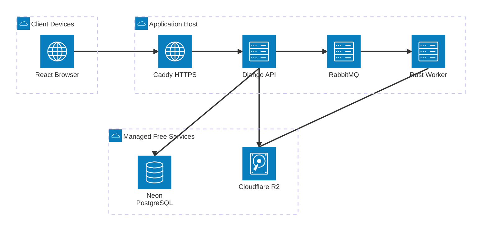
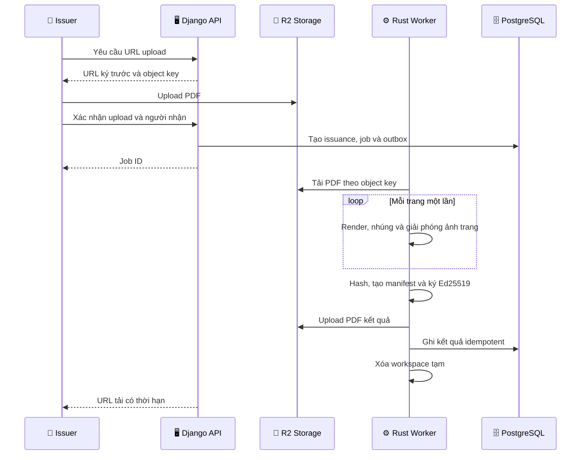
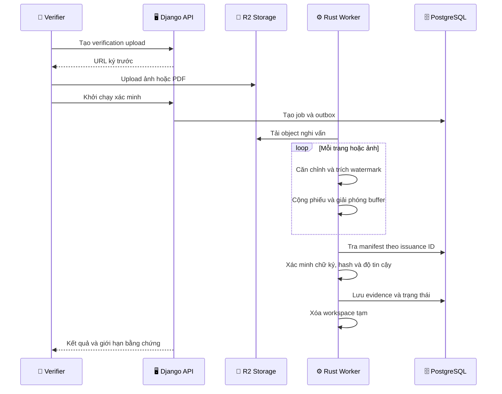

# Đặc tả thiết kế SplitBind

_Đặc tả production-quality cho bài tập lớn An toàn thông tin của Nhóm 9, ngày 13/08/2026_

---

## 📋 Tổng quan

SplitBind là ứng dụng web cấp phát PDF có dấu vân tay số riêng cho từng người nhận, xác minh tài liệu nghi rò rỉ, đánh giá tính toàn vẹn và bảo vệ hồ sơ cấp phát bằng chữ ký số.

Tên đề tài trong bảng phân công chính thức là **“Tìm hiểu và đề xuất Hệ thống truy vết toàn vẹn văn bản”**. Nhóm báo cáo dự kiến ngày **17/09/2026**, thứ tự **2**, theo [bảng phân công học phần](../../course/capstone-assignment-and-presentation-schedule.pdf).

> **Giới hạn bằng chứng:** Hệ thống có thể kết luận một tài liệu nghi vấn khớp với phiên bản đã cấp cho một người nhận. Hệ thống không được kết luận người nhận đó chính là người thực hiện hành vi rò rỉ.

### Mục tiêu duy nhất

Xây dựng và đánh giá một hệ thống có khả năng liên kết tài liệu nghi vấn với hồ sơ cấp phát, kiểm tra tính xác thực của hồ sơ và cung cấp bằng chứng có định lượng về tình trạng toàn vẹn của tài liệu.

### Phạm vi đã xác nhận

| Nhóm | Nội dung |
| --- | --- |
| **Lõi** | Cấp phát PDF riêng, truy vết bản phát hành, xác minh hồ sơ, đánh giá toàn vẹn |
| **Bảo vệ bắt buộc** | Xác thực, phân quyền, HTTPS, audit log, quản lý khóa, giới hạn tài nguyên |
| **Nghiên cứu bắt buộc** | Attack simulator, benchmark độ bền, đo sai số và chất lượng ảnh |
| **Nâng cao sau lõi** | Định vị vùng sửa nâng cao, mã chống thông đồng Tardos, chống biến dạng mạnh |
| **Ngoài phạm vi** | DRM tuyệt đối, ngăn chụp màn hình, kết luận pháp lý về người làm rò rỉ, SLA thương mại |

### Định nghĩa production-quality

Trong dự án này, _production-quality_ nghĩa là mã nguồn có kiểm thử, phân quyền, quản lý bí mật, quan sát được, triển khai tái lập, có backup/restore, rollback và giới hạn tài nguyên. Hạ tầng miễn phí không cung cấp SLA hoặc tính sẵn sàng cao, vì vậy sản phẩm được mô tả là **production-quality ở quy mô học thuật trên free tier**.

## 🎯 Yêu cầu và tiêu chí thành công

### Vai trò người dùng

| Vai trò | Quyền chính |
| --- | --- |
| **Administrator** | Quản lý tài khoản, khóa, chính sách lưu giữ và cấu hình hệ thống |
| **Issuer** | Tạo người nhận, tải PDF, tạo bản cấp phát, tải kết quả thuộc phạm vi được phép |
| **Verifier** | Gửi ảnh/PDF nghi vấn, xem kết quả xác minh được cấp quyền |
| **Auditor** | Chỉ đọc hồ sơ cấp phát, kết quả và audit log; không xem khóa bí mật |

Mọi endpoint nghiệp vụ mặc định yêu cầu đăng nhập. Phân quyền được kiểm tra ở cả API và truy vấn dữ liệu, không chỉ ẩn nút trên giao diện.

### Yêu cầu chức năng

#### Cấp phát tài liệu

1. Issuer tải PDF hợp lệ lên bằng URL ký trước của object storage.
2. Hệ thống xác minh loại file bằng nội dung, không tin phần mở rộng hoặc MIME do trình duyệt gửi.
3. Hệ thống từ chối PDF mã hóa, PDF vượt giới hạn hoặc PDF không render được an toàn.
4. Issuer chọn một người nhận và tạo yêu cầu cấp phát.
5. Hệ thống sinh `issuance_id` ngẫu nhiên 128 bit; ID công khai không chứa thông tin cá nhân.
6. Worker nhúng fingerprint bền vững và watermark toàn vẹn vào từng trang.
7. Worker tạo PDF kết quả, tính SHA-256 và tạo manifest canonical JSON.
8. Worker ký manifest bằng Ed25519 và lưu chữ ký tách khỏi PDF.
9. Hệ thống lưu hồ sơ, audit event và URL tải có thời hạn.
10. Tệp tạm được xóa dù job thành công, thất bại, timeout hay bị hủy.

#### Xác minh tài liệu

1. Verifier tải lên ảnh hoặc PDF nghi vấn.
2. Worker render và xử lý từng trang độc lập.
3. Worker căn chỉnh hình học, trích xuất các bản sao fingerprint và bỏ phiếu theo độ tin cậy.
4. API tra cứu hồ sơ theo `issuance_id` khôi phục được.
5. Hệ thống xác minh chữ ký manifest và, nếu có file nguyên byte, so sánh SHA-256.
6. Watermark toàn vẹn cung cấp dấu hiệu và bản đồ vùng nghi sửa khi đủ dữ liệu.
7. Kết quả ghi rõ dữ kiện, độ tin cậy, giới hạn và trạng thái kết luận.
8. Tệp nghi vấn và ảnh trung gian được xóa theo chính sách lưu giữ.

### Trạng thái kết quả xác minh

| Trạng thái | Điều kiện tối thiểu |
| --- | --- |
| `VERIFIED_INTACT` | Fingerprint hợp lệ, manifest có chữ ký hợp lệ và hash file khớp |
| `SOURCE_IDENTIFIED_MODIFIED` | Fingerprint đủ tin cậy, manifest hợp lệ nhưng hash không khớp hoặc watermark toàn vẹn báo thay đổi |
| `PARTIAL_EVIDENCE` | Có dữ liệu watermark nhưng không đạt ngưỡng gán nguồn |
| `NO_WATERMARK` | Không phát hiện dữ liệu watermark trên phần tài liệu đã phân tích |
| `INVALID_MANIFEST` | Có ID hồ sơ nhưng chữ ký manifest không hợp lệ hoặc thuật toán/khóa bị thu hồi |
| `PROCESSING_FAILED` | Input không xử lý được hoặc job thất bại sau số lần retry cho phép |

`NO_WATERMARK` không có nghĩa tài liệu chắc chắn không thuộc hệ thống. `SOURCE_IDENTIFIED_MODIFIED` không có nghĩa người nhận thực hiện hành vi sửa hoặc phát tán.

### Giới hạn đầu vào ban đầu

| Tài nguyên | Giới hạn mặc định | Cách áp dụng |
| --- | ---: | --- |
| PDF đầu vào | 10 MiB | Chặn trước upload và xác minh lại phía server |
| Ảnh nghi vấn | 10 MiB | Chặn trước upload và sau decode |
| Số trang PDF | 50 | Kiểm tra trước khi tạo job |
| Kích thước ảnh decode | 40 megapixel | Từ chối trước xử lý thuật toán |
| Job đồng thời mỗi worker | 1 | Cấu hình cứng mặc định |
| Thời gian một job | 10 phút | Timeout và hủy có cleanup |
| Retry | 2 lần | Chỉ retry lỗi tạm thời; job phải idempotent |
| `/tmp` của worker | 2 GiB | `tmpfs` hoặc volume có quota |

Giới hạn được cấu hình bằng biến môi trường, nhưng production không được khởi động nếu giá trị vượt trần an toàn được mã hóa trong cấu hình.

## 🏗️ Kiến trúc hệ thống

### Nguyên tắc phân chia

- React chịu trách nhiệm trải nghiệm người dùng, không quyết định quyền truy cập
- Django là control plane: xác thực, phân quyền, metadata, job và audit
- RabbitMQ truyền message có schema và version; không lưu file PDF trong message
- Rust worker là data plane: PDF, ảnh, watermark, hash, chữ ký và cleanup
- Python research là implementation tham chiếu và benchmark, không phục vụ request production
- PostgreSQL chỉ lưu metadata; R2 lưu object có vòng đời

_Sơ đồ triển khai logic gồm trình duyệt, các dịch vụ ứng dụng, hàng đợi, cơ sở dữ liệu và object storage:_

### Thành phần và công nghệ

| Thành phần | Công nghệ | Trách nhiệm |
| --- | --- | --- |
| Frontend | React 19, TypeScript, Vite | UI, form, tiến độ, hiển thị bằng chứng |
| API | Python 3.11+, Django 5.2 LTS, DRF[^1] | Auth, RBAC, metadata, OpenAPI, audit |
| Broker | RabbitMQ | Job queue, retry routing và dead-letter queue |
| Worker | Rust stable, Tokio, Lapin[^2] | Xử lý PDF/ảnh, thuật toán, ký và cleanup |
| Research | Python, NumPy, OpenCV, PyWavelets | Prototype, test vector, benchmark và biểu đồ |
| Database | PostgreSQL trên Neon Free | Metadata, outbox, job, manifest và audit |
| Object storage | Cloudflare R2 Standard[^5] | Input/output có thời hạn và server-side encryption |
| Edge | Caddy | HTTPS, security headers, reverse proxy, static frontend |
| Packaging | Docker Compose | Môi trường nhất quán trên Windows, macOS và Linux |
| CI | GitHub Actions | Test, lint, scan, SBOM và multi-arch build check |

### Quyết định queue

Production không dùng Celery vì worker là Rust. Django ghi job và `outbox_event` trong cùng transaction PostgreSQL; một publisher phát message JSON có `schema_version` sang RabbitMQ. Rust worker consume message bằng AMQP, ghi kết quả idempotent và phát result event. Cơ chế này tránh trạng thái “database đã lưu job nhưng message chưa gửi”.

Message chỉ chứa ID, object key, checksum, loại job, deadline và correlation ID. Message không chứa PDF, khóa bí mật hoặc thông tin cá nhân không cần thiết.

### Luồng cấp phát

### Luồng xác minh

### Vòng đời job

```mermaid
stateDiagram-v2
    accTitle: Vòng đời job SplitBind
    accDescr: Job đi từ tạo mới tới hàng đợi, xử lý và hoàn thành; lỗi tạm thời được retry có giới hạn còn lỗi vĩnh viễn đi vào dead letter

    [*] --> Created: 📝 Transaction tạo job
    Created --> Queued: 📨 Outbox đã publish
    Queued --> Processing: ⚙️ Worker nhận lease
    Processing --> Succeeded: ✅ Kết quả đã commit
    Processing --> RetryableFailed: ⚠️ Lỗi tạm thời
    Processing --> Failed: ❌ Lỗi vĩnh viễn
    RetryableFailed --> Queued: 🔄 Còn retry
    RetryableFailed --> DeadLettered: 🚫 Hết retry
    Queued --> Cancelled: 🛑 Người có quyền hủy
    Processing --> Cancelled: 🛑 Worker xác nhận hủy
    Succeeded --> [*]: 🏁 Hoàn thành
    Failed --> [*]: 🏁 Đóng
    DeadLettered --> [*]: 🏁 Cần điều tra
    Cancelled --> [*]: 🧹 Đã cleanup
```

## 🔐 Mô hình bảo mật và bằng chứng

### Mô hình đe dọa

Hệ thống giả định attacker có thể:

- xem và sao chép PDF đã cấp
- nén, crop, resize, xoay, chụp màn hình hoặc thay đổi nội dung
- tải lên PDF/ảnh độc hại nhằm tiêu thụ CPU, RAM hoặc disk
- thử đoán ID, replay request hoặc truy cập hồ sơ không thuộc quyền
- lấy nhiều bản cấp phát và ghép chúng để làm yếu fingerprint
- đọc mã nguồn công khai trong tương lai

Hệ thống không giả định có thể chống attacker đã chiếm root server, lấy được khóa ký production hoặc kiểm soát toàn bộ thiết bị người nhận.

### Ba lớp bằng chứng

| Lớp | Mục đích | Tính chất |
| --- | --- | --- |
| Robust fingerprint | Nhận dạng bản cấp phát sau biến đổi | Cố sống sót sau xử lý ảnh |
| Semi-fragile watermark | Phát hiện và hỗ trợ định vị thay đổi | Chấp nhận biến đổi vô hại trong ngưỡng, phản ứng với sửa nội dung |
| Signed manifest | Xác thực hồ sơ và file nguyên bản | Chính xác theo byte và khóa ký |

### Thuật toán fingerprint

Pipeline chuẩn:

1. Biểu diễn `issuance_id` và version thành payload nhị phân
2. Thêm CRC để phát hiện decode sai
3. Mã hóa Reed–Solomon và interleave bit
4. Sinh vị trí tile từ khóa watermark và nonce tài liệu bằng CSPRNG
5. Áp dụng DWT, DCT và QIM trên hệ số trung tần
6. Nhúng lặp payload trên nhiều tile và trang
7. Thêm template đồng bộ hình học
8. Khi decode, dùng ORB/RANSAC để căn chỉnh, trích nhiều bản sao và bỏ phiếu mềm

Tham số thuật toán được version hóa. Không thay đổi tham số production mà không tạo version mới và benchmark hồi quy.

### Watermark toàn vẹn

Mỗi vùng trang nhận một mã xác thực dẫn xuất từ nội dung vùng, vị trí, document nonce và khóa riêng cho mục đích toàn vẹn. Kết quả chỉ là tín hiệu kỹ thuật; bản đồ vùng sửa phải đi kèm ngưỡng, sai số và cảnh báo rằng biến đổi hình học/nén mạnh có thể tạo false positive.

### Manifest và chữ ký

Manifest nội bộ dùng canonical JSON và tối thiểu chứa:

- `schema_version`
- `issuance_id`
- `document_id`
- `recipient_id`
- `issued_at`
- `source_sha256`
- `output_sha256`
- `fingerprint_algorithm`
- `integrity_algorithm`
- `signing_key_id`
- `retention_policy_id`

Ed25519 ký bytes canonical của manifest. Khóa ký và khóa watermark là hai key family riêng. Public key và trạng thái thu hồi được lưu trong database; private key không lưu trong Git, image hoặc database.

`recipient_id` là dữ liệu truy cập có kiểm soát, không xuất hiện trong manifest chia sẻ ra ngoài. Bản manifest dùng làm bằng chứng bên ngoài chỉ chứa `issuance_id` giả danh; việc ánh xạ về người nhận chỉ được thực hiện trong hệ thống bởi vai trò có quyền và phải sinh audit log.

### Quản lý khóa

- Local: khóa thử nghiệm nằm trong file ignored, permission tối thiểu và chỉ dùng test data
- CI: khóa test cố định không có giá trị production
- Production Oracle: private key nằm trong OCI Vault nếu tài khoản cấp được Always Free Vault
- Fallback Mac: private key PKCS#8 mã hóa nằm ngoài repository và được mount read-only; passphrase được nhập khi khởi động, không ghi vào shell history
- Mỗi chữ ký ghi `key_id`; rotation tạo khóa mới, khóa cũ chỉ chuyển sang verify-only
- Thu hồi khóa không xóa public key hoặc hồ sơ lịch sử

### Bảo mật web

- Session cookie `HttpOnly`, `Secure`, `SameSite=Lax`; không lưu JWT trong `localStorage`
- CSRF bắt buộc cho mutation từ browser
- Rate limit theo account, IP và loại job
- CORS không mở rộng vì frontend và API dùng cùng origin
- Security headers gồm CSP, HSTS, `X-Content-Type-Options` và frame restrictions
- Presigned URL có thời hạn ngắn, giới hạn object key và không cấp quyền list bucket
- Audit log append-only ở cấp ứng dụng; mọi sự kiện có actor, action, target, timestamp, correlation ID và outcome
- Log không chứa password, session, private key, presigned URL hoàn chỉnh hoặc nội dung PDF

## 🧠 Kiểm soát tài nguyên và vòng đời dữ liệu

### Quy tắc xử lý

- Xử lý từng trang và giải phóng buffer ngay sau khi ghi output
- Không render đồng thời nhiều trang trong một worker
- Không dùng file người dùng làm tên đường dẫn
- Mỗi job dùng workspace ngẫu nhiên nằm trong thư mục đã kiểm soát
- `defer` trong Rust phải cleanup workspace; supervisor cũng dọn workspace mồ côi khi khởi động
- Output được upload trước khi xóa local; checksum được kiểm tra sau upload
- Job idempotent theo `(job_id, attempt)` và không tạo object kết quả trùng
- Worker chạy non-root, filesystem root read-only và chỉ `/tmp` được ghi

### Chính sách lưu giữ mặc định

| Dữ liệu | Thời hạn | Hành động hết hạn |
| --- | ---: | --- |
| Upload chưa gắn job | 24 giờ | R2 lifecycle xóa |
| Input cấp phát | 7 ngày sau thành công | Xóa object, giữ hash và metadata |
| PDF kết quả | 30 ngày | Xóa object; issuer có thể xóa sớm |
| Input xác minh | 24 giờ sau kết quả | Xóa object |
| Ảnh trung gian | Không lưu | Xóa ngay từng trang |
| Manifest và chữ ký | Theo vòng đời hồ sơ môn học | Lưu metadata nhỏ trong PostgreSQL |
| Audit log | Tối thiểu đến hết học phần | Xuất backup trước cleanup |
| CI artifact lỗi | 1 ngày | GitHub tự xóa |

### Hạn mức môi trường local

- Docker Compose dùng profile `core`, `research`, `observability` và `full`
- Máy Mac M2 RAM 8 GiB mặc định chỉ chạy `core`; worker concurrency 1
- Không chạy Docker Desktop và Lima server cùng lúc nếu không cần
- Cache package dùng chung nhưng có lệnh audit và prune có kiểm tra
- Benchmark dataset tải theo manifest/checksum vào thư mục ignored và xóa được tái lập
- Multi-stage image không mang compiler, cache hoặc test data vào runtime

## 💾 Dữ liệu và API

### Thực thể chính

| Thực thể | Nội dung |
| --- | --- |
| `User` | Tài khoản và vai trò |
| `Recipient` | Định danh người nhận thuộc phạm vi tổ chức |
| `Document` | Metadata tài liệu nguồn, không chứa binary |
| `Issuance` | Liên kết document, recipient và fingerprint ID |
| `Manifest` | Canonical payload, chữ ký, key ID và hash |
| `Job` | Loại, trạng thái, attempt, deadline và lỗi an toàn |
| `Verification` | Evidence, confidence và kết luận |
| `AuditEvent` | Sự kiện append-only |
| `OutboxEvent` | Message chờ publish nguyên tử |
| `SigningKey` | Public key, trạng thái và thời gian hiệu lực |

Thông tin cá nhân không được nhúng trực tiếp vào watermark. `recipient_id` chỉ xuất hiện trong hồ sơ được phân quyền; watermark chỉ mang `issuance_id` giả danh.

### API tối thiểu

| Method | Endpoint | Mục đích |
| --- | --- | --- |
| `POST` | `/api/v1/uploads` | Cấp URL upload có thời hạn |
| `POST` | `/api/v1/issuances` | Tạo job cấp phát |
| `GET` | `/api/v1/issuances/{id}` | Xem hồ sơ được cấp quyền |
| `POST` | `/api/v1/verifications` | Tạo job xác minh |
| `GET` | `/api/v1/verifications/{id}` | Xem evidence và kết luận |
| `POST` | `/api/v1/jobs/{id}/cancel` | Yêu cầu hủy job |
| `GET` | `/api/v1/jobs/{id}` | Theo dõi trạng thái |
| `GET` | `/health/live` | Liveness không phụ thuộc dịch vụ ngoài |
| `GET` | `/health/ready` | Readiness của DB, broker và cấu hình khóa |

OpenAPI là nguồn sự thật cho contract frontend. API client TypeScript được sinh trong CI và CI thất bại nếu schema thay đổi mà client chưa cập nhật.

## 🧪 Kiểm thử và đánh giá

### Kim tự tháp kiểm thử

- Rust unit tests cho codec, canonicalization, cleanup và state transition
- Python/Rust shared test vectors cho DWT-DCT-QIM, Reed–Solomon và decode
- Property-based tests cho payload, corruption và idempotency
- Django unit/integration tests cho permission, outbox, API và retention
- Contract tests giữa OpenAPI và frontend
- React tests cho form, trạng thái job và cách hiển thị giới hạn bằng chứng
- End-to-end tests cho cấp phát và xác minh bằng PDF nhỏ không có dữ liệu cá nhân
- Container tests cho non-root, read-only filesystem, health check và resource limit

### Attack matrix bắt buộc

| Nhóm biến đổi | Mức thử tối thiểu |
| --- | --- |
| JPEG | Quality 95, 85, 70, 50 |
| Crop | 10%, 25%, 50% diện tích |
| Resize | 0.5x, 0.75x, 1.5x |
| Rotation | ±1°, ±3°, ±5° |
| Brightness/contrast | Ba mức có kiểm soát |
| Noise/blur | Gaussian ở ba mức |
| Screenshot | Hai độ phân giải và một biến dạng phối cảnh |
| Combined | JPEG + crop; screenshot + perspective |
| Tamper | Thay chữ, che vùng, copy-move và chèn đối tượng |

### Chỉ số

| Chỉ số | Ý nghĩa |
| --- | --- |
| Detection rate | Tỷ lệ phát hiện đúng watermark |
| BER | Tỷ lệ bit giải mã sai |
| False positive rate | Tỷ lệ báo watermark trên tài liệu sạch ngoài hệ thống |
| False attribution rate | Tỷ lệ gán nhầm issuance |
| PSNR / SSIM | Chất lượng cảm nhận sau nhúng |
| Localization IoU | Độ trùng bản đồ vùng sửa với ground truth |
| Peak RSS | RAM đỉnh của worker |
| Processing time/page | Hiệu năng theo trang |
| Temporary disk peak | Dung lượng tạm đỉnh mỗi job |

### Ngưỡng release MVP

- Không có false attribution trên bộ test nghiệm thu được version hóa
- Fingerprint decode thành công ít nhất 95% với JPEG quality 70 và resize 0.75x
- Fingerprint decode thành công ít nhất 90% với crop 25% khi phần còn lại chứa đủ tile
- PSNR trung bình tối thiểu 38 dB và SSIM tối thiểu 0.95 trên bộ ảnh nghiệm thu
- Peak RSS worker không vượt 1.5 GiB với input giới hạn
- Temporary disk peak không vượt 2 GiB
- Mọi đường thành công, lỗi, timeout và cancel đều có test cleanup
- Không có lỗ hổng mức critical/high chưa có quyết định chấp nhận rủi ro bằng văn bản

Ngưỡng screenshot, biến dạng phối cảnh và localization IoU được báo cáo như kết quả nghiên cứu, không là điều kiện chặn MVP cho đến khi baseline thực nghiệm đầu tiên hoàn tất. Không được thay đổi bộ test để che giấu kết quả kém.

## 🚀 Triển khai và vận hành

### Môi trường

| Môi trường | Nền tảng | Vai trò |
| --- | --- | --- |
| Development | Windows WSL2/Docker và macOS | Code, test nhanh, profile theo nhu cầu |
| CI | GitHub Actions Ubuntu | Kiểm thử, scan và build validation |
| Primary | Oracle Always Free Debian/Ubuntu ARM64 | Server công khai chính nếu cấp được capacity |
| Fallback | macOS + Lima + Debian 13 ARM64 | Staging, demo và server dự phòng |
| Offline demo | Docker Compose trên laptop | Không phụ thuộc Internet trong buổi báo cáo |

MacBook Air M2 không cài Debian trực tiếp. Lima dùng Apple Virtualization Framework để chạy Debian 13 ARM64 minimal.[^3][^4] VM mặc định 4 CPU, 4 GiB RAM và disk sparse tối đa 30 GiB; chỉ một worker job chạy đồng thời.

### CI/CD

Pull request phải qua:

1. format và lint
2. type checking
3. unit và integration tests
4. frontend contract tests
5. dependency, secret và license scan
6. container build test cho `linux/amd64` và `linux/arm64`
7. SBOM generation không lưu quá thời hạn cần thiết

Benchmark đầy đủ chạy thủ công hoặc theo lịch, không chạy mọi commit để tránh vượt hạn mức GitHub Actions của gói miễn phí.[^6] Deploy production yêu cầu approval, backup metadata, migration có rollback và health check sau deploy. Nếu health check thất bại, quay lại image digest trước đó.

### Backup và khôi phục

- PostgreSQL metadata xuất backup mã hóa theo lịch và trước migration
- Manifest/chữ ký có thể tái xuất từ database nhưng PDF đã hết hạn không được hứa khôi phục
- R2 lifecycle là chính sách xóa, không phải backup
- Private key backup được mã hóa, lưu tách máy chủ và kiểm tra restore bằng khóa test
- Runbook phục hồi phải chứng minh có thể dựng server mới từ repository, secret và backup metadata

### Quan sát

Các metric tối thiểu:

- queue depth và age của job lâu nhất
- job success/failure/retry theo loại
- thời gian và RAM đỉnh theo trang
- temporary disk peak và cleanup failure
- R2/Neon usage so với free tier
- HTTP latency/error rate
- lần ký/xác minh thất bại và key ID liên quan

Alert ưu tiên cleanup failure, disk trên 80%, queue bị kẹt, khóa sắp hết hạn và database gần quota.

## 🗺️ Thứ tự triển khai

1. Đóng băng threat model, data contract và bộ PDF/ảnh nghiệm thu nhỏ
2. Viết Python reference implementation và attack simulator
3. Benchmark baseline, chốt thuật toán và tham số version 1
4. Tạo shared test vectors và port lõi sang Rust
5. Xây Rust worker với giới hạn tài nguyên và cleanup
6. Xây Django API, RBAC, transactional outbox và audit
7. Tích hợp RabbitMQ, R2 và PostgreSQL
8. Xây React UI từ OpenAPI
9. Hoàn thiện integration, security và multi-arch tests
10. Triển khai primary/fallback, diễn tập backup, rollback và offline demo

Không bắt đầu chức năng chống thông đồng hoặc định vị nâng cao trước khi hai workflow lõi đạt ngưỡng MVP.

## ⚠️ Rủi ro và biện pháp

| Rủi ro | Mức | Biện pháp |
| --- | --- | --- |
| Watermark không đạt tuyên bố | Rất cao | Benchmark trước UI, công bố đúng giới hạn |
| Phạm vi quá rộng trước 17/09 | Cao | Cổng MVP, nâng cao chỉ sau lõi |
| Build OpenCV/PDF đa kiến trúc | Cao | Pin image/dependency, CI amd64/arm64 sớm |
| Free tier thay đổi hoặc hết capacity | Cao | Oracle primary, Mac fallback, offline demo |
| RAM 8 GiB trên Mac | Trung bình | Lima 4 GiB, concurrency 1, Compose profiles |
| Lộ khóa hoặc presigned URL | Cao | Vault/mount read-only, redaction, rotation |
| PDF độc hại gây DoS | Cao | Giới hạn trước decode, timeout, sandbox container |
| Cleanup sai làm đầy disk | Cao | Quota, `defer`, sweeper, metric và fault-injection test |
| Gán nguồn bị hiểu thành buộc tội | Cao | Ngôn ngữ bằng chứng bắt buộc trong UI/báo cáo |

## ✅ Tiêu chí hoàn tất

Dự án chỉ được xem là hoàn tất khi:

- hai workflow lõi chạy end-to-end trên deployment tái lập
- thuật toán được đánh giá bằng attack matrix và metric đã định nghĩa
- manifest Ed25519 được xác minh độc lập bằng public key
- permission tests chứng minh người dùng không đọc tài nguyên ngoài phạm vi
- cleanup được kiểm chứng cho success, failure, retry, timeout và cancel
- container chạy non-root với giới hạn tài nguyên
- CI xanh trên code, test, scan và multi-arch build check
- backup/restore và rollback đã được diễn tập
- báo cáo phân biệt fact, confidence, limitation và inference
- offline demo hoạt động khi server hoặc Internet không sẵn sàng

## 🔗 Tài liệu liên quan

- Bản tổng hợp trao đổi với giảng viên, lịch môn học và thông tin máy thành viên được lưu cục bộ; các tài liệu này không được đưa vào repository vì chứa dữ liệu cá nhân hoặc không thuộc sản phẩm
- [Repository private](https://github.com/qivarnq3g/splitbind)

## 📚 Tham khảo

[^1]: Django Software Foundation. (2025). [“Django 5.2 release notes”](https://docs.djangoproject.com/en/5.2/releases/5.2/).

[^2]: The Rust Project Developers. [“Understanding Ownership”](https://doc.rust-lang.org/stable/book/ch04-00-understanding-ownership.html). _The Rust Programming Language_.

[^3]: Debian Project. (2026). [“Debian ‘trixie’ Release Information”](https://www.debian.org/releases/stable/).

[^4]: Lima Project. (2026). [“VZ virtual machine type”](https://lima-vm.io/docs/config/vmtype/vz/).

[^5]: Cloudflare. (2026). [“R2 pricing”](https://developers.cloudflare.com/r2/pricing/).

[^6]: GitHub. (2026). [“Product usage included with each plan”](https://docs.github.com/en/billing/reference/product-usage-included).

---

_Phiên bản đặc tả: 1.0 · Trạng thái: chờ nhóm duyệt · Người duy trì: Nhóm 9_
